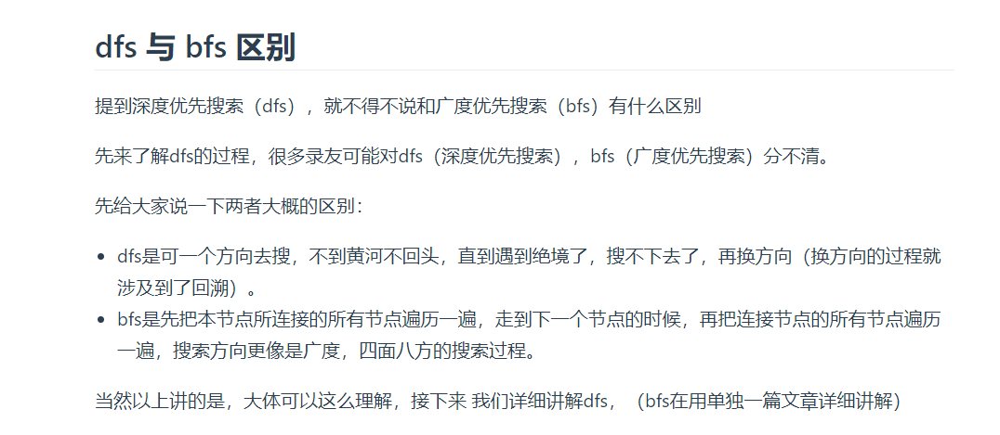
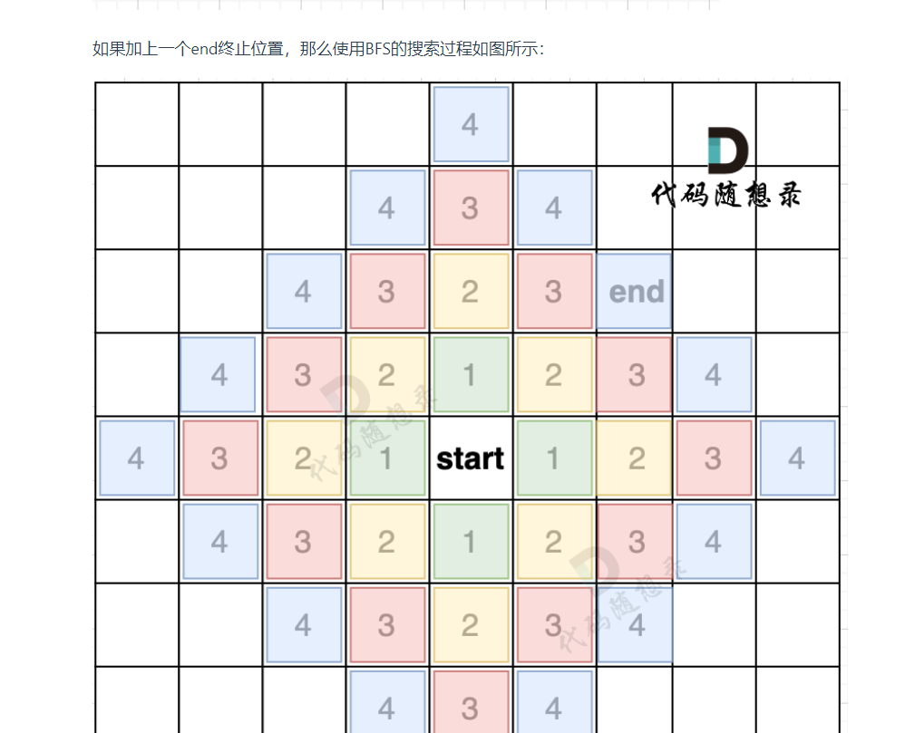

# **深度优先遍历**


**DFS**是一种通过探索图中的分支来查找目标节点的搜索算法。它从一个起始节点开始，沿着一条分支尽可能深入地进行探索，直到不能再深入为止，然后回溯到前一个节点，继续探索其他分支。

**BFS**是一种逐层遍历图的搜索算法。它从起始节点开始，首先探索所有与起始节点直接相连的节点，然后继续探索这些节点的相邻节点，依此类推，直到找到目标节点为止。BFS使用队列来管理节点的探索顺序，确保先探索较近的节点。

回溯法代码框架
```C++
void backtracking(参数) {
    if (终止条件) {
        存放结果;
        return;
    }
    for (选择：本层集合中元素（树中节点孩子的数量就是集合的大小）) {
        处理节点;
        backtracking(路径，选择列表); // 递归
        回溯，撤销处理结果
    }
}

```

深度优先遍历代码框架
```C++
void dfs(参数) {
    if (终止条件) {
        存放结果;
        return;
    }

    for (选择：本节点所连接的其他节点) {
        处理节点;
        dfs(图，选择的节点); // 递归
        回溯，撤销处理结果
    }
}
```

# **广度优先遍历**



代码框架(该模板针对的就是，上面的四方格的地图)
```C++
int dir[4][2] = {0, 1, 1, 0, -1, 0, 0, -1}; // 表示四个方向
// grid 是地图，也就是一个二维数组
// visited标记访问过的节点，不要重复访问
// x,y 表示开始搜索节点的下标
void bfs(vector<vector<char>>& grid, vector<vector<bool>>& visited, int x, int y) {
    queue<pair<int, int>> que; // 定义队列
    que.push({x, y}); // 起始节点加入队列
    visited[x][y] = true; // 只要加入队列，立刻标记为访问过的节点
    while(!que.empty()) { // 开始遍历队列里的元素
        pair<int ,int> cur = que.front(); que.pop(); // 从队列取元素
        int curx = cur.first;
        int cury = cur.second; // 当前节点坐标
        for (int i = 0; i < 4; i++) { // 开始想当前节点的四个方向左右上下去遍历
            int nextx = curx + dir[i][0];
            int nexty = cury + dir[i][1]; // 获取周边四个方向的坐标
            if (nextx < 0 || nextx >= grid.size() || nexty < 0 || nexty >= grid[0].size()) continue;  // 坐标越界了，直接跳过
            if (!visited[nextx][nexty]) { // 如果节点没被访问过
                que.push({nextx, nexty});  // 队列添加该节点为下一轮要遍历的节点
                visited[nextx][nexty] = true; // 只要加入队列立刻标记，避免重复访问
            }
        }
    }

}
```

## **200.岛屿数量**

深度搜索版本：

```C++
class Solution {
public:
//深搜、广搜、并查集都能做
//深搜
    int dir[4][2] = {0, 1, 0, -1, -1, 0, 1, 0}; //4个方向
    void dfs(vector<vector<char>>& grid, vector<vector<bool>>& visited, int x, int y) {
        if(visited[x][y] == true || grid[x][y] == '0') return;
        visited[x][y] = true;
        for(int i = 0; i < 4; i++) {
            int nextx = x + dir[i][0];
            int nexty = y + dir[i][1];
            if(nextx < 0 || nextx >= grid.size() || nexty < 0 || nexty >= grid[0].size()) {
                continue;
            }
            dfs(grid, visited, nextx, nexty);
        }
    }

    int numIslands(vector<vector<char>>& grid) {
        int m = grid.size();
        int n = grid[0].size();
        int res = 0;
        vector<vector<bool>> visited = vector<vector<bool>>(m, vector<bool>(n, false));
        for(int i = 0; i < m; i++) {
            for(int j = 0; j < n; j++) {
                if(visited[i][j] == false && grid[i][j] == '1') {
                    res++;
                    dfs(grid, visited, i ,j);
                }
            }
        }
        return res;
    }   
};
```
广度优先搜索版本：
```C++
class Solution {
public:
//深搜、广搜、并查集都能做
    int dird[4][2] = {0, 1, 0, -1, 1, 0, -1, 0};
    void bfs(vector<vector<char>>& grid, vector<vector<bool>>& visited, int x, int y) {
        queue<pair<int, int>> qe;
        qe.push({x, y});
        visited[x][y] = true;
        while(!qe.empty()) {
            pair<int, int> cur = qe.front();
            qe.pop();
            int curx = cur.first;
            int cury = cur.second;
            for(int i = 0; i < 4; i++) {
                int nextx = curx + dird[i][0];
                int nexty = cury + dird[i][1];
                if(nextx < 0 || nextx >= grid.size() || nexty < 0 || nexty >= grid[0].size()) continue;
                if(visited[nextx][nexty] == false && grid[nextx][nexty] == '1') {
                    qe.push({nextx, nexty});
                    visited[nextx][nexty] = true;
                }
            }
        }


    }

    int numIslands(vector<vector<char>>& grid) {
        int m = grid.size();
        int n = grid[0].size();
        int res = 0;
        vector<vector<bool>> visited = vector<vector<bool>>(m, vector<bool>(n, false));
        for(int i = 0; i < m; i++) {
            for(int j = 0; j < n; j++) {
                if(visited[i][j] == false && grid[i][j] == '1') {
                    res++;
                    bfs(grid, visited, i, j);
                }
            }
        }
        return res;
    }   
};

```