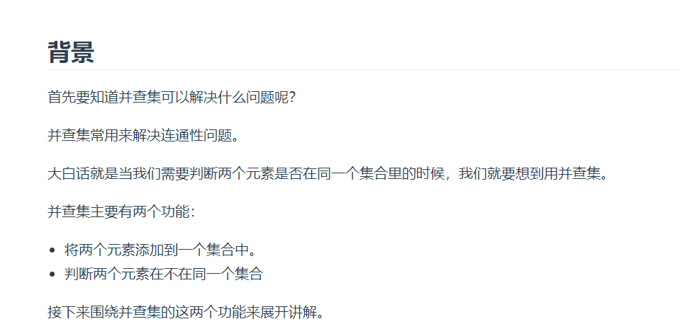
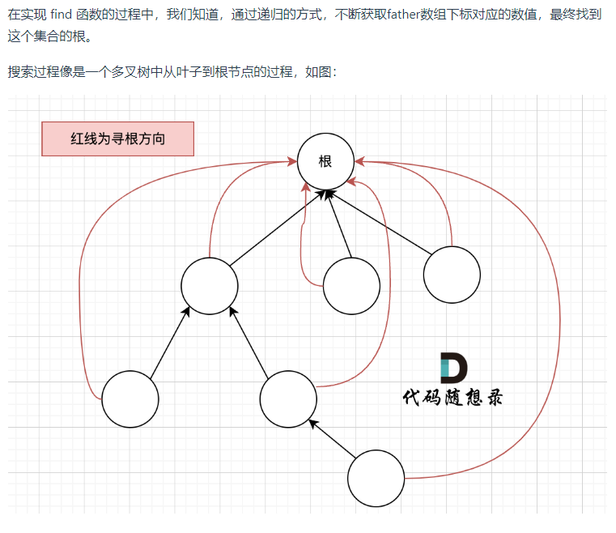
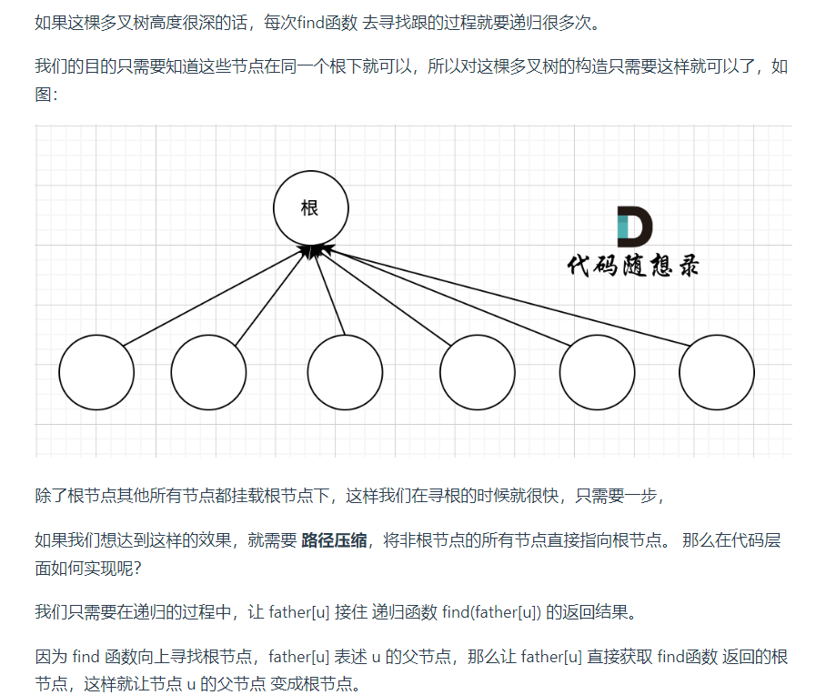

# **并查集**


路径压缩：



并查集代码模板:
```C++
int n = 1005; // n根据题目中节点数量而定，一般比节点数量大一点就好
vector<int> father = vector<int> (n, 0); // C++里的一种数组结构

// 并查集初始化
void init() {
    for (int i = 0; i < n; ++i) {
        father[i] = i;
    }
}
// 并查集里寻根的过程
int find(int u) {
    return u == father[u] ? u : father[u] = find(father[u]); // 路径压缩
}

// 判断 u 和 v是否找到同一个根
bool isSame(int u, int v) {
    u = find(u);
    v = find(v);
    return u == v;
}

// 将v->u 这条边加入并查集
void join(int u, int v) {
    u = find(u); // 寻找u的根
    v = find(v); // 寻找v的根
    if (u == v) return ; // 如果发现根相同，则说明在一个集合，不用两个节点相连直接返回
    father[v] = u;
}
```

通过模板，我们可以知道，并查集主要有三个功能。
- 寻找根节点，函数：find(int u)，也就是判断这个节点的祖先节点是哪个
- 将两个节点接入到同一个集合，函数：join(int u, int v)，将两个节点连在同一个根节点上
- 判断两个节点是否在同一个集合，函数：isSame(int u, int v)，就是判断两个节点是不是同一个根节点