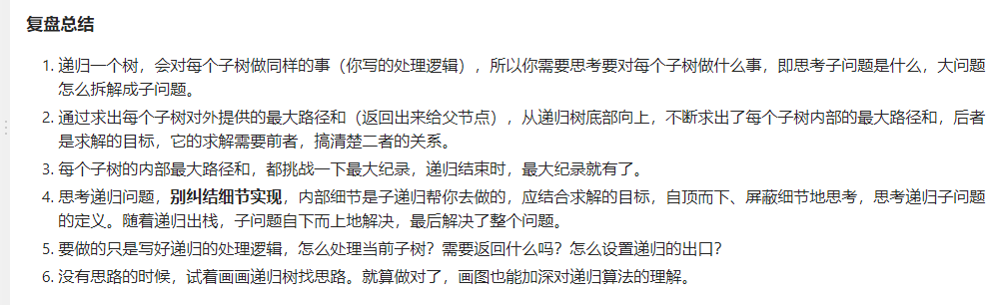
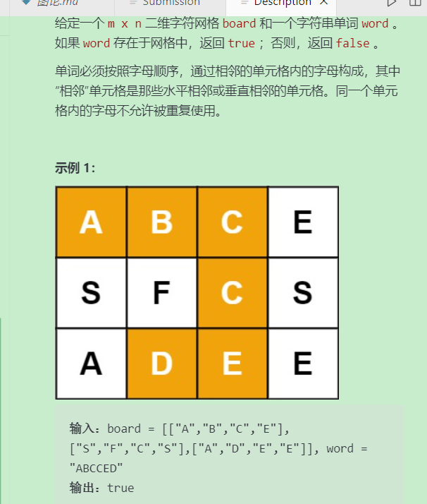
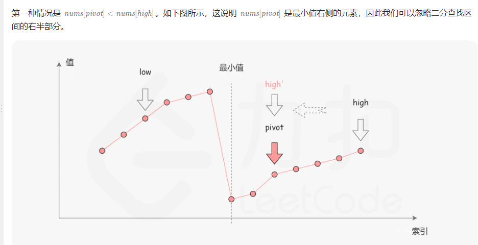
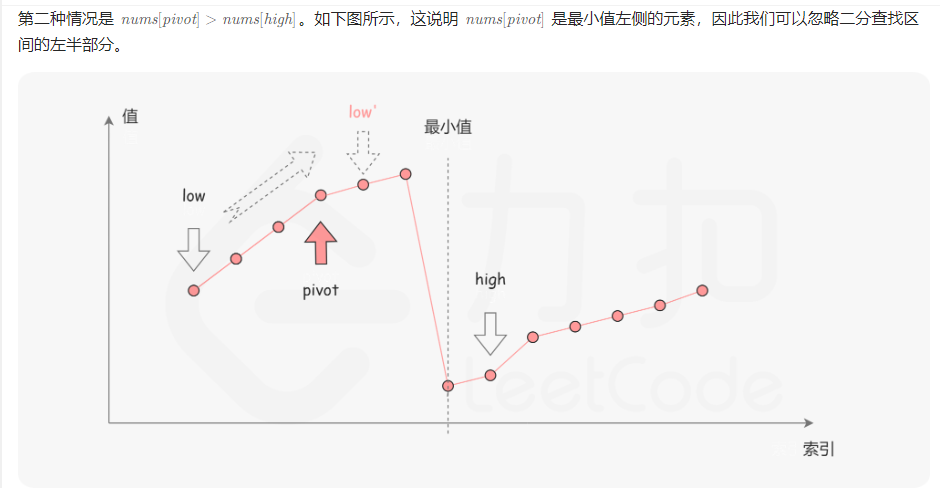
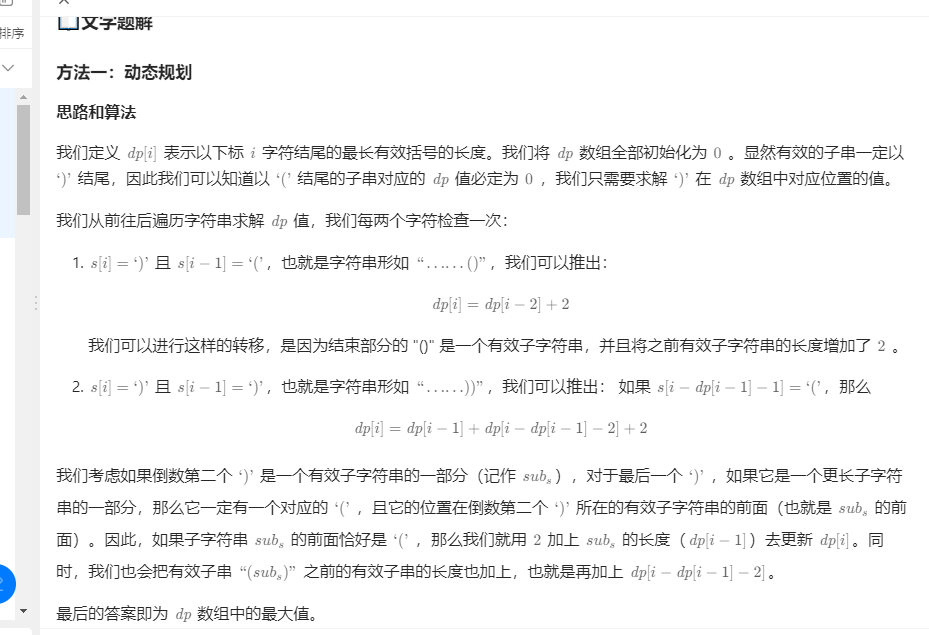

## **148.排序链表**
自上到下 空间复杂度O(logn):递归函数调用占用的


自下到上 


```C++
//链表归并 自底向上 时间O(nlogn) 空间O(1) 自顶到底  时间O(nlogn) 空间O(logn)：递归函数调用
//数组归并 自底向上 时间O(nlogn) 空间O(1) 自顶到底  时间O(nlogn) 空间O(n)
//时间O(nlogn) 的排序：堆排 快排 归并

//自顶向下方法
class Solution {
public:
    // struct ListNode {
    //     int val;
    //     ListNode* next;
    //     ListNode() : val(0), next(nullptr) {}
    //     ListNode(int x) : val(x), next(nullptr) {}
    //     ListNode(int x, ListNode* next) : val(x), next(next) {}
    // };

    ListNode* sortList(ListNode* head) {
        if(head == nullptr || head->next == nullptr) return head;
        ListNode* mid = findMid(head);
        ListNode* righthead = mid->next;
        mid->next = nullptr; //切断中心节点
        
        ListNode* left = sortList(head);
        ListNode* right = sortList(righthead);

        return merge(left, right);
    }

    //876.链表的中心节点
    ListNode* findMid(ListNode* head) {
        if(head == nullptr || head->next == nullptr) return head;
        ListNode* slow = head;
        ListNode* fast = head;
        while(fast->next && fast->next->next) {
            slow = slow->next;
            fast = fast->next->next;
        }
        return slow;
    }

    //21.合并两个有序链表
    ListNode* merge(ListNode* l1, ListNode* l2) {
        ListNode* newhead = new ListNode();
        ListNode* cur = newhead;

        while(l1 && l2) {
            if(l1->val < l2->val) {
                cur->next = l1;
                l1 = l1->next;
            }
            else {
                cur->next = l2;
                l2 = l2->next;
            }
            cur = cur->next;
        }

        cur->next = l1 == nullptr ? l2 : l1;

        return newhead->next;
    }
};
```

## **28.合并k个升序链表**
方法1：顺序合并 时间：O(k^2*n) 空间O(1)
```C++
#include <vector>
using namespace std;

class Solution {
public:
    // struct ListNode {
    //     int val;
    //     ListNode* next;
    //     ListNode() : val(0), next(nullptr) {}
    //     ListNode(int x) : val(x), next(nullptr) {}
    //     ListNode(int x, ListNode* next) : val(x), next(next) {}
    // };
    //方法1：顺序合并
    //21.合并两个有序链表
    ListNode* merge(ListNode* l1, ListNode* l2) {
        if(l1 == nullptr || l2 == nullptr) {
            return l1 == nullptr ? l2 : l1;
        }
        ListNode* head = new ListNode();
        ListNode* cur = head;
        while(l1 && l2) {
            if(l1->val < l2->val) {
                cur->next = l1;
                l1 = l1->next;
            }
            else {
                cur->next = l2;
                l2 = l2->next;
            }
            cur = cur->next;
        }
        cur->next = l1 == nullptr ? l2 : l1;
        return head->next;
    }

    ListNode* mergeKLists(vector<ListNode*>& lists) {
        ListNode* res = nullptr;
        for(int i = 0; i < lists.size(); i++) {
            res = merge(res, lists[i]);
        }
        return res;
    }
};
```

方法二：分治
```C++
class Solution {
public:
    // struct ListNode {
    //     int val;
    //     ListNode* next;
    //     ListNode() : val(0), next(nullptr) {}
    //     ListNode(int x) : val(x), next(nullptr) {}
    //     ListNode(int x, ListNode* next) : val(x), next(next) {}
    // };
    //方法二：分治，方法1的改进
    //21.合并两个有序链表
    ListNode* merge(ListNode* l1, ListNode* l2) {
        if(l1 == nullptr || l2 == nullptr) {
            return l1 == nullptr ? l2 : l1;
        }
        ListNode* head = new ListNode();
        ListNode* cur = head;
        while(l1 && l2) {
            if(l1->val < l2->val) {
                cur->next = l1;
                l1 = l1->next;
            }
            else {
                cur->next = l2;
                l2 = l2->next;
            }
            cur = cur->next;
        }
        cur->next = l1 == nullptr ? l2 : l1;
        return head->next;
    }
    ListNode* fenzhi(vector<ListNode*>& lists, int left, int right) {
        //划分
        if(left == right) return lists[left];
        if(left > right) return nullptr;
        int mid = left + (right - left) / 2;
        ListNode* leftlist = fenzhi(lists, left, mid);
        ListNode* rightlist = fenzhi(lists, mid + 1, right);

        return merge(leftlist, rightlist);
    }

    ListNode* mergeKLists(vector<ListNode*>& lists) {
        return fenzhi(lists, 0, lists.size() - 1);
    }
};
```

方法三：使用优先队列合并

这个方法和前两种方法的思路有所不同，我们需要维护当前每个链表没有被合并的元素的最前面一个，k个链表就最多有k个满足这样条件的元素，每次在这些元素里面选取val属性最小的元素合并到答案中。在选取最小元素的时候，我们可以用优先队列来优化这个过程。

```C++
#include <vector>
#include <queue>
using namespace std;

class Solution {
public:
    // struct ListNode {
    //     int val;
    //     ListNode* next;
    //     ListNode() : val(0), next(nullptr) {}
    //     ListNode(int x) : val(x), next(nullptr) {}
    //     ListNode(int x, ListNode* next) : val(x), next(next) {}
    // };

    //方法三：优先队列
    class mycompare{
    public:
        bool operator()(const ListNode* a, const ListNode* b){
            return a->val > b->val; //小顶堆
        }
    };

    ListNode* mergeKLists(vector<ListNode*>& lists) {
        priority_queue<ListNode*, vector<ListNode*>, mycompare> pq;
        //[[1,4,5],[1,3,4],[2,6]]
        for(auto node: lists) {
            if(node) {
                pq.push(node); //pq: 1 1 2
            }
        }
        ListNode* newhead = new ListNode();
        ListNode* cur = newhead;
        while(!pq.empty()) {
            auto node = pq.top();
            pq.pop();
            //例如第一个节点分别为1 3 4 但是1后面的2比 3 4也都小所以第二个节点为2 应该把他也加入优先级队列
            if(node->next){
                pq.push(node->next);
            }
            cur->next = node;
            cur = cur->next;
        }
        return newhead->next;
     
    }
};
```

## **146.LRU缓存**

哈希表 + 双向链表 的结合。

```C++
class LRUCache {
private:
    int size;
    list<pair<int, int>> cache;
    unordered_map<int, list<pair<int,int>>::iterator> umap;
public:

    LRUCache(int capacity) {
        this->size = capacity;
    }
    
    int get(int key) {
        if(umap.find(key) == umap.end()) return -1;
        auto keyvalue = *umap[key]; //解引用类型为pair<int,int>
        //将其移到链表头，先后面删除
        cache.erase(umap[key]);//erase参数是迭代器指针
        cache.push_front(keyvalue);//添加到首部
        umap[key] = cache.begin(); //更新映射关系， 即新的迭代器位置
        return keyvalue.second;
    }
    
    void put(int key, int value) {
        //不存在
        if(umap.find(key) == umap.end()) {
            if(cache.size() == size) {
                //删除映射对
                umap.erase(cache.back().first);
                cache.pop_back();//尾部删除
            }
        }
        else {
            cache.erase(umap[key]);
        }
        /*
        cache.push_back({key, value});
        umap[key] = cache.back();//将报错
        std::list 容器在进行插入操作后，其迭代器可能会失效。这是因为插入操作可能会导致容器重新分配内存，从而导致之前的迭代器变得无效。

        具体说，在你的情况中，cache.push_back({key, value}) 可能会使得之前的迭代器 cache.back() 失效，
        这意味着将失效的迭代器赋值给 umap[key] 可能会导致错误。
        为了避免这种情况，应该在使用迭代器前确保它们仍然有效。
        */


        cache.push_front({key, value});
        umap[key] = cache.begin();
    }
};
```
官方题解，手搓链表
```C++
struct DLinkedNode {
    int m_key;
    int m_value;
    DLinkedNode *prev;
    DLinkedNode *next;
    DLinkedNode(): m_key(0), m_value(0), prev(nullptr), next(nullptr) {

    }
    DLinkedNode(int key, int value): m_key(key), m_value(value), prev(nullptr), next(nullptr) {

    }
};


class LRUCache {
private:
    unordered_map<int, DLinkedNode *> m_key2Node;
    int m_capacity;
    DLinkedNode *head;
    DLinkedNode *tail;

public:
    LRUCache(int capacity) {
        // 初始化的时候, 让系统分配头尾两个节点
        head = new DLinkedNode();
        tail = new DLinkedNode();
        head->next = tail;
        tail->prev = head;
        // 控制缓存的容量
        m_capacity = capacity;
    }
    
    int get(int key) {
        // 如果容器里有这个key，就直接返回，并把这个移动到链表的头部
        if (m_key2Node.find(key) != m_key2Node.end()) {
            removeNode(m_key2Node[key]);
            addNode2Head(m_key2Node[key]);
            return m_key2Node[key]->m_value;
        } else { // 如果没有这个节点，就返回-1
            return -1;
        }
    }
    
    void put(int key, int value) {
        // 如果有这个节点，就覆盖这个key对应的值，并把这个节点放在链表的头部
        if (m_key2Node.find(key) != m_key2Node.end()) {
            m_key2Node[key]->m_value = value;
            removeNode(m_key2Node[key]);
            addNode2Head(m_key2Node[key]);
        } else { // 如果没有这个节点，就添加这个节点，并把这个节点放在链表头部，如果节点数量超过容器大小，就删除尾部节点的元素
            DLinkedNode *node = new DLinkedNode(key, value);
            m_key2Node[key] = node;
            addNode2Head(node);
            while (m_key2Node.size() > m_capacity) {
                removeTail();
            }
        }
    }

    // 移动一个节点到链表的头部，是要先删除节点，再在链表的头部添加这个节点
    // 删除一个节点的函数
    void removeNode(DLinkedNode *node){
        node->prev->next = node->next;
        node->next->prev = node->prev;
    }
    // 添加一个节点到链表的头部的函数
    void addNode2Head(DLinkedNode *node){
        node->next = head->next;
        head->next->prev = node;
        head->next = node;
        node->prev = head;
    }
    // 从尾部移除一个节点的函数
    void removeTail() {
        m_key2Node.erase(tail->prev->m_key);
        DLinkedNode *node = tail->prev;
        tail->prev->prev->next = tail;
        tail->prev = tail->prev->prev;
        // 防止内存泄漏
        delete node;
    }
};

/**
 * Your LRUCache object will be instantiated and called as such:
 * LRUCache* obj = new LRUCache(capacity);
 * int param_1 = obj->get(key);
 * obj->put(key,value);
 */

```

## **543.二叉树的直径**
跟求二叉树的深度比较像

```C++
class Solution {
public:
    // struct TreeNode{
    //     /* data */
    //     int val;
    //     TreeNode* left;
    //     TreeNode* right;
    //     TreeNode() : val(0), left(nullptr), right(nullptr) {}
    //     TreeNode(int x, TreeNode* left, TreeNode* right) : val(x), left(left), right(right) {} 
    // };
    int res = 0;
    int traversal(TreeNode* root) {
        if(root == nullptr) return 0;
        int left = traversal(root->left);
        int right = traversal(root->right);
        //将每个节点最大直径(左子树深度+右子树深度)当前最大值比较并取大者
        res = max(res, left + right);
        return max(left, right) + 1;
    }

    int diameterOfBinaryTree(TreeNode* root) {
        //if(root->left == nullptr && root->right == nullptr) return 0;
        traversal(root);
        return res;
    }
};

```

## **230.二叉搜索树中第K小的元素**

```C++
class Solution {
public:
    struct TreeNode{
        /* data */
        int val;
        TreeNode* left;
        TreeNode* right;
        TreeNode() : val(0), left(nullptr), right(nullptr) {}
        TreeNode(int x, TreeNode* left, TreeNode* right) : val(x), left(left), right(right) {} 
    };
    void inorder(TreeNode* root, vector<int>& vec) {
        if(root == nullptr) return;
        inorder(root->left, vec);
        vec.push_back(root->val);
        inorder(root->right, vec);
        return;
    }
    int kthSmallest(TreeNode* root, int k) {
        vector<int> vec;
        inorder(root, vec);
        return vec[k - 1];
    }
};
```

迭代
```C++
   int kthSmallest(TreeNode* root, int k) {
        stack<TreeNode*> st;
        TreeNode* cur = root;
        while(!st.empty() || cur != nullptr) {
            if(cur) {
                st.push(cur);
                cur = cur->left;
            }
            else {
                TreeNode* tmp = st.top();
                st.pop();
                k--;
                if(k == 0) {
                    return tmp->val;
                }
                
                cur = tmp->right;
            }  
        }
        return 0;

    }
```

## **114.二叉树展开为链表**

```C++
    void flatten(TreeNode* root) {
        if(root == nullptr) return;
        stack<TreeNode*> st;
        TreeNode* node =  new TreeNode();
        st.push(root);
        while(!st.empty()) {
            TreeNode* cur = st.top();
            st.pop();

            if(cur->right) {
                st.push(cur->right);
            } 
            if(cur->left) {
                st.push(cur->left);
            }
            node->right = cur;
            node->left = nullptr;
            node = node->right;
        }
    }
```
官方题解2，跟我的差不多
```C++
    void flatten(TreeNode* root) {
        if(root == nullptr) return;
        stack<TreeNode*> st;
        TreeNode* node = nullptr;
        st.push(root);
        while(!st.empty()) {
            TreeNode* cur = st.top();
            st.pop();
            if(node != nullptr) {
                node->right = cur;
                node->left = nullptr;
            }
            if(cur->right) {
                st.push(cur->right);
            } 
            if(cur->left) {
                st.push(cur->left);
            }
            node = cur;
        }
    }
```

## **437.路径总和3**
```C++
class Solution {
public:
    // struct TreeNode{
    //     /* data */
    //     int val;
    //     TreeNode* left;
    //     TreeNode* right;
    //     TreeNode() : val(0), left(nullptr), right(nullptr) {}
    //     TreeNode(int x, TreeNode* left, TreeNode* right) : val(x), left(left), right(right) {} 
    // };
   
    int ans = 0;
    /*一个朴素的做法是搜索以每个节点为根的（往下的）所有路径，并对路径总和为
     targetSumtargetSumtargetSum 的路径进行累加统计。*/

    //做先序遍历求累加和
    void dfs(TreeNode* root, int targetSum, long sum) {
        if(root == nullptr) return;
        sum += root->val;
        if(sum == targetSum) ans++;
        dfs(root->left, targetSum, sum);
        dfs(root->right, targetSum, sum);

    }

    int pathSum(TreeNode* root, int targetSum) {
        if(!root) return 0;
        dfs(root, targetSum, 0);
        //求每个点作为根节点向下的路径和为targetsum
        pathSum(root->left, targetSum);
        pathSum(root->right, targetSum);
        return ans;
    }
};
```

## **124.二叉树中的最大路径和hard**

```C++
class Solution {
public:

    // struct TreeNode{
    //     /* data */
    //     int val;
    //     TreeNode* left;
    //     TreeNode* right;
    //     TreeNode() : val(0), left(nullptr), right(nullptr) {}
    //     TreeNode(int x, TreeNode* left, TreeNode* right) : val(x), left(left), right(right) {} 
    // };
    int res = INT_MIN;
    // bool max(const int& a, const int& b) {
    //     return a > b;
    // }

    int dfs(TreeNode* root) {
        if(root == nullptr) return 0;
    
        //计算左边分支最大值，左边分支如果为负数还不如不选择
        int left = max(dfs(root->left), 0);
        int right = max(dfs(root->right), 0);
         //left->root->right 作为路径与已经计算过历史最大值做比较
        res = max(left + right + root->val, res);
        // 返回经过root的单边最大分支给当前root的父节点计算使用
        return root->val + max(left, right);
    }

    int maxPathSum(TreeNode* root) {
        if(root == nullptr) return 0;
        dfs(root);
        return res;
    }
};

```

## **22.括号生成**
```C++
#include <vector>
#include <string>
using namespace std;
class Solution {
public:
    vector<string> res;

    void backtracking(int leftRemain, int rightRemain, int size, string path) {
        if(path.size() == size) {
            res.push_back(path);
            return;
        }

        //leftRemain rightRemain剩余左右括号数
        //左括号大于0 就可以选
        if(leftRemain > 0) {
            backtracking(leftRemain - 1, rightRemain, size, path + "(");
        }

        if(rightRemain > leftRemain) {
    
            backtracking(leftRemain, rightRemain - 1, size, path + ")");
         
        }
    }
    vector<string> generateParenthesis(int n) {

        backtracking(n, n, n * 2, "");
        return res;
    }
```

另一个体现回溯过程的版本
```C++
#include <vector>
#include <string>
using namespace std;
class Solution {
public:
    vector<string> res;
    string path = "";
    void backtracking(int leftRemain, int rightRemain, int size) {
        if(path.size() == size) {
            res.push_back(path);
            return;
        }

        //leftRemain rightRemain剩余左右括号数
        //左括号大于0 就可以选
        if(leftRemain > 0) {
            path += "(";
            backtracking(leftRemain - 1, rightRemain, size);
            path.pop_back();
        }

        if(rightRemain > leftRemain) {
            path += ")";
            backtracking(leftRemain, rightRemain - 1, size);
            path.pop_back();
        }
    }
    vector<string> generateParenthesis(int n) {

        backtracking(n, n, n * 2);
        return res;
    }
};
```

## **79.单词搜索**
//剑指offer12.矩阵中的路径

深度+回溯
```C++
#include <vector>
#include <string>
using namespace std;
//剑指offer12.矩阵中的路径
class Solution {
public:

    int dirt[4][2] = {0, 1, 0, -1, -1, 0, 1, 0};

    bool backtracking(vector<vector<char>>& board, string& word, int x, int y, int k, vector<vector<bool>>& visited) {
        if(board[x][y] != word[k] || visited[x][y]) return false;
        if(k == word.size() - 1) return true;
        
        visited[x][y] = true;

        for(int i = 0; i < 4; i++) {
            int nextx = x + dirt[i][0];
            int nexty = y + dirt[i][1];
            if(nextx < 0 || nextx >= board.size() || nexty < 0 || nexty >= board[0].size()) continue;
            if(backtracking(board, word, nextx, nexty, k + 1, visited)) {
                return true;
            }
        }
        visited[x][y] = false;

        return false;
    } 

    
    bool exist(vector<vector<char>>& board, string word) {
        int m = board.size();
        int n = board[0].size();
        vector<vector<bool>>visited (m, vector<bool>(n, false));
        for(int i = 0; i < m; i++) {
            for(int j = 0; j < n; j++) {
                if(backtracking(board, word, i, j, 0, visited)) {
                    return true;
                }
            }
        }
        return false;
        
    }
};
```

## **74.搜索二维矩阵**

非二分查找版本 时间复杂度O(m+n)

```C++
class Solution {
public:
//非二分法版本 O(m + n) 
    bool searchMatrix(vector<vector<int>>& matrix, int target) {
        int m = matrix.size();
        int n = matrix[0].size();
        int i = m - 1; //行
        int j = 0; //列
        while(i >= 0 && j <= n - 1) {
            if(matrix[i][j] > target) {
                i--;
            }else if(matrix[i][j] < target) {
                j++;
            }
            else {
                return true;
            }
        }
        return false;
    }
};
```

二分版本O(log(m*n))
```C++
class Solution {
public:
//二分版本O(logmn) 
    bool searchMatrix(vector<vector<int>>& matrix, int target) {
        int m = matrix.size();
        int n = matrix[0].size();
        int low = 0, high = n * m - 1;
        while(low <= high) {
            int mid = low + (high - low) / 2;
            int row = mid / n; //注意 是 mid / n  不是m
            int col = mid % n;
            if(matrix[row][col] == target) {
                return true;
            }
            else if(matrix[row][col] < target) {
                low = mid + 1;
            }
            else {
                high = mid - 1;
            }
        }
        return false;
    }
};

```

## **153.寻找旋转排序数组中的最小值**




```C++
#include <vector>
using namespace std;
/*
我们考虑数组中的最后一个元素 x：在最小值右侧的元素
（不包括最后一个元素本身），它们的值一定都严格小于 x；
而在最小值左侧的元素，它们的值一定都严格大于 x。因此，
我们可以根据这一条性质，通过二分查找的方法找出最小值。


就是边界值小于中间值的时候中间值肯定不是最小值所以 low = mid + 1 边界值大于
中间值的时候 中间值可能会是最小值所以 high = mid 保留mid避免错过
*/
class Solution {
public:
    int findMin(vector<int>& nums) {
        int n = nums.size();
        if(n == 0) return nums[0];
        int left = 0;
        int right = n - 1;
        while(left < right) {
            int mid = left + (right - left) / 2;
            //mid在最小值 右侧 则可以忽略二分查找的右半部分
            if(nums[mid] < nums[right]) {
                right = mid
            }
            else {
                left = mid + 1;
            }
        }
        return nums[left];
   
    }
};
```

## **155.最小栈**

使用一个栈的做法：
```C++
#include <stack>
using namespace std;

//单栈法实现
class MinStack {
public:
    
    stack<int> st;
    int min;
    MinStack() {
        min = INT_MAX;
    }
    //如果加入的元素 小于当前最小值 则把当前最小值 和加入的值同时入栈
    void push(int val) {
        if(val <= min) {
            st.push(min);
            min = val;
        }
        st.push(val);
    }
    
    void pop() {
        //栈顶元素是最小值，把最小值赋值给她下面的元素 然后他俩出栈
        if(st.top() == min) {
            st.pop();
            min = st.top();
            st.pop();
        } 
        //不是最小值直接出栈
        else {
            st.pop();
        }
    }
    
    int top() {
        return st.top();
    }
    
    int getMin() {
        return min;
    }
};
```

## **394.字符串解吗**

```C++
#include <string>
#include <stack>
using namespace std;

class Solution {
public:
    string decodeString(string s) {
        stack<pair<int, string>> st; //存储[之前的 结果 和 乘数
        int multi = 0;
        string res;

        for(auto str: s) {
            if(str >= '0' && str <= '9') {
                multi = multi * 10 + (str - '0'); //注意数字可能不止一位
            }
            else if(str == '[') {
                st.push({multi, res});
                multi = 0;
                res = "";
            }
            else if(str == ']') {
                string pre = st.top().second;
                int n = st.top().first;
                st.pop();
                for(int i = 0; i < n; i++) {
                    pre = pre + res;
                }
                res = pre;
                
            }
            else {
                res += str;
            }
        }
        return res;
    }
};

```
## **215.数组中的第k个最大元素**
与以下题相似：

剑指offer40：最小的k个数

leetcode347.前k个高频元素

这些题都是topk问题，可以用快排、堆排的方法去解决，其中堆排可以用优先级队列或者手写堆排去解决
```C++
priority_queue<int, vector<int>, greater<int>> pq; //小顶堆 堆顶元素最小  可以求前k个最大的数
priority_queue<int, vector<int>, less<int>> pq; //大顶堆
```
优先级队列的第三个参数，可以我们自己定义，可以使用lambda表达式，或者自己定义cmp，例如：
```C++
auto cmp = [](const int& a, const int& b){
    return a > b;
}
priority_queue<int, vector<int>, decltype(cmp)> pq; 

```

本题方法1：堆排
```C++
class Solution {
public:
    //优先队列 创建小顶堆 时间O(nlogk) 空间O(k)
    int findKthLargest(vector<int>& nums, int k) {
        priority_queue<int, vector<int>, greater<int>> pq;

        for(int i = 0; i < nums.size(); i++) {
            if(pq.size() < k || nums[i] > pq.top()) {
                pq.push(nums[i]);
            }
            if(pq.size() > k) pq.pop(); 
        }
        return pq.top();
    }
};
```
## **152.乘积最大子数组（双dp数组）**
```C++
class Solution {
public:
//维护两个dp 一个保存截至到i包括i的最大乘积  一个保存截至到i包括i的最小乘积
    int maxProduct(vector<int>& nums) {
        vector<int> maxdp(nums), mindp(nums);
        int res = nums[0];
        for(int i = 1; i < nums.size(); i++) {
            maxdp[i] = max(maxdp[i - 1] * nums[i], max(nums[i], mindp[i - 1] * nums[i]));
            res = max(res, maxdp[i]);
            mindp[i] = min(maxdp[i - 1] * nums[i], min(nums[i], mindp[i - 1] * nums[i]));
        }
        return res;
    }
};

```

## **32.最长有效括号（hard）**
dp法：

```C++
class Solution {
public:
    //最长有效括号一定是以）结尾
    int longestValidParentheses(string s) {
        vector<int> dp(s.size(), 0);
        int res = 0;
        for(int i = 1; i < s.size(); i++) {
            if(s[i] == ')') {
                if(s[i - 1] == '(') {
                    dp[i] = (i >= 2 ? dp[i - 2] : 0) + 2;
                }
                else if((i - dp[i - 1] >= 1) && s[i - dp[i - 1] - 1] == '('){
                    dp[i] = dp[i - 1] + 2 + ((i - dp[i - 1] - 2) >= 0 ? dp[i - dp[i - 1] - 2] : 0);
                }
            }
            res = max(res, dp[i]);
        }
        return res;
    }
};
```

栈法：转成求最长连续0的长度
```C++
#include <string>
#include <vector>
#include <stack>
using namespace std;
//可以dp 可以栈 dp真想不到

class Solution {
public:
    //最长有效括号一定是以）结尾
    int longestValidParentheses(string s) {
        stack<int> st;
        vector<int> mark(s.size(), 0);
        for(int i = 0; i < s.size(); i++) {
            if(s[i] == '(') {
                st.push(i);
            }
            else {
                if(st.empty()) {
                    mark[i] = 1;
                }
                else{
                    st.pop();
                }
            }
        }
        // )()((()) 等价  1 0 0 1 0 0 0 0
        //将多余左括号置1
        while(!st.empty()) {
            mark[st.top()] = 1;
            st.pop();
        }
        int len = 0;
        int res = 0;
        for(int i = 0; i < mark.size(); i++) {
            if(mark[i] == 1) {
                len = 0;
                continue;
            }
            len++;
            res = max(res, len);
        }
        return res;
    }
};
```
## **287.寻找重复的数**

方法1：
```C++
#include <vector>
using namespace std;
//类似剑指offer 数组中重复的数字 和leetcode442 数组中重复的数据
//leetcode 41 缺失的第一个正数  
//这些题都是原地哈希题
class Solution {
public:
//该解法不符合题意 题目要求不能更改数组 不能使用额外空间
    int findDuplicate(vector<int>& nums) {
        int i = 0;
        while(i < nums.size()) {
            if(nums[i] == i + 1) {
                i++;
                continue;
            }

            if(nums[i] == nums[nums[i] - 1]) {
                break;
            }
            swap(nums[i], nums[nums[i] - 1]);
        }
        return nums[i];
    }
    
};
```