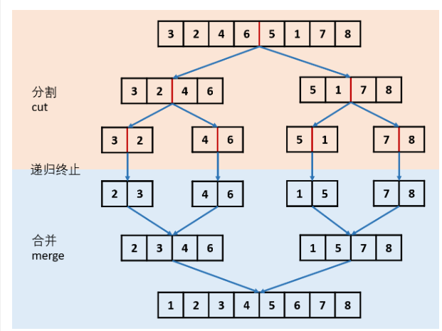
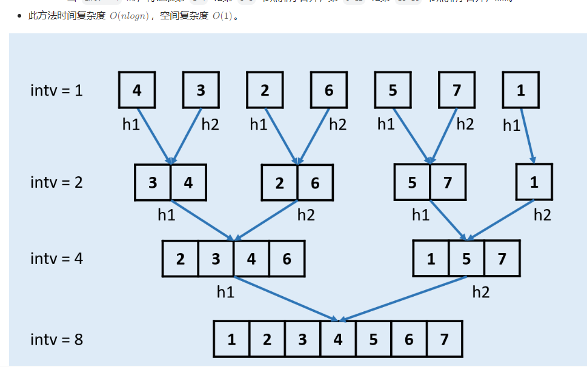
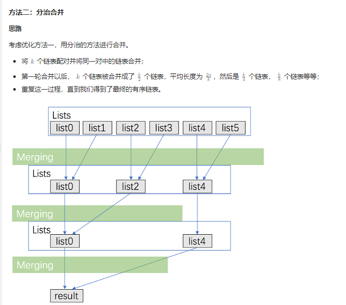

## **148.排序链表**
自上到下 空间复杂度O(logn):递归函数调用占用的


自下到上 


```C++
//链表归并 自底向上 时间O(nlogn) 空间O(1) 自顶到底  时间O(nlogn) 空间O(logn)：递归函数调用
//数组归并 自底向上 时间O(nlogn) 空间O(1) 自顶到底  时间O(nlogn) 空间O(n)
//时间O(nlogn) 的排序：堆排 快排 归并

//自顶向下方法
class Solution {
public:
    // struct ListNode {
    //     int val;
    //     ListNode* next;
    //     ListNode() : val(0), next(nullptr) {}
    //     ListNode(int x) : val(x), next(nullptr) {}
    //     ListNode(int x, ListNode* next) : val(x), next(next) {}
    // };

    ListNode* sortList(ListNode* head) {
        if(head == nullptr || head->next == nullptr) return head;
        ListNode* mid = findMid(head);
        ListNode* righthead = mid->next;
        mid->next = nullptr; //切断中心节点
        
        ListNode* left = sortList(head);
        ListNode* right = sortList(righthead);

        return merge(left, right);
    }

    //876.链表的中心节点
    ListNode* findMid(ListNode* head) {
        if(head == nullptr || head->next == nullptr) return head;
        ListNode* slow = head;
        ListNode* fast = head;
        while(fast->next && fast->next->next) {
            slow = slow->next;
            fast = fast->next->next;
        }
        return slow;
    }

    //21.合并两个有序链表
    ListNode* merge(ListNode* l1, ListNode* l2) {
        ListNode* newhead = new ListNode();
        ListNode* cur = newhead;

        while(l1 && l2) {
            if(l1->val < l2->val) {
                cur->next = l1;
                l1 = l1->next;
            }
            else {
                cur->next = l2;
                l2 = l2->next;
            }
            cur = cur->next;
        }

        cur->next = l1 == nullptr ? l2 : l1;

        return newhead->next;
    }
};
```

## **28.合并k个升序链表**
方法1：顺序合并 时间：O(k^2*n) 空间O(1)
```C++
#include <vector>
using namespace std;

class Solution {
public:
    // struct ListNode {
    //     int val;
    //     ListNode* next;
    //     ListNode() : val(0), next(nullptr) {}
    //     ListNode(int x) : val(x), next(nullptr) {}
    //     ListNode(int x, ListNode* next) : val(x), next(next) {}
    // };
    //方法1：顺序合并
    //21.合并两个有序链表
    ListNode* merge(ListNode* l1, ListNode* l2) {
        if(l1 == nullptr || l2 == nullptr) {
            return l1 == nullptr ? l2 : l1;
        }
        ListNode* head = new ListNode();
        ListNode* cur = head;
        while(l1 && l2) {
            if(l1->val < l2->val) {
                cur->next = l1;
                l1 = l1->next;
            }
            else {
                cur->next = l2;
                l2 = l2->next;
            }
            cur = cur->next;
        }
        cur->next = l1 == nullptr ? l2 : l1;
        return head->next;
    }

    ListNode* mergeKLists(vector<ListNode*>& lists) {
        ListNode* res = nullptr;
        for(int i = 0; i < lists.size(); i++) {
            res = merge(res, lists[i]);
        }
        return res;
    }
};
```

方法二：分治
```C++
class Solution {
public:
    // struct ListNode {
    //     int val;
    //     ListNode* next;
    //     ListNode() : val(0), next(nullptr) {}
    //     ListNode(int x) : val(x), next(nullptr) {}
    //     ListNode(int x, ListNode* next) : val(x), next(next) {}
    // };
    //方法二：分治，方法1的改进
    //21.合并两个有序链表
    ListNode* merge(ListNode* l1, ListNode* l2) {
        if(l1 == nullptr || l2 == nullptr) {
            return l1 == nullptr ? l2 : l1;
        }
        ListNode* head = new ListNode();
        ListNode* cur = head;
        while(l1 && l2) {
            if(l1->val < l2->val) {
                cur->next = l1;
                l1 = l1->next;
            }
            else {
                cur->next = l2;
                l2 = l2->next;
            }
            cur = cur->next;
        }
        cur->next = l1 == nullptr ? l2 : l1;
        return head->next;
    }
    ListNode* fenzhi(vector<ListNode*>& lists, int left, int right) {
        //划分
        if(left == right) return lists[left];
        if(left > right) return nullptr;
        int mid = left + (right - left) / 2;
        ListNode* leftlist = fenzhi(lists, left, mid);
        ListNode* rightlist = fenzhi(lists, mid + 1, right);

        return merge(leftlist, rightlist);
    }

    ListNode* mergeKLists(vector<ListNode*>& lists) {
        return fenzhi(lists, 0, lists.size() - 1);
    }
};
```

方法三：使用优先队列合并

这个方法和前两种方法的思路有所不同，我们需要维护当前每个链表没有被合并的元素的最前面一个，k个链表就最多有k个满足这样条件的元素，每次在这些元素里面选取val属性最小的元素合并到答案中。在选取最小元素的时候，我们可以用优先队列来优化这个过程。

```C++
#include <vector>
#include <queue>
using namespace std;

class Solution {
public:
    // struct ListNode {
    //     int val;
    //     ListNode* next;
    //     ListNode() : val(0), next(nullptr) {}
    //     ListNode(int x) : val(x), next(nullptr) {}
    //     ListNode(int x, ListNode* next) : val(x), next(next) {}
    // };

    //方法三：优先队列
    class mycompare{
    public:
        bool operator()(const ListNode* a, const ListNode* b){
            return a->val > b->val; //小顶堆
        }
    };

    ListNode* mergeKLists(vector<ListNode*>& lists) {
        priority_queue<ListNode*, vector<ListNode*>, mycompare> pq;
        //[[1,4,5],[1,3,4],[2,6]]
        for(auto node: lists) {
            if(node) {
                pq.push(node); //pq: 1 1 2
            }
        }
        ListNode* newhead = new ListNode();
        ListNode* cur = newhead;
        while(!pq.empty()) {
            auto node = pq.top();
            pq.pop();
            //例如第一个节点分别为1 3 4 但是1后面的2比 3 4也都小所以第二个节点为2 应该把他也加入优先级队列
            if(node->next){
                pq.push(node->next);
            }
            cur->next = node;
            cur = cur->next;
        }
        return newhead->next;
     
    }
};
```

## **146.LRU缓存**

哈希表 + 双向链表 的结合。

```C++
class LRUCache {
private:
    int size;
    list<pair<int, int>> cache;
    unordered_map<int, list<pair<int,int>>::iterator> umap;
public:

    LRUCache(int capacity) {
        this->size = capacity;
    }
    
    int get(int key) {
        if(umap.find(key) == umap.end()) return -1;
        auto keyvalue = *umap[key]; //解引用类型为pair<int,int>
        //将其移到链表头，先后面删除
        cache.erase(umap[key]);//erase参数是迭代器指针
        cache.push_front(keyvalue);//添加到首部
        umap[key] = cache.begin(); //更新映射关系， 即新的迭代器位置
        return keyvalue.second;
    }
    
    void put(int key, int value) {
        //不存在
        if(umap.find(key) == umap.end()) {
            if(cache.size() == size) {
                //删除映射对
                umap.erase(cache.back().first);
                cache.pop_back();//尾部删除
            }
        }
        else {
            cache.erase(umap[key]);
        }
        /*
        cache.push_back({key, value});
        umap[key] = cache.back();//将报错
        std::list 容器在进行插入操作后，其迭代器可能会失效。这是因为插入操作可能会导致容器重新分配内存，从而导致之前的迭代器变得无效。

        具体说，在你的情况中，cache.push_back({key, value}) 可能会使得之前的迭代器 cache.back() 失效，
        这意味着将失效的迭代器赋值给 umap[key] 可能会导致错误。
        为了避免这种情况，应该在使用迭代器前确保它们仍然有效。
        */


        cache.push_front({key, value});
        umap[key] = cache.begin();
    }
};
```
官方题解，手搓链表
```C++
struct DLinkedNode {
    int m_key;
    int m_value;
    DLinkedNode *prev;
    DLinkedNode *next;
    DLinkedNode(): m_key(0), m_value(0), prev(nullptr), next(nullptr) {

    }
    DLinkedNode(int key, int value): m_key(key), m_value(value), prev(nullptr), next(nullptr) {

    }
};


class LRUCache {
private:
    unordered_map<int, DLinkedNode *> m_key2Node;
    int m_capacity;
    DLinkedNode *head;
    DLinkedNode *tail;

public:
    LRUCache(int capacity) {
        // 初始化的时候, 让系统分配头尾两个节点
        head = new DLinkedNode();
        tail = new DLinkedNode();
        head->next = tail;
        tail->prev = head;
        // 控制缓存的容量
        m_capacity = capacity;
    }
    
    int get(int key) {
        // 如果容器里有这个key，就直接返回，并把这个移动到链表的头部
        if (m_key2Node.find(key) != m_key2Node.end()) {
            removeNode(m_key2Node[key]);
            addNode2Head(m_key2Node[key]);
            return m_key2Node[key]->m_value;
        } else { // 如果没有这个节点，就返回-1
            return -1;
        }
    }
    
    void put(int key, int value) {
        // 如果有这个节点，就覆盖这个key对应的值，并把这个节点放在链表的头部
        if (m_key2Node.find(key) != m_key2Node.end()) {
            m_key2Node[key]->m_value = value;
            removeNode(m_key2Node[key]);
            addNode2Head(m_key2Node[key]);
        } else { // 如果没有这个节点，就添加这个节点，并把这个节点放在链表头部，如果节点数量超过容器大小，就删除尾部节点的元素
            DLinkedNode *node = new DLinkedNode(key, value);
            m_key2Node[key] = node;
            addNode2Head(node);
            while (m_key2Node.size() > m_capacity) {
                removeTail();
            }
        }
    }

    // 移动一个节点到链表的头部，是要先删除节点，再在链表的头部添加这个节点
    // 删除一个节点的函数
    void removeNode(DLinkedNode *node){
        node->prev->next = node->next;
        node->next->prev = node->prev;
    }
    // 添加一个节点到链表的头部的函数
    void addNode2Head(DLinkedNode *node){
        node->next = head->next;
        head->next->prev = node;
        head->next = node;
        node->prev = head;
    }
    // 从尾部移除一个节点的函数
    void removeTail() {
        m_key2Node.erase(tail->prev->m_key);
        DLinkedNode *node = tail->prev;
        tail->prev->prev->next = tail;
        tail->prev = tail->prev->prev;
        // 防止内存泄漏
        delete node;
    }
};

/**
 * Your LRUCache object will be instantiated and called as such:
 * LRUCache* obj = new LRUCache(capacity);
 * int param_1 = obj->get(key);
 * obj->put(key,value);
 */

```

