# **动态规划5步曲**
1. 确定dp数组以及下标含义
2. 确定递推公式
3. dp数组如何初始化
4. 确定遍历顺序
5. 举例推导dp数组

# **基础题目**
## 509.斐波那契数和70.爬楼梯
```C++
//递推公式都是
dp[i] = dp[i - 1] + dp[i - 2]
```

## 746.使用最小花费爬楼梯
```C++
//注意定义数组的大小应该为size + 1 爬到下标为size才是真正地爬上
//了楼梯顶
int minCostClimbingStairs(vector<int>& cost) {
    vector<int> dp(cost.size() + 1);
    dp[0] = 0;
    dp[1] = 0;
    for(int i = 2; i <= cost.size(); i++) {
        dp[i] = min((dp[i-1] + cost[i-1]), (dp[i - 2] + cost[i - 2]));
    }
    return dp[cost.size()];
}
```

## 62.不同楼梯
```C++
/*注意要初始化第一行和第一列*/
for(int i = 0; i < m; i++) dp[i][0] = 1;
for(int j = 0; j < n; j++) dp[0][j] = 1;
```

## 343.整数拆分
注意j从1开始，j = 0的话没有意义。也可以这么理解，j * (i - j) 是单纯的把整数拆分为两个数相乘，而j * dp[i - j]是拆分成两个以及两个以上的个数相乘。
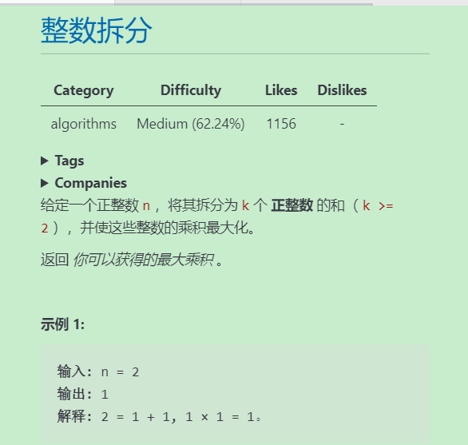
```C++
int integerBreak(int n) {
    vector<int> dp(n + 1);
    dp[2] = 1;
    for(int i = 3; i <= n; i++) {
        for(int j = 1; j < i; j++) {
            dp[i] = max(dp[i], max(j * dp[i - j], j * (i - j)));
        }
    }
    return dp[n];
}
```
## 96.不同的二叉搜索树（基础题目最后一道）
**其中dp[i]的定义是从1到i作为头节点可组成的二叉搜索树的总数。** 也可以理解是i个不同元素节点组成的二叉搜索树的个数为dp[i] ，都是一样的。 
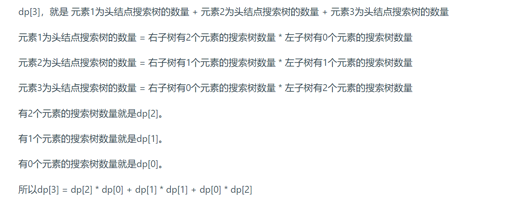
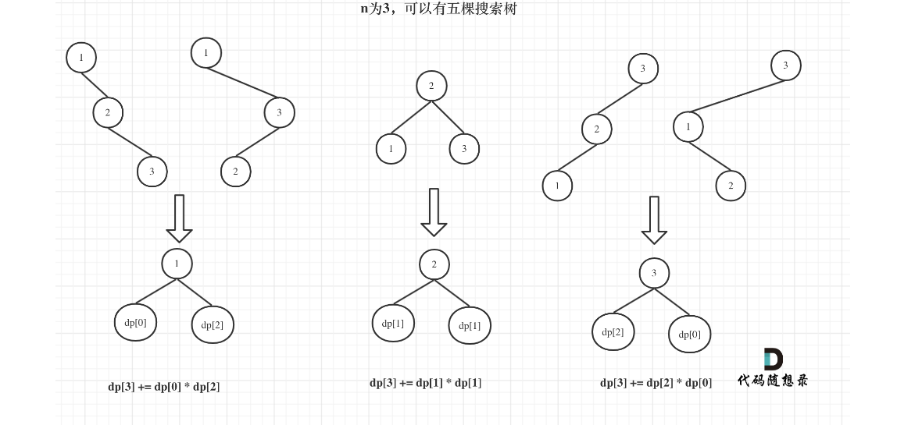

```C++
/*
例如i = 3；dp[3] = dp[0]*dp[2] + dp[1]*dp[1] + dp[2]*dp[0];

*/
int numTrees(int n) {
    vector<int> dp(n + 1);
    dp[0] = 1;
    for(int i = 1; i <= n; i++) {
        for(int j = 1; j <= i; j++) {
            dp[i] += dp[j - 1] * dp[i - j];
        }
    }
    return dp[n];
}
```
# **背包问题**
## **0-1背包理论基础**
### **背包问题之间关系图**
**深刻理解0-1背包问题、完全背包问题就足够。**
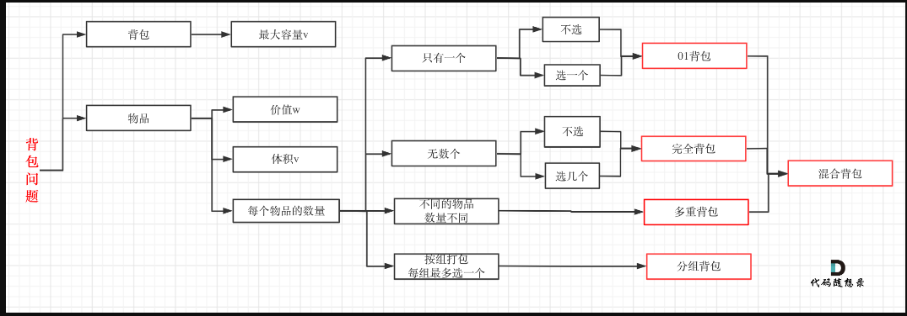
### **0-1背包**
什么是0-1背包？\
有n件物品和一个最多能背重量为w 的背包。第i件物品的重量是weight[i]，得到的价值是value[i] 。每件物品只能用一次，求解将哪些物品装入背包里物品价值总和最大。例如：
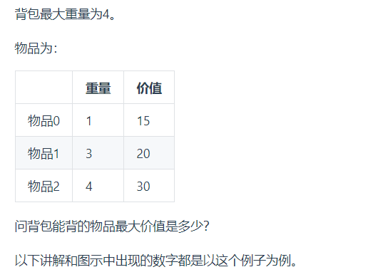

### **二维dp数组**
从动态规划五部曲出发：\
**1. 确定dp数组以及下标含义：** 

**dp[i][j]表示从下标为[0 - i]的物品里任意选取，放进容量为j的背包，价值总和最大是多少？**

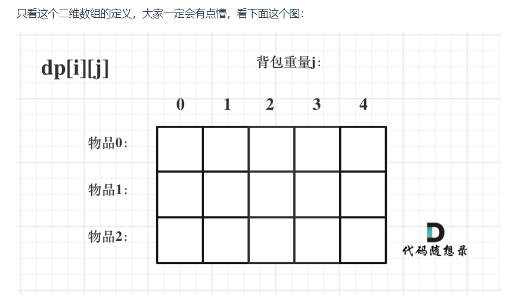

**2. 确定递推公式：** 
- 由dp[i - 1][j]推出，即背包容量为j，里面不放物品i的最大价值，此时dp[i][j]就是dp[i - 1][j]。(其实就是当物品i的重量大于背包j的重量时，物品i无法放进背包中，所以背包内的价值依然和前面相同。)
- 由dp[i - 1][j - weight[i]]推出，dp[i - 1][j - weight[i]] 为背包容量为j - weight[i]的时候不放物品i的最大价值，那么dp[i - 1][j - weight[i]] + value[i] （物品i的价值），就是背包放物品i得到的最大价值
  
所以递推公式为：
```bash
dp[i][j] = max(dp[i - 1][j], dp[i - 1][j - weight[i]] + value[i]);
```
**对于公式中后半部分的理解:** 

**当i放进去时，那么这时候整个物品集就被分成两部分，1到i-1和第i，而这时i是确定要放进去的，那么就把j空间里的weight[i]大小的空间给占据了，只剩下j-weight[i]的空间留给前面i-1，那么只要这时候前面i-1在j-weight[i]空间里构造出最大价值，即dp[i-1][j-weight[i]] ，再加上此时放入的i的价值value[i]，就是dp[i][j]了。**

**3. dp数组初始化：** 

从dp[i][j]的定义出发，如果背包容量j为0的话，即dp[i][0]，无论是选取哪些物品，背包价值总和一定为0。如图：
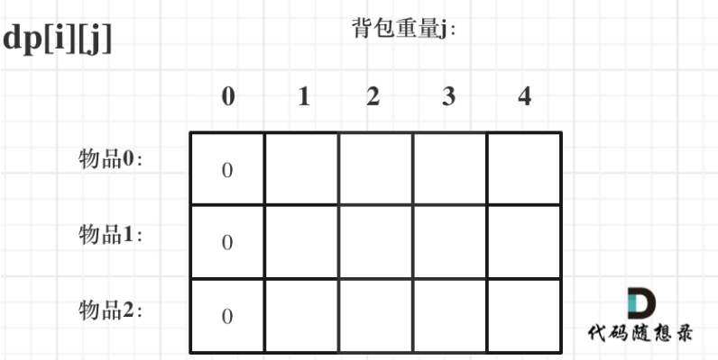

再看dp[0][j]，即：i为0，存放编号0的物品的时候，各个容量的背包所能存放的最大价值。那么很明显当 j < weight[0]的时候，dp[0][j] 应该是 0，因为背包容量比编号0的物品重量还小。当j >= weight[0]时，dp[0][j] 应该是value[0]，因为背包容量放足够放编号0物品。
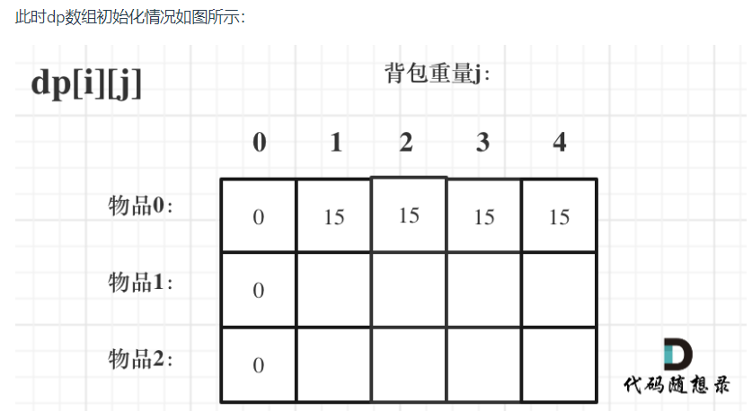

其它位置初始为什么值都可以，因为dp[i][j]是由左上方数值推导出来的，最后都会被覆盖。只不过统一初始化为0，更方便一些。
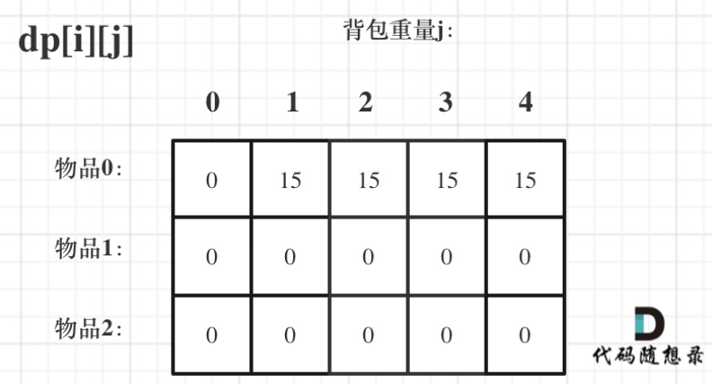

**4. 确定遍历顺序：** 

先遍历物品还是先遍历背包都是可以的。先遍历物品，然后遍历背包重量的代码如下：
```C++
// weight数组的大小 就是物品个数
for(int i = 1; i < weight.size(); i++) { // 遍历物品
    for(int j = 0; j <= bagweight; j++) { // 遍历背包容量
        if (j < weight[i]) dp[i][j] = dp[i - 1][j];
        else dp[i][j] = max(dp[i - 1][j], dp[i - 1][j - weight[i]] + value[i]);

    }
}
```
先遍历背包，再遍历物品：
```C++
// weight数组的大小 就是物品个数
for(int j = 0; j <= bagweight; j++) { // 遍历背包容量
    for(int i = 1; i < weight.size(); i++) { // 遍历物品
        if (j < weight[i]) dp[i][j] = dp[i - 1][j];
        else dp[i][j] = max(dp[i - 1][j], dp[i - 1][j - weight[i]] + value[i]);
    }
}
```

**4. 举例推导dp数组：** 
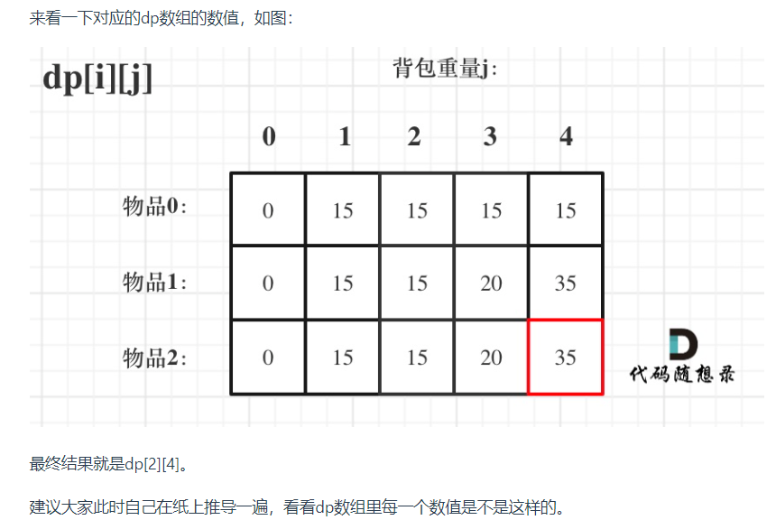

**完整C++代码如下：**
```C++
#include <iostream>
#include <vector>
using namespace std;

void fun(){
    vector<int> weight{1,3,4};
    vector<int> value{15,20,30};
    int bagweight=4;

    //初始化dp数组
    vector<vector<int>> dp(weight.size(),vector<int>(bagweight+1,0));

    //dp数组赋值
    for(int j=weight[0]; j<=bagweight; j++){
        dp[0][j]=value[0];
    }

    //遍历
    //先遍历物品 再遍历背包
    for(int i=1; i<weight.size(); i++){
        for(int j=0; j<=bagweight; j++){
            if(j<weight[i]){
                dp[i][j]=dp[i-1][j];
            }
            else{
                dp[i][j]=max(dp[i-1][j],dp[i-1][j-weight[i]]+value[i]);
            }
        }
    }
    cout<<dp[weight.size()-1][bagweight];

}

int main(){
    fun();
    getchar();
    return 0;
}
```

### **一维dp数组（滚动数组）**
从动态规划五部曲出发：\
**1. 确定dp数组的定义：** 

**在一维dp数组中，dp[j]表示：容量为j的背包，所背的物品价值可以最大为dp[j]。**

**2. 一维dp数组的递推公式：** 

dp[j]可以通过dp[j - weight[i]]推导出来，dp[j - weight[i]]表示容量为j - weight[i]的背包所背的最大价值。

dp[j - weight[i]] + value[i] 表示 容量为 j - 物品i重量 的背包 加上 物品i的价值。（也就是容量为j的背包，放入物品i了之后的价值即：dp[j]）

此时dp[j]有两个选择，一个是取自己dp[j] 相当于 二维dp数组中的dp[i-1][j]，即不放物品i，一个是取dp[j - weight[i]] + value[i]，即放物品i，指定是取最大的，毕竟是求最大价值

所以递推公式：
```bash
dp[j] = max(dp[j], dp[j - weight[i]] + value[i]);
```

**3. 一维dp数组如何初始化：** 

dp[j]表示：容量为j的背包，所背的物品价值可以最大为dp[j]，那么dp[0]就应该是0，因为背包容量为0所背的物品的最大价值就是0。

那么dp数组除了下标0的位置，初始为0，其他下标应该初始化多少呢？

看一下递归公式：dp[j] = max(dp[j], dp[j - weight[i]] + value[i]);

dp数组在推导的时候一定是取价值最大的数，如果题目给的价值都是正整数那么非0下标都初始化为0就可以了。

**这样才能让dp数组在递归公式的过程中取的最大的价值，而不是被初始值覆盖了。**

那么我假设物品价值都是大于0的，所以dp数组初始化的时候，都初始为0就可以了。

**4. 一维dp数组遍历顺序：** 

代码如下：
```C++
/*
背包倒序遍历，是为了保证物品i只被放入一次
并且一定是先遍历物品，再遍历背包
因为一维dp的写法，背包容量一定是要倒序遍历（原因上面已经讲了），如果遍历背包容量放在上一层，那么每个dp[j]就只会放入一个物品，即：背包里只放入了一个物品。
*/
for(int i = 0; i < weight.size(); i++) { // 遍历物品
    for(int j = bagWeight; j >= weight[i]; j--) { // 遍历背包容量
        dp[j] = max(dp[j], dp[j - weight[i]] + value[i]);

    }
}
```
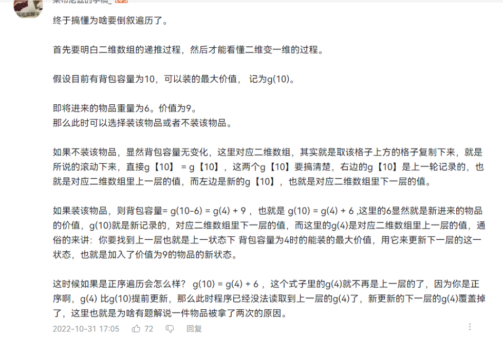
**5. 举例推导dp数组：** 
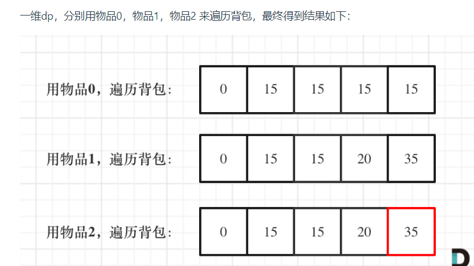

**一维dp01背包完整C++测试代码**
```C++
#include <iostream>
#include <vector>
using namespace std;

void fun(){
    vector<int> weight{1,3,4};
    vector<int> value{15,20,30};
    int bagweight=4;

    //初始化dp数组
    vector<int> dp(bagweight+1,0);

    //遍历dp数组
    //先物品后背包 从后往前倒叙遍历
    for(int i=0; i<weight.size(); i++){
        for(int j=bagweight; j>=weight[i]; j--){
            dp[j]=max(dp[j],dp[j-weight[i]]+value[i]);
        }
    }

    cout<<dp[bagweight]<<endl;
}

int main(){
    fun();
    getchar();
    return 0;
}
```

## **0-1背包问题相关题目**
416.分割等和子集
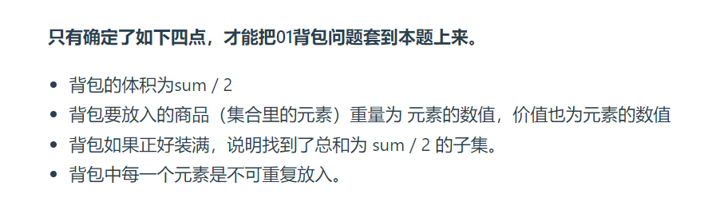
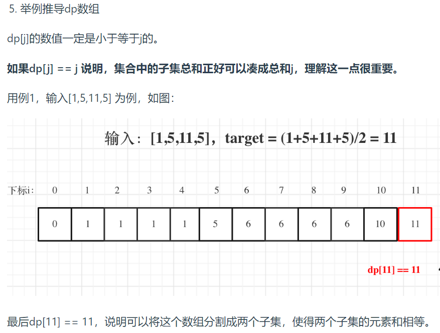
```C++
/*
可用一维dp背包问题来套用本题
递推公式：
dp[j] = max(dp[j], dp[j - nums[i]] + nums[i]);
dp[j]表示 背包总容量（所能装的总重量）是j，
放进物品后，背的最大重量为dp[j]。
*/

bool canPartition(vector<int>& nums) {
    //数组大小200，最大元素100 所以200*100得一半取10000
    /*
    dp[j]表示 背包总容量（所能装的总重量）是j，
    放进物品后，背的最大重量为dp[j]。
    */

    vector<int> dp(10001, 0);

    int sum = 0;
    for(auto i: nums) {
        sum += i;
    }

    if(sum % 2 == 1) {
        return false;
    }

    int target = sum / 2;
    //先遍历物品再遍历背包 
    for(int i = 0; i < nums.size(); i++) {
        //元素不可重复放入 从大到小倒序遍历背包
        for(int j = target; j >= nums[i]; j--) {
            dp[j] = max(dp[j], dp[j - nums[i]] + nums[i]);
        }
    }

    if(dp[target] == target) {
        return true;
    }

    return false;
}
```

1049.最后一块石头得重量ii
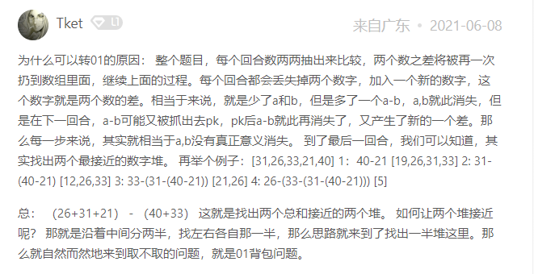
```C++
    int lastStoneWeightII(vector<int>& stones) {
        //容量为j的背包，可以装的最大重量为dp[j]
        vector<int> dp(1501, 0);
        int sum = 0;
        for(auto i: stones) {
            sum += i;
        }
        int target = sum / 2; //向下取整
        for(int i = 0; i < stones.size(); i++) {
            for(int j = target; j >= stones[i]; j--) {
                dp[j] = max(dp[j], dp[j - stones[i]] + stones[i]);
            }
        }
        //相撞之后剩下的重量
        /*
        最后dp[target]里是容量为target的背包所能背的最大重量。那么分成两堆石头，一堆石头的总重量是dp[target]，另一堆就是sum - dp[target]。
        */
        return sum - dp[target] - dp[target];

    }
```
49.目标和(好题)\
本题为leetcode中等难度，但我看了题解之后，觉得这种答案我是完全不会想出来，自己还是太菜了，本题要在一组数中每个数前添上加号或者负号，最后相加，使其等于所给的target。按照题解，我们可以将其中添加加号的一组数，命为left；要添加负号的一组数命名为right，则有left+right=sum，left-right=target，其中target和sum是固定的，则可以推出left=(target+sum)/2，则可以转换成dp来解决。二维dp[i][j]的意义则为，从下标0-i的编号任意挑选物品，填满重量为j的背包有多少种组合，其中初始化dp[0][0]=1，其它则为0，二维dp解决此问题代码如下：
```C++
int findTargetSumWays(vector<int>& nums, int target) {
    /*
    left + right = sum;
    left - right = target
    left = (sum + target) / 2;
    dp[j]:装满容量为j的背包，有多少种组合。套用本题即
    累加和为left，有多少种组合
    */
    int sum = 0;
    for(auto i: nums) {
        sum += i;
    }
    if(abs(target) > sum) return 0;
    //和为奇数实现不了
    if((sum + target) % 2 == 1) return 0;
    int begweight = (sum + target) / 2;
    vector<int> dp(begweight + 1, 0);
    dp[0] = 1;
    for(int i = 0; i < nums.size(); i++) {
        for(int j = begweight; j >= nums[i]; j--) {
            dp[j] += dp[j - nums[i]];
            //二维dp：dp[i][j]=dp[i-1][j]+dp[i-1][j-nums[i-1]];
        }
    }
    return dp[begweight];
}
```
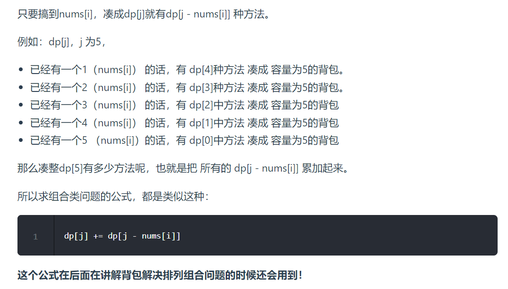

474.一和零 

代码如下：
```C++
    //有两个容量m和n 正常可用三维dp数组计算
    //但dp[i][][]的值和d[i-1][][]有关 则可以降维到二维dp[][]计算，即
    //滚动数组 二维dp[i][j]的含义是：最多有i个0和j个1的strs的最大子集的大小。。
int findMaxForm(vector<string>& strs, int m, int n) {
    //遍历物品
    //dp[i][j]:最多有i个0和j个1的strs的最大子集的大小为dp[i][j]。
    vector<vector<int>> dp(m + 1, vector<int>(n + 1, 0));
    for(string str: strs) {
        int zero = 0;
        int one = 0;
        for(char c: str) {
            if(c == '1') {
                one++;
            }
            else {
                zero++;
            }
        }
        //遍历背包 二维度背包 倒序遍历
        for(int i = m; i >= zero; i--) {
            for(int j = n; j >= one; j--) {
                dp[i][j] = max(dp[i][j], dp[i - zero][j - one] + 1);
            }
        }
    }

    return dp[m][n];
}
```
```C++
dp[i][j] = max(dp[i][j], dp[i - zero][j - one] + 1)就相当于01背包问题dp[i][j] = max(dp[i - 1][j], dp[i - 1][j - weight[i]] + value[i]),其中的zero和one相当于weight[i], +1就相当于加value[i]。
```
## **0-1背包问题相关题目总结**
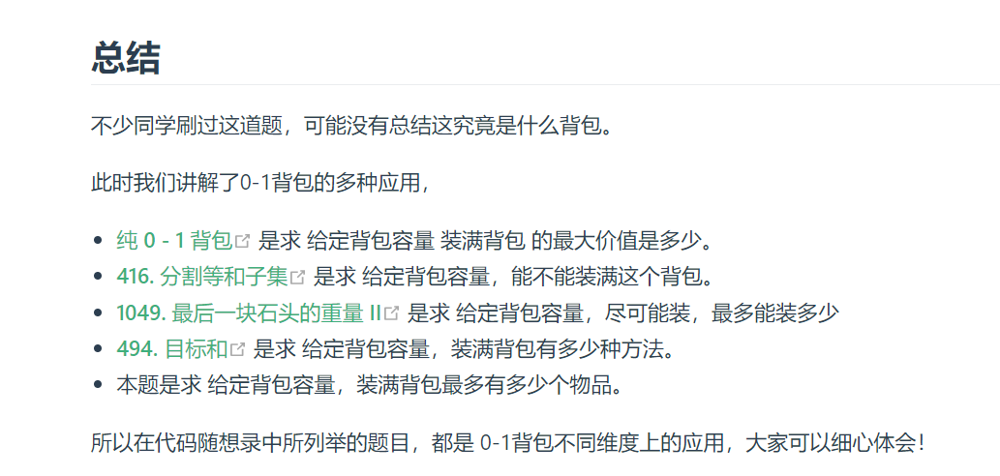

## **完全背包理论基础**
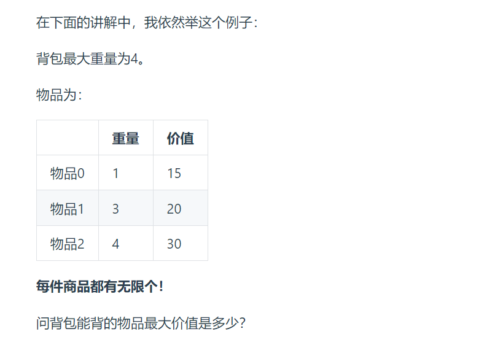

**遍历顺序**

先遍历物品，再遍历背包；先遍历背包，再遍历物品都是可以的。
内层也不用倒序了，因为一个物品可以重复添加了。

先遍历物品，再遍历背包：
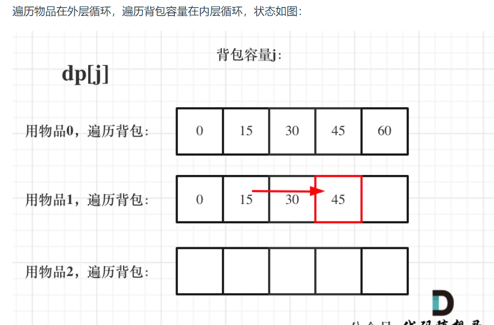
```C++
// 先遍历物品，再遍历背包
for(int i = 0; i < weight.size(); i++) { // 遍历物品
    for(int j = weight[i]; j <= bagWeight ; j++) { // 遍历背包容量
        dp[j] = max(dp[j], dp[j - weight[i]] + value[i]);

    }
}
```

先遍历背包，再遍历物品：
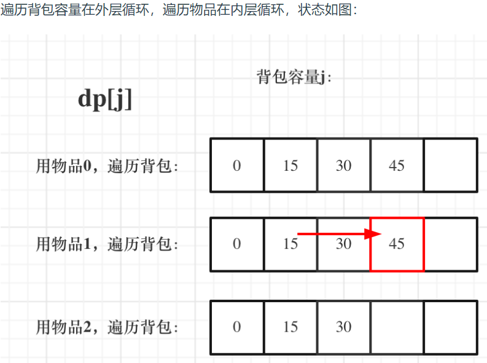
```C++
// 先遍历背包，再遍历物品
for(int j = 0; j <= bagWeight; j++) { // 遍历背包容量
    for(int i = 0; i < weight.size(); i++) { // 遍历物品
        if (j - weight[i] >= 0) dp[j] = max(dp[j], dp[j - weight[i]] + value[i]);
    }
    cout << endl;
}
```


**一维完全背包完整C++测试代码**
```C++
#include <iostream>
#include <vector>
using namespace std;

void completebag(){
    vector<int> weight{1,3,4};
    vector<int> value{15,20,30};
    int bagweight=4;

    //一维滚动数组，定义dp及初始化;
    vector<int> dp(bagweight+1,0);

    //遍历 先物品 后背包
    for(int i=0; i<weight.size(); i++){
        //内层不用倒叙了，因为一个物品可以重复添加
        for(int j=weight[i];j<=bagweight; j++){
            dp[j]=max(dp[j],dp[j-weight[i]]+value[i]);
        }
    }
    
    cout<<dp[bagweight]<<endl; //60 装15 15 30 正好重量为4

}

int main(){

    completebag();
    getchar();
    return 0;
}
```
## **完全背包问题相关题目**
518.零钱兑换-ii

本题可套用完全背包代码，但是只能先遍历物品，再遍历背包。本题要求凑成总和的组合数，元素之间明确要求没有顺序

因为先遍历背包，再遍历物品的话，算出来的就是排列数，{1，5}和{5,1}会被当做两种情况，与题目要求的组合数不符。
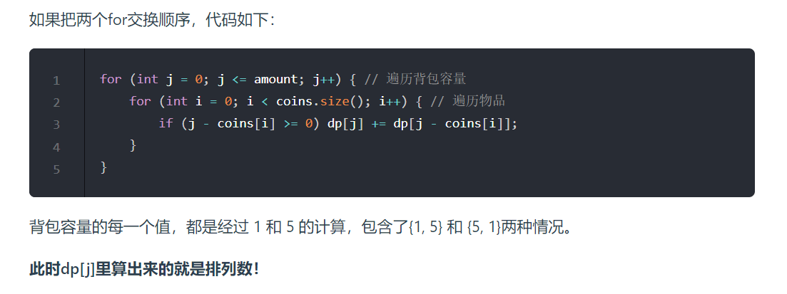
```C++
int change(int amount, vector<int>& coins) {
    //if(coins.size() == 1 && coins[0] < amount) return 0;
    //dp[j]装满j，有几种组合方式
    vector<int> dp(amount + 1, 0);
    dp[0] = 1;
    for(int i = 0; i < coins.size(); i++) {
        for(int j = coins[i]; j <= amount; j++) {
            dp[j] += dp[j - coins[i]];
            /*  
                二维：dp[i][j] = dp[i - 1][j] + dp[i - 1][j - coins[i]]
                一维展开：dp[j] = dp[j] + dp[j - coins[i]];
                等式右边dp[j] : 表示 i 不放 的组合数
                等式右边dp[j - coins[i]] : 放i 能组成金额j的组合数
            */
        }
    }
    return dp[amount];
}
```

377.组合总和4

本题就是求排列数，所以要先遍历背包，再遍历物品，这样{1，3}和{3，1}

这种，才会被算做两个集合。如果先遍历物品，再遍历背包的话，就不会出现

{3，1}这种情况，因为物品3只能出现再1后面。

```C++
int combinationSum4(vector<int>& nums, int target) {
    vector<int> dp(target + 1, 0);
    dp[0] = 1;

    for(int j = 0; j <= target; j++) {
        for(int i = 0; i < nums.size(); i++) {
            //C++后台测试用例两个dp和会超过INTMAX 所以要加限制
            if(j >= nums[i] && dp[j] < INT_MAX - dp[j - nums[i]]) {
                dp[j] += dp[j - nums[i]];
            }
        }
    }

    return dp[target];
}
```

322.零钱兑换

**如果求组合数就是外层for循环遍历物品，内层for遍历背包。**

**如果求排列数就是外层for遍历背包，内层for循环遍历物品。**

此题遍历顺序随便

```C++
int coinChange(vector<int>& coins, int amount) {
    /*
    凑足总额为j - coins[i]的最少个数为dp[j - coins[i]]，那么只需
    要加上一个钱币coins[i]即dp[j - coins[i]] + 1就是dp[j]（考虑coins[i]）
    所以dp[j] 要取所有 dp[j - coins[i]] + 1 中最小的。
    */
    //dp[j]:凑成金额j所需要的最少的硬币个数；
    vector<int> dp(amount + 1, INT_MAX);
    dp[0] = 0;
    for(int i = 0; i < coins.size(); i++) {
        for(int j = coins[i]; j <= amount; j++) {
            //如果dp[j-coins[i]]等于初始值则跳过
            if(dp[j - coins[i]] != INT_MAX) {
                dp[j] = min(dp[j], dp[j - coins[i]] + 1);
            }     
        }
    }
    if(dp[amount] == INT_MAX) return -1;
    return dp[amount];
}

```

279.完全平方数
```C++
class Solution {
public:
/*
我来把题目翻译一下：完全平方数就是物品（可以无限件使用），
凑个正整数n就是背包，问凑满这个背包最少有多少物品？

dp[j] 可以由dp[j - i * i]推出， dp[j - i * i] + 1 便可以凑成dp[j]。
此时我们要选择最小的dp[j]，所以递推公式：dp[j] = min(dp[j - i * i] + 1, dp[j]);
*/
    int numSquares(int n) {
        //dp[j] : 组成和为j的完全平方数的最小数量为dp[j]
        vector<int> dp(n + 1, INT_MAX);
        dp[0] = 0;
        //先遍历物品 再遍历背包

        for(int i = 1; i * i <= n; i++) {
            for(int j = i * i; j <= n; j++) {
                dp[j] = min(dp[j], dp[j - i * i] + 1);
            }
        }

        return dp[n];
    
    }
};
```

139.单词拆分 

如果dp[j] = true, 并且j到i之间(i > j)的单词在字典中出现过，那么dp[i]一定也为true。所以dp[i]可以由dp[j]推导出来。初始化时dp[0]应为true，若为false的话，后序dp值均为false。

并且本题也只能先遍历背包，再遍历物品，是一道排列问题。

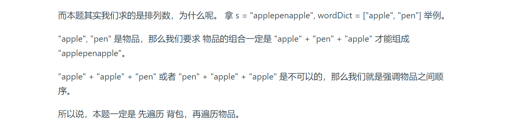
```C++
class Solution {
public:
/*
    dp[i] : 字符串长度为i的话，dp[i]为true，
    表示可以拆分为一个或多个在字典中出现的单词。
*/
    bool wordBreak(string s, vector<string>& wordDict) {
        unordered_set<string> uset(wordDict.begin(),wordDict.end());
        vector<bool> dp(s.size() + 1, false);
        dp[0] = true;
        //先遍历背包再遍历物品
        //物品
        for(int i = 0; i <= s.size(); i++) {
            //背包
            for(int j = 0; j < i; j++) {
                string word = s.substr(j, i - j);
                if(uset.find(word) != uset.end() && dp[j] == true) {
                    dp[i] = true;
                }
            }
        }

        return dp[s.size()];
    }
};
```

## **多重背包理论基础（了解即可）**
有N种物品和一个容量为V 的背包。第i种物品最多有Mi件可用，每件耗费的空间是Ci ，价值是Wi 。求解将哪些物品装入背包可使这些物品的耗费的空间 总和不超过背包容量，且价值总和最大。

多重背包和01背包是非常像的， 为什么和01背包像呢？

每件物品最多有Mi件可用，把Mi件摊开，其实就是一个01背包问题了。
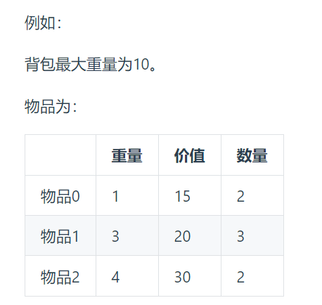
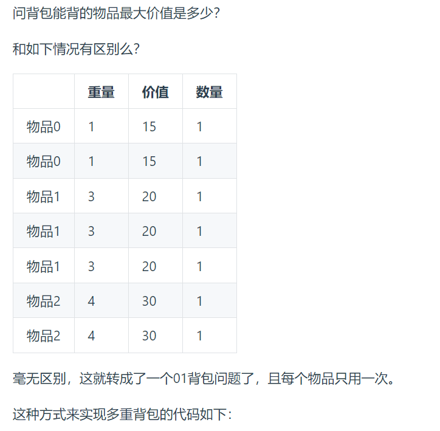

**代码如下：**
```C++
void test_multi_pack() {
    vector<int> weight = {1, 3, 4};
    vector<int> value = {15, 20, 30};
    vector<int> nums = {2, 3, 2};
    int bagWeight = 10;
    for (int i = 0; i < nums.size(); i++) {
        while (nums[i] > 1) { // nums[i]保留到1，把其他物品都展开
            weight.push_back(weight[i]);
            value.push_back(value[i]);
            nums[i]--;
        }
    }

    vector<int> dp(bagWeight + 1, 0);
    for(int i = 0; i < weight.size(); i++) { // 遍历物品
        for(int j = bagWeight; j >= weight[i]; j--) { // 遍历背包容量
            dp[j] = max(dp[j], dp[j - weight[i]] + value[i]);
        }
        for (int j = 0; j <= bagWeight; j++) {
            cout << dp[j] << " ";
        }
        cout << endl;
    }
    cout << dp[bagWeight] << endl;

}
int main() {
    test_multi_pack();
}
```

## **背包问题总结**

### **背包递推公式**

问能否能装满背包（或者最多装多少）：dp[j] = max(dp[j], dp[j - nums[i]] + nums[i]); ，对应题目如下：

- 动态规划：416.分割等和子集
- 动态规划：1049.最后一块石头的重量 II

问装满背包有几种方法：dp[j] += dp[j - nums[i]] ，对应题目如下：
- 动态规划：494.目标和
- 动态规划：518. 零钱兑换2
- 动态规划：377.组合总和4
- 动态规划：70. 爬楼梯进阶版（完全背包）

问背包装满最大价值：dp[j] = max(dp[j], dp[j - weight[i]] + value[i]); ，对应题目如下：
- 动态规划：474.一和零

问装满背包所有物品的最小个数：dp[j] = min(dp[j - coins[i]] + 1, dp[j]); ，对应题目如下：
- 动态规划：322.零钱兑换
- 动态规划：279.完全平方数

### **遍历顺序**

**01背包**

二维dp数组01背包先遍历物品还是先遍历背包都是可以的，且第二层for循环是从小到大遍历。

一维dp数组01背包只能先遍历物品再遍历背包容量，且第二层for循环是从大到小遍历。

**完全背包**

纯完全背包的一维dp数组实现，先遍历物品还是先遍历背包都是可以的，且第二层for循环是从小到大遍历。

但是仅仅是纯完全背包的遍历顺序是这样的，题目稍有变化，两个for循环的先后顺序就不一样了。

**如果求组合数就是外层for循环遍历物品，内层for遍历背包。**

**如果求排列数就是外层for遍历背包，内层for循环遍历物品。**

相关题目如下：

- 求组合数：518.零钱兑换II
- 求排列数：377. 组合总和 Ⅳ、70. 爬楼梯进阶版（完全背包）

如果求最小数，那么两层for循环的先后顺序就无所谓了，相关题目如下：
- 求最小数：322. 零钱兑换 、279.完全平方数
  

对于背包问题，其实递推公式算是容易的，难是难在遍历顺序上，如果把遍历顺序搞透，才算是真正理解了。

# **打家劫舍**
198.打家劫舍(房屋排成一排)

决定dp[i]的因素就是第i房间偷还是不偷。

如果偷第i房间，那么dp[i] = dp[i - 2] + nums[i] ，即：第i-1房一定是不考虑的，找出 下标i-2（包括i-2）以内的房屋，最多可以偷窃的金额为dp[i-2] 加上第i房间偷到的钱。

如果不偷第i房间，那么dp[i] = dp[i - 1]，即考虑i-1房，**（注意这里是考虑，并不是一定要偷i-1房，这是很多同学容易混淆的点）**

然后dp[i]取最大值，即dp[i] = max(dp[i - 2] + nums[i], dp[i - 1]);
```C++
class Solution {
public:
    /*
    dp[i]：考虑下标i（包括i）
    以内的房屋，最多可以偷窃的金额为dp[i]。
    */
    int rob(vector<int>& nums) {
        if(nums.size() == 1) {
            return nums[0];
        }

        vector<int> dp(nums.size());
        //初始化
        dp[0] = nums[0];
        dp[1] = max(nums[0], nums[1]);

        for(int i = 2; i < nums.size(); i++) {
            dp[i] = max(dp[i - 1], dp[i - 2] + nums[i]);
        }

        return dp[nums.size() - 1];
    }
};
```

213.打家劫舍-ii(房屋排成一圈)

对于一个数组成环的话，有三种情况，例如{1,6,1,9,1}：
- 情况1：考虑不包含首尾
- 情况2：考虑含首不含尾
- 情况3：考虑含尾不含首

注意这里用的词是**考虑**，例如情况3，不一定就会去偷最后一个位置。同时情况2和情况3，也包括了情况1。

```C++
class Solution {
public:
    int rob(vector<int>& nums) {
        if(nums.size() == 1) return nums[0];
        //含首不含尾
        int res1 = steel(nums, 0, nums.size() - 2); 
        //含尾不含首
        int res2 = steel(nums, 1, nums.size() - 1);
        return max(res1, res2);
        
    }

    int steel(vector<int>& nums, int start, int end) {
        if(end == start) return nums[start];
        vector<int> dp(nums.size());
        dp[start] = nums[start];
        dp[start + 1] = max(nums[start], nums[start + 1]);

        for(int i = start + 2; i <= end; i++) {
            dp[i] = max(dp[i - 1], dp[i - 2] + nums[i]);
        }

        return dp[end];
    }
};
```

337. 打家劫舍-iii（树形dp入门题）

如果是偷当前节点，那么左右孩子就不能偷，val1 = cur->val + left[0] + right[0]; （如果对下标含义不理解就再回顾一下dp数组的含义）

如果不偷当前节点，那么左右孩子就可以偷，至于到底偷不偷一定是选一个最大的，所以：val2 = max(left[0], left[1]) + max(right[0], right[1]);

最后当前节点的状态就是{val2, val1}; 即：{不偷当前节点得到的最大金钱，偷当前节点得到的最大金钱
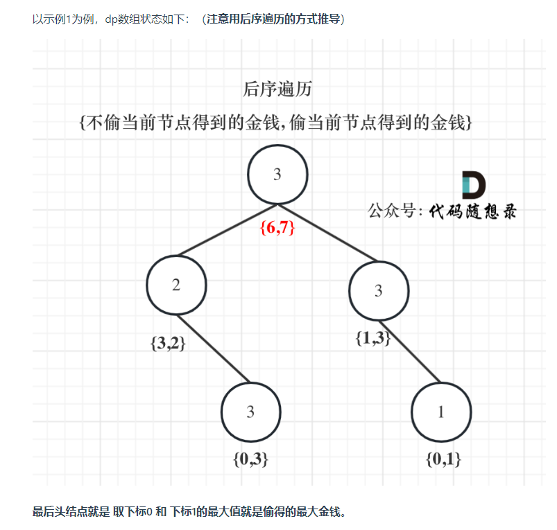
```C++
class Solution {
public:
    // struct TreeNode {
    //     int val;
    //     TreeNode* left;
    //     TreeNode* right;
    //     TreeNode() : val(0), left(nullptr), right(nullptr) {};
    //     TreeNode(int x) : val(x), left(nullptr), right(nullptr) {};

    // };
    /*
    所以dp数组（dp table）以及下标的含义：
    下标为0记录不偷该节点所得到的的最大金钱，
    下标为1记录偷该节点所得到的的最大金钱。

    所以本题dp数组就是一个长度为2的数组！
    */
    //后序遍历   0：不偷  1：偷
    vector<int> robtree(TreeNode* root) {
        if(root == nullptr) {
            return {0, 0};
        }

        vector<int> left = robtree(root->left);
        vector<int> right = robtree(root->right);

        //偷该节点
        int val1 = root->val + left[0] + right[0];

        //不偷该节点
        int val2 = max(left[0], left[1]) + max(right[0], right[1]);
        
        return {val2, val1};
    }

    int rob(TreeNode* root) {
        vector<int> res = robtree(root);
        return max(res[0], res[1]);
    }
};
```

# **股票问题**

**121.买卖股票的最佳时机（只能买卖一次）**

**可贪心、也可动态规划：**

动态规划代码如下：

因为股票全程只能买卖一次，所以如果买入股票，那么第i天持有股票即dp[i][0]一定就是 -prices[i]。

dp数组初始化：

dp[0][0]表示第0天持有股票，此时的持有股票就一定是买入股票了，因为不可能有前一天推出来，所以dp[0][0] -= prices[0];

dp[0][1]表示第0天不持有股票，不持有股票那么现金就是0，所以dp[0][1] = 0;
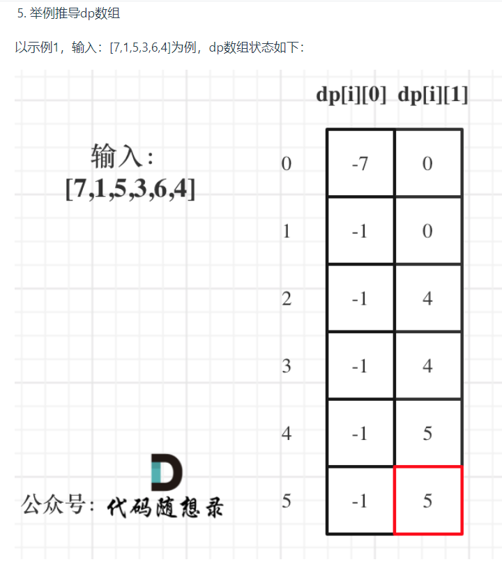
```C++
class Solution {
public:
//可贪心可动规
int maxProfit(vector<int>& prices) {
    //dp[i][0]:第i天持有股票所得的最大现金数 (持有，考虑买入)
    //dp[i][1]:第i天不持有股票所得的最大现金数 （不持有，考虑卖出）
    //持有 不等于 当天买入 也有可能是昨天买入的 今天保持持有状态
    int len = prices.size();
    if(len == 0) return 0;
    vector<vector<int>> dp(len, vector<int>(2));
    dp[0][0] = -prices[0];
    dp[0][1] = 0;

    for(int i = 1; i < len; i++) {
        //前一天买，今天买 都是负数 所以取max 看哪个花的少
        dp[i][0] = max(dp[i - 1][0], -prices[i]);
        dp[i][1] = max(dp[i - 1][1], dp[i - 1][0] + prices[i]);
    }

    //返回最后一天卖出，所持有的最多现金
    return dp[len - 1][1];
}
};
```
贪心：
```C++
//贪心
int maxProfit(vector<int>& prices) {
    //寻找最大利润区间， 左边最小和右边最大的值 做差
    int res = 0;
    int left = INT_MAX;
    for(int i = 0; i < prices.size(); i++) {
        left = min(left, prices[i]);
        res = max(res, prices[i] - left);
    }
    return res;
    
}
```

**122.买卖股票的最佳时机-ii（可以买卖多次）**
```C++
class Solution {
public:
    /*
    动规：与121.买卖股票的最佳时机，只在递推公式有一处不同,
    即dp[i][0] = dp[i - 1][1] - prices[i] 因为变成了可买卖多次了
    121是只允许买卖一次，因为股票全程只能买卖一次，所以如果买入股票，
    那么第i天持有股票即dp[i][0]一定就是 -prices[i]。
    */

    int maxProfit(vector<int>& prices) {
        int len = prices.size();
        if(len == 0) return 0;
        vector<vector<int>> dp(len, vector<int>(2));
        dp[0][0] = -prices[0];
        dp[0][1] = 0;
        //0:持有 1：不持有
        for(int i = 1; i < len; i++) {
            //与121唯一一处不同
            dp[i][0] = max(dp[i - 1][0], dp[i - 1][1] - prices[i]);
            dp[i][1] = max(dp[i - 1][1], dp[i - 1][0] + prices[i]);
        }
        return dp[len - 1][1];
    }
};
```
贪心：
```C++
//贪心
int maxProfit(vector<int>& prices) {
    int res = 0;

    for(int i = 1; i < prices.size(); i++) {
        //计算隔一天的利润 累加利润为正数的结果
        res += max(0, prices[i] - prices[i - 1]);
    }

    return res;
}
```

**买卖股票的最佳时机-iii（最多买卖两次）**
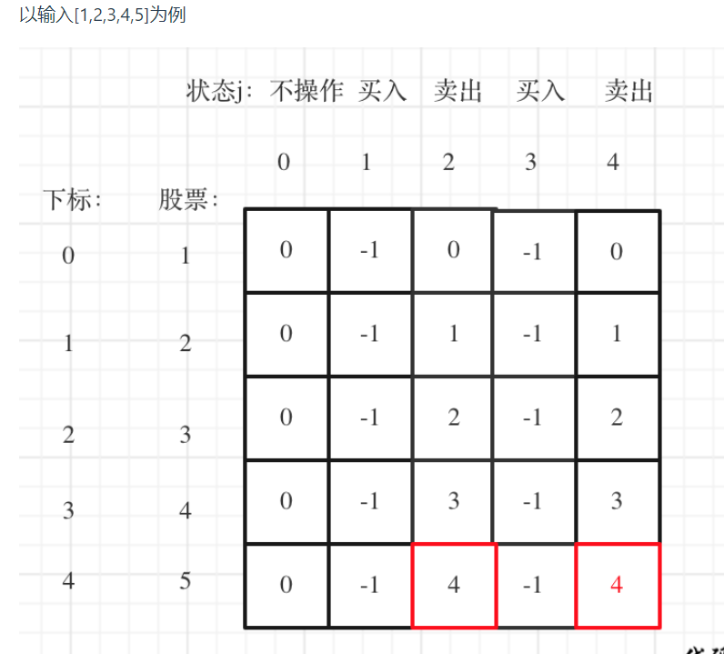
两个红框是卖出的状态，而两次卖出的状态现金最大一定是最后一次卖出。如果想不明白的录友也可以这么理解：如果第一次卖出已经是最大值了，那么我们可以在当天立刻买入再立刻卖出。所以dp[4][4]已经包含了dp[4][2]的情况。也就是说第二次卖出手里所剩的钱一定是最多的。

所以最终最大利润是dp[4][4]。
```C++
class Solution {
public:
/*
0.没有操作 （其实我们也可以不设置这个状态）
1.第一次持有股票
2.第一次不持有股票
3.第二次持有股票
4.第二次不持有股票

dp[i][j]中 i表示第i天，j为 [0 - 4] 五个状态，
dp[i][j]表示第i天状态j所剩最大现金。
*/
    int maxProfit(vector<int>& prices) {
        int len = prices.size();
        if(len == 0) return 0;
        vector<vector<int>> dp(len, vector<int>(5, 0));
        dp[0][1] = -prices[0];
        dp[0][3] = -prices[0];
        for(int i = 1; i < len; i++) {
            dp[i][0] = dp[i - 1][0]; //可省略不写
            dp[i][1] = max(dp[i - 1][1], dp[i - 1][0] - prices[i]);
            dp[i][2] = max(dp[i - 1][2], dp[i - 1][1] + prices[i]);
            dp[i][3] = max(dp[i - 1][3], dp[i - 1][2] - prices[i]);
            dp[i][4] = max(dp[i - 1][4], dp[i - 1][3] + prices[i]);
        }
        return dp[len - 1][4];
    }
};
```

**188.买卖股票的最佳时机-iv（最多买卖k次）**

上一题的进阶版, 注意for循环条件范围的书写。
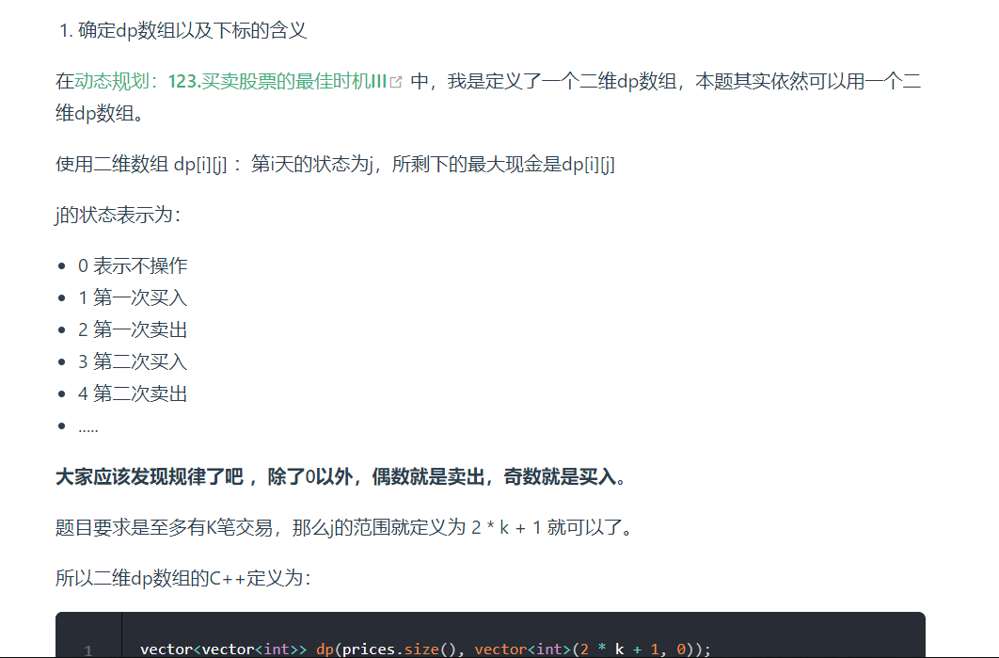

```C++
class Solution {
public:
/*
    上一题进阶版
    二维数组 dp[i][j] ：
    第i天的状态为j，所剩下的最大现金是dp[i][j]
    除0以外 j为奇数就是买入（持有） 偶数就是卖出（不持有）
*/
    int maxProfit(int k, vector<int>& prices) {
        int len = prices.size();
        if(len == 0) return 0;

        vector<vector<int>> dp(len, vector<int>(2 * k + 1, 0));

        //dp初始化
        for(int i = 1; i < 2 * k; i += 2) {
            dp[0][i] = -prices[0];
        }

        for(int i = 1; i < len; i++) {
            for(int j = 0; j < 2 * k - 1; j += 2) {
                //奇数买（持有）
                dp[i][j + 1] = max(dp[i - 1][j + 1], dp[i - 1][j] - prices[i]);
                
                //偶数卖(不持有)
                dp[i][j + 2] = max(dp[i - 1][j + 2], dp[i - 1][j + 1] + prices[i]);
            }
        }
        return dp[len - 1][2 * k];
    }
};
```

**最佳买卖股票时机含冷冻期（买卖多次，卖出有一天冷冻期）**

**达到买入股票状态(状态1)：**

(1)前一天就买入了股票\
(2)前一天是冷冻期\
(3)前一天是保持卖出状态（状态2）

**达到保持卖出股票状态(状态2)：**

(1)前一天就是卖出（状态2）\
(2)前一天是冷冻期

**达到今天就卖出状态（状态3）：**

(1)前一天一定是持有股票状态（状态1）

```C++
class Solution {
public:
/*
状态一dp[i][0]：持有股票状态（今天买入股票，或者是之前就买入了股票然后没有操作，一直持有）

不持有股票状态，这里就有两种卖出股票状态:
状态二dp[i][1]：保持卖出股票的状态（两天前就卖出了股票，度过一天冷冻期。或者是前一天就是卖出股票状态，一直没操作）
状态三dp[i][2]：今天卖出股票

状态四dp[i][3]：今天为冷冻期状态，但冷冻期状态不可持续，只有一天！
*/
    int maxProfit(vector<int>& prices) {
        int len = prices.size();
        if(len == 0) return 0;
        vector<vector<int>> dp(len, vector<int>(4, 0));
        dp[0][0] = -prices[0];

        for(int i = 1; i < prices.size(); i++) {
            dp[i][0] = max(dp[i - 1][0], max(dp[i - 1][1] - prices[i], dp[i - 1][3] - prices[i]));
            dp[i][1] = max(dp[i - 1][1], dp[i - 1][3]);
            dp[i][2] = dp[i - 1][0] + prices[i];
            //达到冷冻期状态，昨天卖出了股票
            dp[i][3] = dp[i - 1][2];
        }

        return max(dp[len - 1][3], max(dp[len - 1][2], dp[len - 1][1]));
    }
};
```

**714.买卖股票的最佳时机含手续费（买卖多次，每次有手续费）**

本题和**122.买卖股票的最佳时机-ii**基本相同，就是在卖出的时候多了一笔手续费

```C++
#include <vector>
using namespace std;

class Solution {
public:
    int maxProfit(vector<int>& prices, int fee) {
           
        int len = prices.size();
        if(len == 0) return 0;
        vector<vector<int>> dp(len, vector<int>(2));
        dp[0][0] = -(prices[0] + fee);
        //或者dp[0][0] = -price[0];
        dp[0][1] = 0;
        //0:持有 1：不持有
        for(int i = 1; i < len; i++) {
            dp[i][0] = max(dp[i - 1][0], dp[i - 1][1] - prices[i] - fee);
            dp[i][1] = max(dp[i - 1][1], dp[i - 1][0] + prices[i]);
            //或者 dp[i][1] = max(dp[i - 1][1], dp[i - 1][0] + prices[i] - fee);
        }
        return dp[len - 1][1];
    }
};
```

## **股票问题总结**
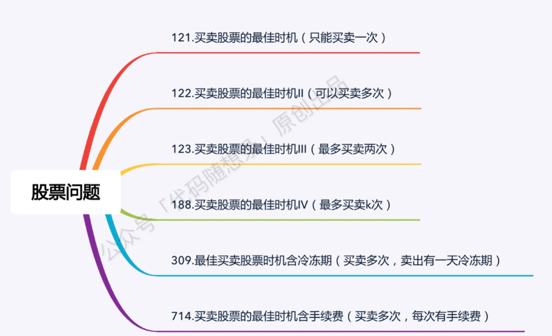

# **子序列问题**
## **子序列不连续**

300.最长递增(上升)子序列

```C++
class Solution {
public:
    //dp[i]表示i之前包括i的以nums[i]结尾的最长递增子序列的长度
    int lengthOfLIS(vector<int>& nums) {
        int len = nums.size();
        if(len == 0 || len == 1) return len;
        int res = 0;
        vector<int> dp(len, 1);

        for(int i = 1; i < len; i++) {
            for(int j = 0; j < i; j++) {
                if(nums[i] > nums[j]) {
                    /*
                        注意这里不是比较dp[i]和dp[j]+1
                        而是取dp[j]得最大值
                    */
                    dp[i] = max(dp[i], dp[j] + 1);
                }
            }
            if(dp[i] > res) res = dp[i];
        }
        return res;   
    }
};
```
1143.最长公共子序列
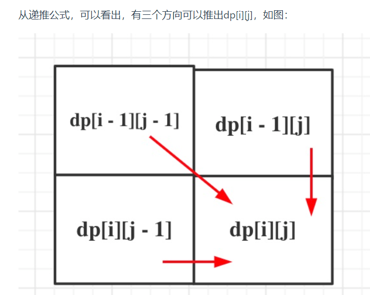
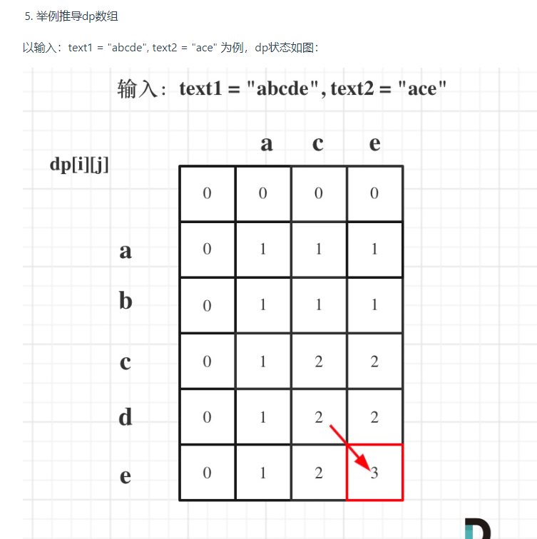
```C++
class Solution {
public:
    int longestCommonSubsequence(string text1, string text2) {
        /*
        dp[i][j]:长度为[0,i]的字符串text1和长度为[0,j]的字符串
        text2的最长公共子序列为dp[i][j]
        */
        int len1 = text1.size();
        int len2 = text2.size();
        vector<vector<int>> dp(len1, vector<int>(len2, 0));
    
        if(text1[0] == text2[0]) {
            dp[0][0] = 1;
        }
         //初始化第一行
        for(int i = 1; i < len2; i++) {
            if(text2[i] == text1[0]) {
                dp[0][i] = 1;
            }else {
                dp[0][i] = dp[0][i - 1];
            }
        }
        //初始化第一列
        for(int i = 1; i < len1; i++) {
            if(text1[i] == text2[0]) {
                dp[i][0] = 1;
            } else {
                dp[i][0] = dp[i - 1][0];
            }
        }

        for(int i = 1; i < len1; i++) {
            for(int j = 1; j < len2; j++) {
                if(text2[j] == text1[i]) {
                    dp[i][j] = dp[i - 1][j - 1] + 1;
                }
                else {
                    dp[i][j] = max(dp[i - 1][j], dp[i][j - 1]);
                }
            }
        }
        return dp[len1 - 1][len2 - 1];
    }
};
```

1035.不相交的线（题解和上题一样）

## **子序列连续**

674.最长连续递增序列

```C++
int findLengthOfLCIS(vector<int>& nums) {
    int len = nums.size();
    if(len <= 1) return len;
    vector<int> dp(len, 1);
    dp[0] = 1;
    int res = 0;
    for(int i = 1; i < len; i++) {
        if(nums[i] > nums[i - 1]) {
            dp[i] = dp[i - 1] + 1;
        }
        if(dp[i] > res) res = dp[i];
    }
    return res;
}
```

718.最长重复子数组（注意和1143的区别）

注意此题和1143.最长公共子序列的区别

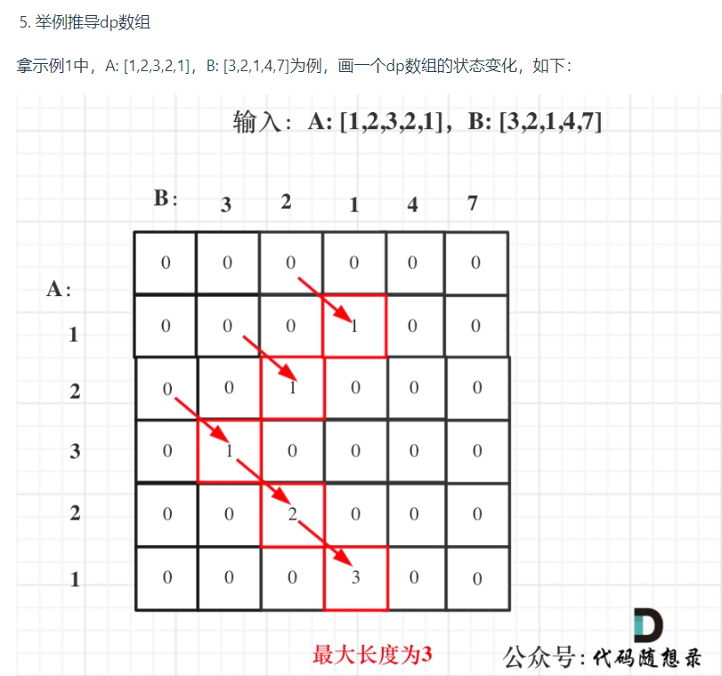

```C++
class Solution {
public:
/*
不要把此题和1143.最长公共子序列弄混。1143.的要求是子序列可以不连续。记住子序列默认不连续，子数组连续
dp[i][j] ：以下标i - 1为结尾的A，和以下标j - 1为结尾的B，最长重复子数组长度为dp[i][j]。 （特别注意： “以下标i - 1为结尾的A” 标明一定是 以A[i-1]为结尾的字符串 ）
下面代码是以下标i结尾的版本
*/
    int findLength(vector<int>& nums1, vector<int>& nums2) {
        int len1 = nums1.size();
        int len2 = nums2.size();
        vector<vector<int>> dp(len1, vector<int>(len2, 0));
        int res = 0;
        //初始化 
        for(int i = 0; i < len1; i++) {
            if(nums2[0] == nums1[i]) {
                dp[i][0] = 1;
                //这句不能少
                /*
                [1,2,3,2,8]
                [5,6,1,4,7]要不这种情况输出答案将为0，但是正确答案为1
                */
                res = max(res, dp[i][0]);
            }
        }
        //行
        for(int i = 0; i < len2; i++) {
            if(nums1[0] == nums2[i]) {
                dp[0][i] = 1;
                //这句不能少
                res = max(res, dp[0][i]);
            }
        }
        

        for(int i = 1; i < len1; i++) {
            for(int j = 1; j < len2; j++) {
                if(nums1[i] == nums2[j]) {
                    dp[i][j] = dp[i - 1][j- 1] + 1;
                }
                res = max(res, dp[i][j]);
            }
            
        }
        return res;
    }
};
```

53.最大子数组和（可贪心可动规）

```C++
int maxSubArray(vector<int>& nums) {
    int len = nums.size();
    if(len == 0) return 0;
    if(len == 1) return nums[0];
    vector<int> dp(len, 0);
    dp[0] = nums[0];
    int res = dp[0];
    //dp[i]：包括下标i（以nums[i]为结尾）的最大连续子序列和为dp[i]。
    for(int i = 1; i < len; i++) {
        dp[i] = max(dp[i - 1] + nums[i], nums[i]);
        if(dp[i] > res) res = dp[i];
    }
    return res;
}
```

## **编辑距离**

392.判断子序列（可以dp，可以双指针）

这个版本代码用例不能够全通过
```C++
 bool isSubsequence(string s, string t) {
        int len1 = s.size();
        int len2 = t.size();
        if(len1 == 0) return true;
        if(len1 > len2) return false;
        //dp[i][j]:表示以下标i为结尾的字符串s，
        //和以下标j为结尾的字符串t，相同子序列的长度为dp[i][j]。
        vector<vector<int>> dp(len1, vector<int>(len2, 0));
      
        //初始化列
        for(int i = 0; i < len1; i++) {
            if(s[i] == t[0]) dp[i][0] = 1;
        }
        //行
        for(int i = 1; i < len2; i++) {
            if(s[0] == t[i]) {
                dp[0][i] == 1;
            }
            else{
                dp[0][i] = dp[0][i - 1];
            }
        }
        for(int i = 0; i < dp.size(); i++) {
            for(int j = 0; j < dp[0].size(); j++) {
                cout << dp[i][j] <<" ";
            }
            cout << endl;
        }

        for(int i = 1; i < len1; i++) {
            for(int j = 1; j < len2; j++) {
                if(s[i] == t[j]) {
                    dp[i][j] = dp[i - 1][j - 1] + 1;
                }
                else {
                    dp[i][j] = dp[i][j - 1];
                }
            }
        }
        //日志
        for(int i = 0; i < dp.size(); i++) {
            for(int j = 0; j < dp[0].size(); j++) {
                cout << dp[i][j] <<" ";
            }
            cout << endl;
        }

        if(dp[len1 - 1][len2 - 1] == s.size()) return true;
        
        return false;
        
    }
```
另一个版本：dp[i][j]:表示以下标i - 1为结尾的字符串s，和以下标j - 1为结尾的字符串t，相同子序列的长度为dp[i][j]。该版本初始化方便，因为这样的定义在dp二维矩阵中可以留出初始化的区间，如图：
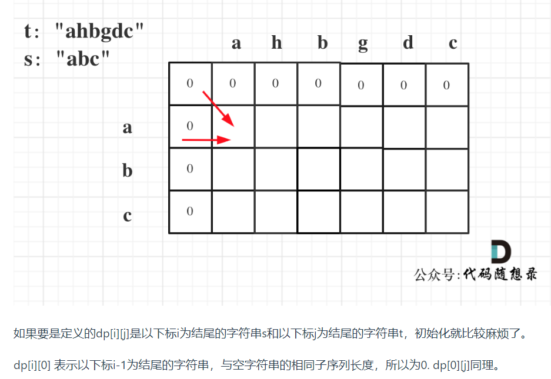
```C++
    bool isSubsequence(string s, string t) {
        int len1 = s.size();
        int len2 = t.size();

        if(len1 > len2) return false;
        /*
        dp[i][j]:表示以下标i - 1为结尾的字符串s，和以下标j - 1为结尾的字符串t，
        相同子序列的长度为dp[i][j]。
        */
        vector<vector<int>> dp(len1 + 1, vector<int>(len2 + 1, 0));

        for(int i = 1; i <= len1; i++) {
            for(int j = 1; j <= len2; j++) {
                if(s[i - 1] == t[j - 1]) {
                    dp[i][j] = dp[i - 1][j - 1] + 1;
                }
                else {
                    dp[i][j] = dp[i][j - 1];
                }
            }
        }
        if(dp[len1][len2] == s.size()) return true;
        return false;
    }
```

双指针解法：
```C++
bool isSubsequence(string s, string t) {
    int len1 = s.size();
    int len2 = t.size();
    if(len1 > len2) return false;
    int left = 0;
    int right = 0;
    while(right < len2) {
        if(s[left] == t[right]) {
            left++;
        }
        right++;
    }

    if(left == len1) {
        return true;
    }
    return false;
}
```

115.**不同的子序列（hard）**
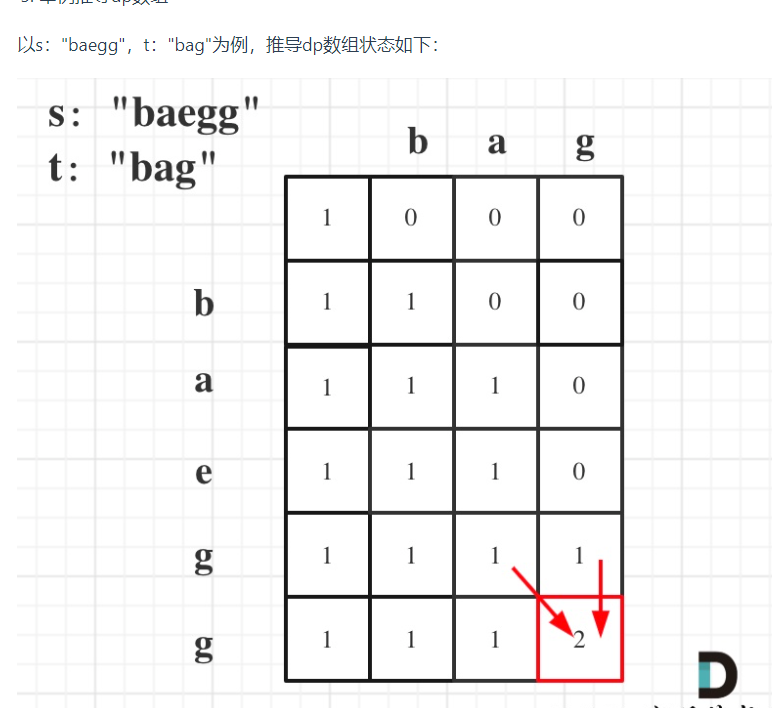
```bash
dp[i][j]：以i-1为结尾的s子序列中 出现以j-1
为结尾的t 的个数为dp[i][j]
二维数组 例如：s = rabbbit t= rabbit 
len(s) + 1行 len(t) + 1列
    0 1 2 3 4 5 6
      r a b b i t
    1 0 0 0 0 0 0
0 r 1
1 a 1
2 b 1
3 b 1
4 b 1 
5 i 1
6 t 1
定义数组大小为字符串的长度加1，一方面是初始化方便，另一方面是允许s和t存在为空串的情况

为啥状态方程是： s[i - 1] == t[j - 1] 时 dp[i][j] = dp[i-1][j-1] + dp[i-1][j]；s[i - 1] != t[j - 1] 时 dp[i][j] = dp[i-1][j]
先看s[i - 1] == t[j - 1] 时，以s = "rara" t = "ra" 为例，当i = 4, j = 4时，s[i - 1] == t[j - 1]。
此时分为2种情况，s串用最后一位的a + 不用最后一位的a。
如果用s串最后一位的a,那么t串最后一位的a也被消耗掉，此时的子序列其实=dp[i-1][j-1]
如果不用s串最后一位的a，那就得看"rar"里面是否有"ra"子序列的了，就是dp[i-1][j]
所以 dp[i][j] = dp[i-1][j-1] + dp[i-1][j]

再看s[i - 1] != t[j - 1] 比如 s = "rarb" t = "ra" 还是当i = 4, j = 2时，s[i - 1] != t[j - 1]
此时显然最后的b想用也用不上啊。所以只能指望前面的"rar"里面是否有能匹配"ra"的
所以此时dp[i][j] = dp[i-1][j]
```

```C++
    int numDistinct(string s, string t) {
    /*
    dp[i][0]=1:由于空字符串是任何字符串的子序列
    dp[0][j]=0:由于非空字符串不是空字符串的子序列
    dp[0][0]=1;
    */
        int len1 = s.size();
        int len2 = t.size();
        if(len2 > len1) return 0;
        vector<vector<uint64_t>> dp(len1 + 1, vector<uint64_t>(len2 + 1, 0));
        for(int i = 0; i <= len1; i++) {
            dp[i][0] = 1;//列
        }
        // for(int i = 1; i < len2; i++) {
        //     dp[0][i] = 0;
        // }
            
        for(int i = 1; i <= len1; i++) {
            for(int j = 1; j <= len2; j++) {
                if(s[i - 1] == t[j - 1]) {
                    dp[i][j] = dp[i - 1][j - 1] + dp[i - 1][j];
                }
                else {
                    dp[i][j] = dp[i - 1][j];
                }
            }
        }
        return dp[len1][len2];
    }
```
583.两个字符串的删除操作

本题可以转化为求两个字符串的最长公共子序列，代码如下：

```C++
class Solution {
public:
    int minDistance(string word1, string word2) {
        int len1 = word1.size();
        int len2 = word2.size();
        //dp[i][j]：字符串a以下标i - 1为结尾，
        //字符串b以下标j - 1为结尾的最长相同连续子序列长度

        vector<vector<int>> dp(len1 + 1, vector<int>(len2 + 1, 0));

        for(int i = 1; i <= len1; i++) {
            for(int j = 1;j <= len2; j++) {
                if(word1[i - 1] == word2[j - 1]) {
                    dp[i][j] = dp[i - 1][j - 1] + 1;
                }
                else{
                    dp[i][j] = max(dp[i - 1][j], dp[i][j - 1]);
                }
            }
        }
        return len1 + len2 - 2 * dp[len1][len2];
    }
};
```
72.编辑距离（hard）

1.确定dp数组及下标含义

dp[i][j] 表示以下标i-1为结尾的字符串word1，和以下标j-1为结尾的字符串word2，最近编辑距离为dp[i][j]。

2.确定递推公式

当word1[i - 1] = word2[j - 1]时，dp[i][j] = dp[i - 1][j - 1]; word1[i - 1] 与 word2[j - 1]相等了，那么就不用编辑了，以下标i-2为结尾的字符串word1和以下标j-2为结尾的字符串word2的最近编辑距离dp[i - 1][j - 1]就是 dp[i][j]了。

当不相等的时候就需要编辑了：

**操作一**：word1删除一个元素，那么就是以下标i - 2为结尾的word1 与 j-1为结尾的word2的最近编辑距离 再加上一个操作。

**操作二**：word2删除一个元素，那么就是以下标i - 1为结尾的word1 与 j-2为结尾的word2的最近编辑距离 再加上一个操作。

word2添加元素就相当于word1删除元素。

**操作三**：替换元素，word1替换word1[i - 1]，使其与word2[j - 1]相同，此时不用增删加元素。可以回顾一下，if (word1[i - 1] == word2[j - 1])的时候我们的操作 是 dp[i][j] = dp[i - 1][j - 1] 对吧。那么只需要一次替换的操作，就可以让 word1[i - 1] 和 word2[j - 1] 相同。

3.dp数组初始化

dp[i][0] ：以下标i-1为结尾的字符串word1，和空字符串word2，最近编辑距离为dp[i][0]。

那么dp[i][0]就应该是i，对word1里的元素全部做删除操作，即：dp[i][0] = i;

同理dp[0][j] = j;

4.举例推导
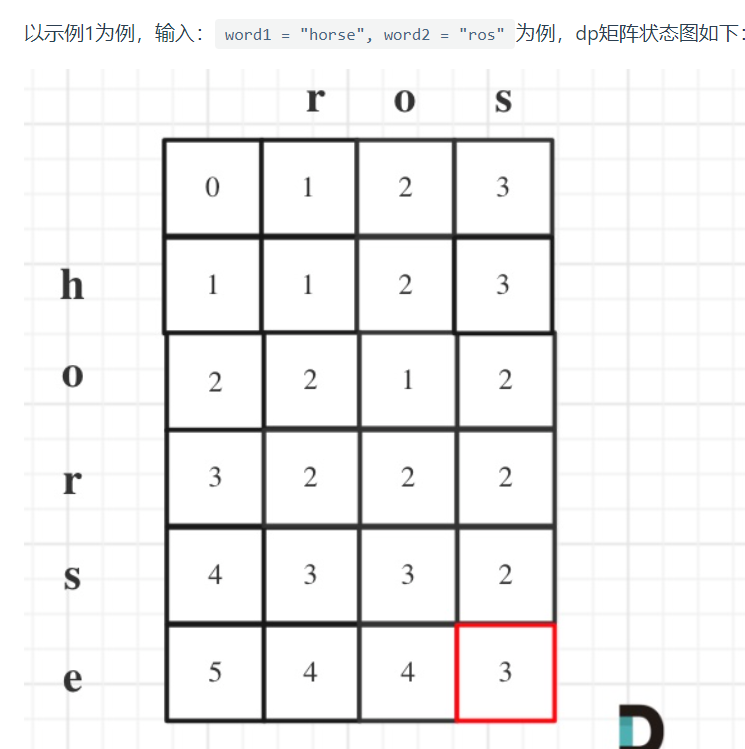

```C++
class Solution {
public:
    int minDistance(string word1, string word2) {
        /*
            dp[i][j] 表示以下标i-1为结尾的字符串word1，和以下
            标j-1为结尾的字符串word2，最近编辑距离为dp[i][j]
        */
        int len1 = word1.size();
        int len2 = word2.size();

        vector<vector<int>> dp(len1 + 1, vector<int>(len2 + 1, 0));
       //初始化
        for(int i = 0; i <= len1; i++) {
            dp[i][0] = i;
        }
        for(int j = 0; j <= len2; j++) {
            dp[0][j] = j;
        }

        for(int i = 1; i <= len1; i++) {
            for(int j = 1; j <= len2; j++) {
                if(word1[i - 1] == word2[j - 1]) {
                    dp[i][j] = dp[i - 1][j - 1];
                }
                else{
                    //增 删 换
                    //增和删一样
                    dp[i][j] = min(dp[i - 1][j] + 1, min(dp[i][j - 1] + 1, dp[i - 1][j - 1] + 1));
                }
            }
        }
        return dp[len1][len2];
    }
    
};
```

## **回文**

647.回文子串（可dp可双指针）

注意：此题的遍历顺序与之前做的题不同，不再是单纯的从上到下，从左到右遍历。

dp：

布尔类型的dp[i][j]：表示区间范围[i,j] （注意是左闭右闭）的子串是否是回文子串，如果是dp[i][j]为true，否则为false。

注意因为dp[i][j]的定义，所以j一定是大于等于i的，那么在填充dp[i][j]的时候一定是只填充右上半部分。
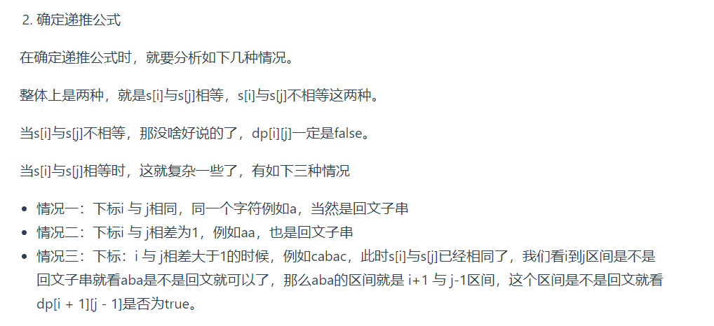
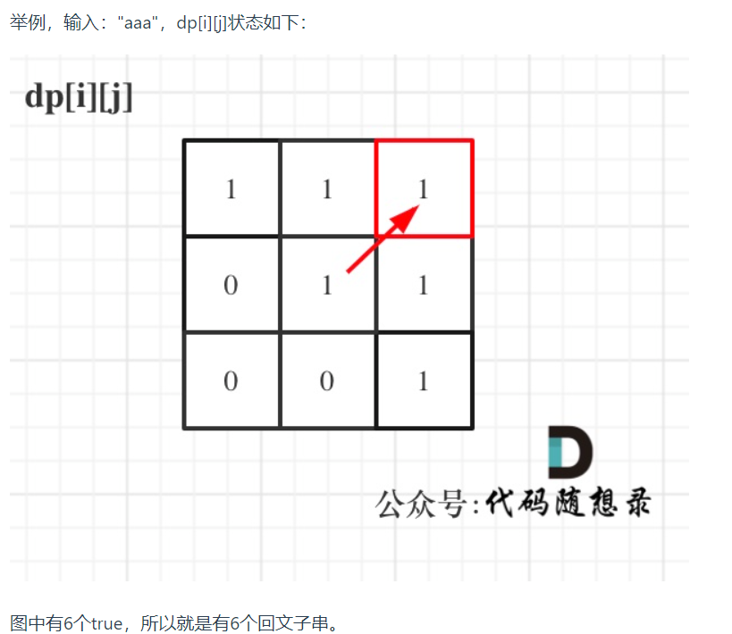

```C++
int countSubstrings(string s) {
/*
布尔类型的dp[i][j]：表示区间范围[i,j] （注意是左闭右闭）
的子串是否是回文子串，如果是dp[i][j]为true，否则为false。
*/
    int len = s.size();
    int res = 0;
    vector<vector<bool>> dp(len, vector<bool>(len, false));
    //从下到上，从左到右，填充右上半部分
    
    //注意因为dp[i][j]的定义，所以j一定是大于等于i的，
    //那么在填充dp[i][j]的时候一定是只填充右上半部分。
    for(int i = len - 1; i >= 0; i--) {
        for(int j = i; j < len; j++) {
            if(s[i] == s[j]) {
                if(j - i <= 1) {
                    res++;
                    dp[i][j] = true;
                }
                else if(dp[i + 1][j - 1]) {
                    res++;
                    dp[i][j] = true;
                }
            }
        }
    }
}
```
双指针：

在遍历中心点的时候，要注意中心点有两种情况。
一个元素可以作为中心点，两个元素也可以作为中心点。
那么有人同学问了，三个元素还可以做中心点呢。其实三个元素就可以由一个元素左右添加元素得到，四个元素则可以由两个元素左右添加元素得到。
所以我们在计算的时候，要注意一个元素为中心点和两个元素为中心点的情况。

```C++
//双指针
int doublepoint(string& s, int i, int j, int n) {
    int res = 0;
    while(i >= 0 && j < n && s[i] == s[j]) {
        i--;
        j++;
        res++;
    }
    return res;
}

int countSubstrings(string s) {
    int res = 0;
    for(int i = 0; i < s.size(); i++) {
        res += doublepoint(s, i, i, s.size());
        res += doublepoint(s, i, i + 1, s.size());
    }
    return res;
}
```

516.最长回文子序列
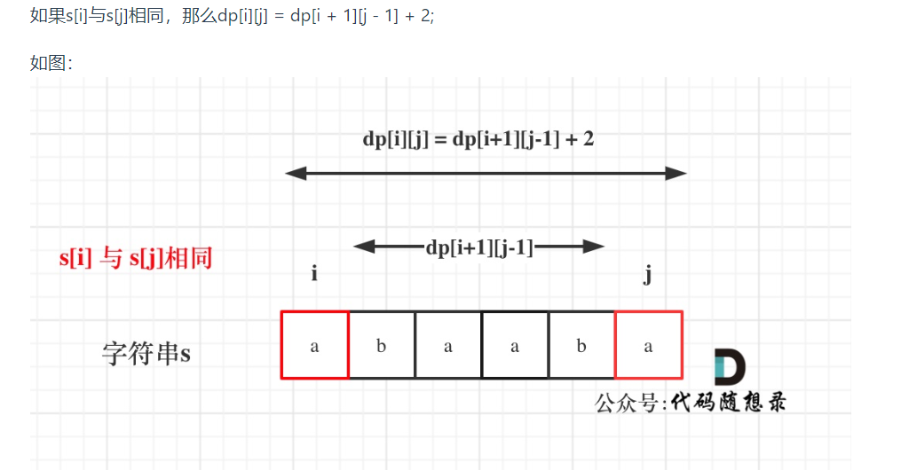
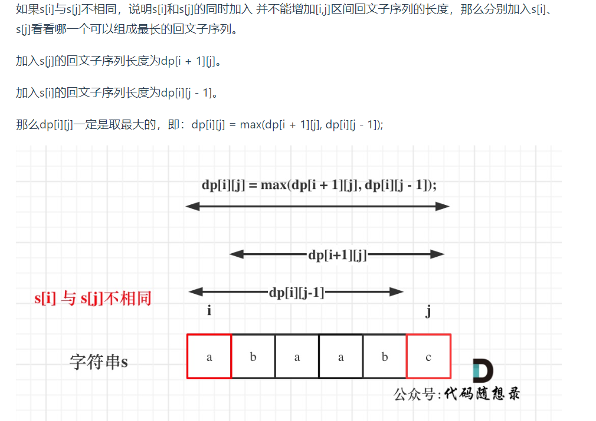
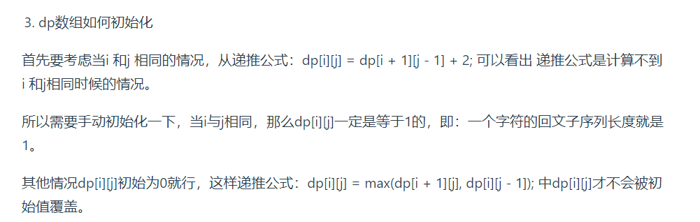
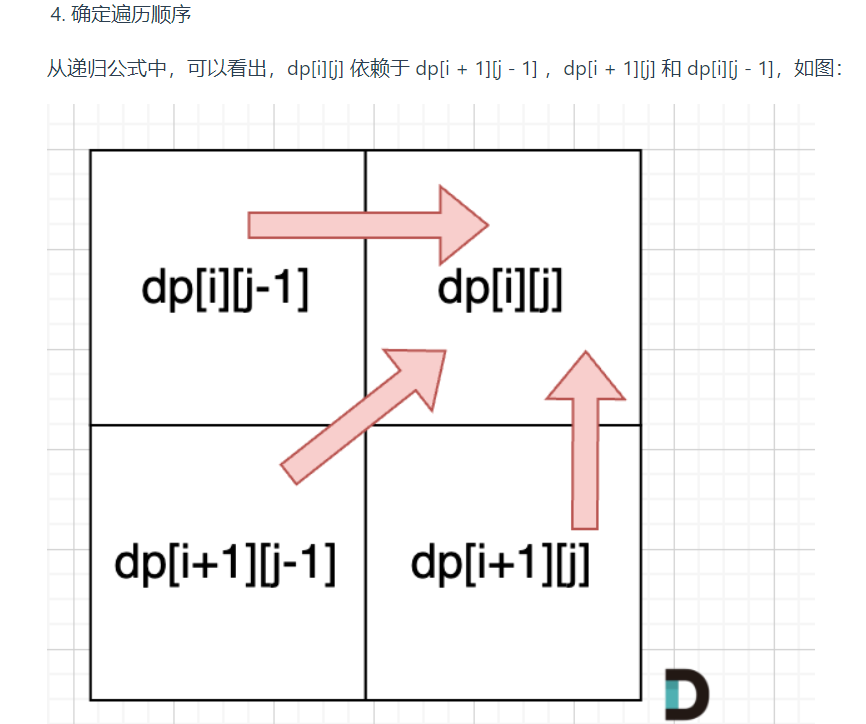
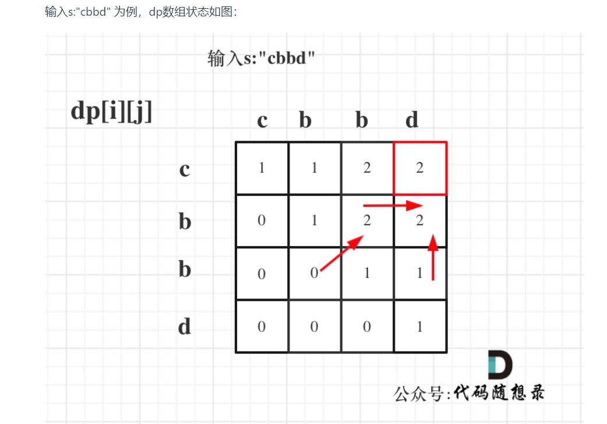
```C++
    int longestPalindromeSubseq(string s) {
        int len = s.size();
        //dp[i][j]：字符串s在[i, j]范围内最长的回文子序列的长度为dp[i][j]。
        vector<vector<int>> dp(len, vector<int>(len, 0));
        for(int i = 0; i < len; i++) {
            dp[i][i] = 1;
        }
        for(int i = len - 1; i >= 0; i--) {
            for(int j = i + 1; j < len; j++) {
                if(s[j] == s[i]) {
                    dp[i][j] = dp[i + 1][j - 1] + 2;
                }
                else{
                    dp[i][j] = max(dp[i + 1][j], dp[i][j - 1]);
                }
            }
        }

        return dp[0][len - 1];
    }
```