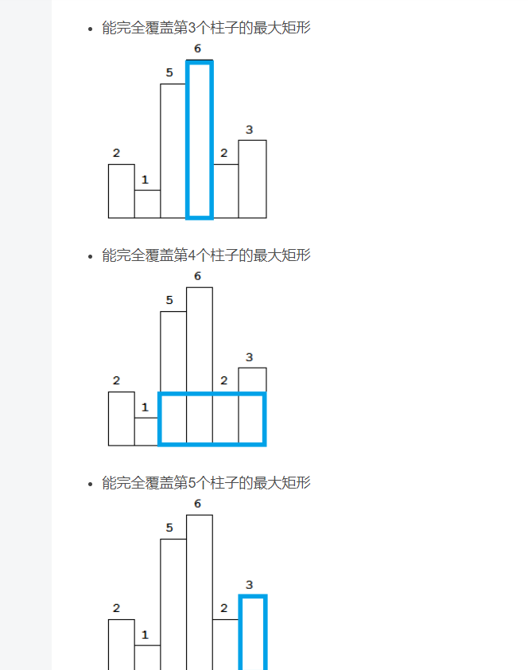

**793.每日温度**
```C++
    //单调栈
    vector<int> dailyTemperatures(vector<int>& temperatures) {
        int len = temperatures.size();
        vector<int> res(len, 0);
        stack<int> st;
        st.push(0);
        //求右边第一个大于自己的元素时候, 栈头到栈底元素应该递增，即栈底元素最大
        for(int i = 1; i < len; i++) {
            //栈里存下标即可
            if(temperatures[i] <= temperatures[st.top()]) {
                st.push(i);
            }
            else{
                while(!st.empty() && temperatures[i] > temperatures[st.top()]) {
                    
                    res[st.top()] = i - st.top();
                    st.pop();
                }
                st.push(i);
            }
        }
        return res;
    }
```

**496.下一个更大元素i**
```C++
//自解
    vector<int> nextGreaterElement(vector<int>& nums1, vector<int>& nums2) {
        vector<int> res(nums1.size(), - 1);
        vector<int> vc(nums2.size(), -1); 
        stack<int> st;
        st.push(0);
        for(int i = 1; i < nums2.size(); i++) {
            while(!st.empty() && nums2[i] > nums2[st.top()]) {
                vc[st.top()] = i; //比自己大得元素下标
                st.pop();
            }
            st.push(i);
        }
        for(int i = 0; i < nums1.size(); i++) {
            for(int j = 0; j < nums2.size(); j++) {
                if(nums2[j] == nums1[i] && vc[j] != -1) {
                    res[i] = nums2[vc[j]];
                }
            }
        }
        return res;
    }
```

判断栈顶元素是否在nums1里出现过，（注意栈里的元素是nums2的元素），如果出现过，开始记录结果。

记录结果这块逻辑有一点小绕，要清楚，此时栈顶元素在nums2数组中右面第一个大的元素是nums2[i]

单调栈 + 哈希
```C++
    vector<int> nextGreaterElement(vector<int>& nums1, vector<int>& nums2) {
        vector<int> res(nums1.size(), - 1);
        unordered_map<int, int> umap;
        stack<int> st;
        st.push(0);

        for(int i = 0; i < nums1.size(); i++) {
            umap[nums1[i]] = i;
        }

        for(int i = 1; i < nums2.size(); i++) {
            while(!st.empty() && nums2[i] > nums2[st.top()]) {
                if(umap.count(nums2[st.top()]) > 0) {
                    int index = umap[nums2[st.top()]];
                    res[index] = nums2[i];
                }
                st.pop();
            }
            st.push(i);
        }
   
        return res;
    }
```

**503.下一个更大元素-ii**

```C++
    vector<int> nextGreaterElements(vector<int>& nums) {
        //不扩充nums，而是在遍历的过程中模拟走了两边nums。
        stack<int> st;
        st.push(0);
        vector<int> res(nums.size(), -1);
        //模拟走两边nums
        for(int i = 0; i < nums.size() * 2; i++) {
            while(!st.empty() && nums[i % nums.size()] > nums[st.top()]) {
                res[st.top()] = nums[i % nums.size()];
                st.pop();
            }
            st.push(i % nums.size());
        }

        return res;
    }
```
合并两个数组版:
```C++
class Solution {
public:
    vector<int> nextGreaterElements(vector<int>& nums) {
    
        stack<int> s;
        s.push(0);
        nums.insert(nums.end(), nums.begin(), nums.end());
        vector<int> res(nums.size(), -1);

        for(int i=1; i<nums.size(); i++){
            while(!s.empty() && nums[i]>nums[s.top()]){
                res[s.top()]=nums[i];
                s.pop();
            }  
            s.push(i);

        }
        res.resize(nums.size()/2);
        return res;

    }
};
```

**42.接雨水（hard，双指针，单调栈）**

双指针：按列计算

找出当前位置的左边最高点和右边最高点，那么当前位置可以存的水就是int count = min(lheight, rheight) - nums[i]。

```C++
    //双指针
    int trap(vector<int>& height) {
        //记录每个位置左边(包括当前位置)的最高的高度
        vector<int> lheight(height.size(), 0);
        vector<int> rheight(height.size(), 0);
        lheight[0] = height[0];
        rheight[height.size() - 1] = height[height.size() - 1];

        for(int i = 1; i < height.size(); i++) {
            lheight[i] = max(height[i], lheight[i - 1]);
        }
        for(int i = height.size() - 2; i >= 0; i--) {
            rheight[i] = max(height[i], rheight[i + 1]);
        }
        int sum = 0;
        for(int i = 0; i < height.size(); i++) {
            int count = min(lheight[i], rheight[i]) - height[i];
            sum += count;
            // if(count >= 0) {
            //     sum += count;
            // }
        }
        return sum;
    }
```

单调栈：按行计算

栈内元素，从栈头到栈底递增，即从小到大，栈内元素存元素下标

因为一旦发现添加的柱子高度大于栈头元素了，此时就出现凹槽了，栈头元素就是凹槽底部的柱子，栈头第二个元素就是凹槽左边的柱子，而添加的元素就是凹槽右边的柱子。


```C++
    //单调栈
    int trap(vector<int>& height) {
        stack<int> st;
        st.push(0);
        int res = 0;
        for(int i = 1; i < height.size(); i++) {
            if(height[i] < height[st.top()]) {
                st.push(i);
            }
            else if(height[i] == height[st.top()]) {
                st.pop(); //其实这一句可以不加，效果是一样的，但处理相同的情况的思路却变了。              
                st.push(i);
            }
            else {
                while(!st.empty() && height[st.top()] < height[i]) {
                    int mid = st.top();
                    st.pop();
                    if(!st.empty()) {
                        int h = min(height[i], height[st.top()]) - height[mid];
                        int w = i - st.top() - 1;
                        res += h * w;
                    }
                }
                st.push(i);
            }
        }
        return res;
    }
```

**84.柱状图中最大的矩形（可双指针，可单调栈，难）**

例如：{6，7，5，2，4，5，9，3} 左右添0后，

{0，6，7，5，2，4，5，9，3，0}


单调栈：

栈顶到栈底元素应从大到小

同时要在数组前后分别添加一个0，防止数组本身为正序或者倒序的情况，如果不添加0，将不会走到代码中的else情况，返回的结果将会为0。

当第i个柱子进栈时，如果栈顶柱子的高度小于等于第i个柱子，则第i个柱子进栈；

如果高于第i个柱子，则出栈，并计算以柱子A（即当前栈顶柱子）为高的矩形最大面积。

最后以每个柱子的高度为高，都计算了一遍面积，求出最大面积。

 

