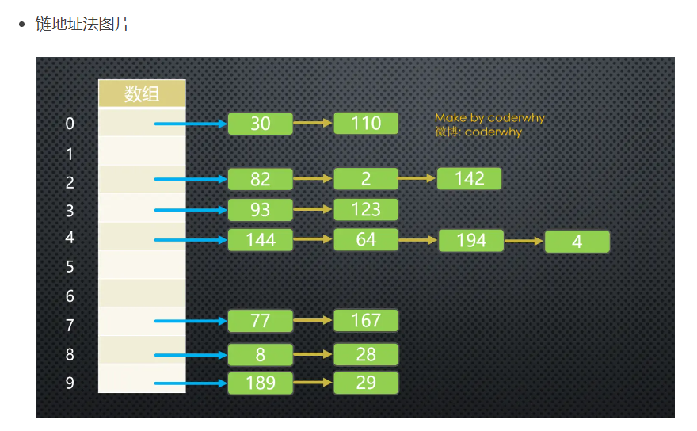
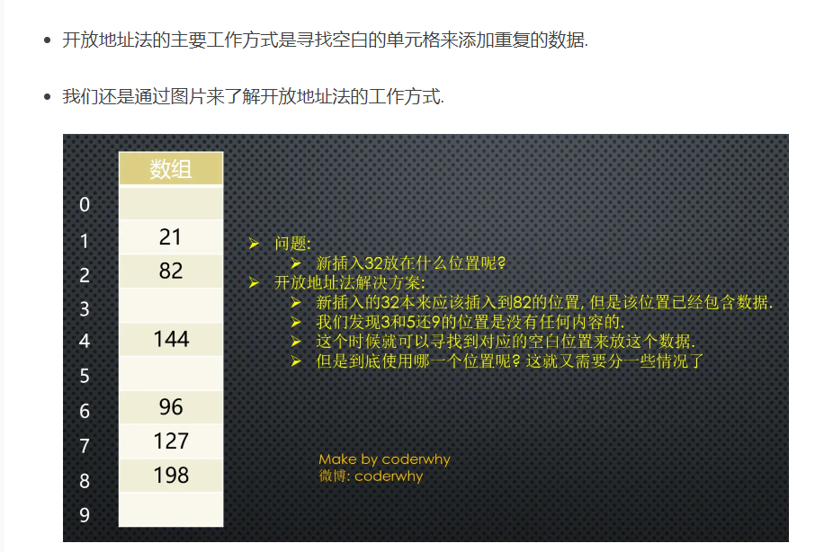
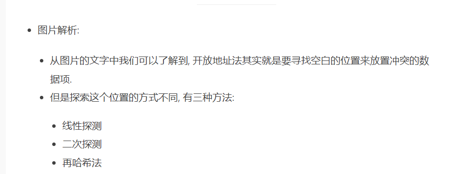
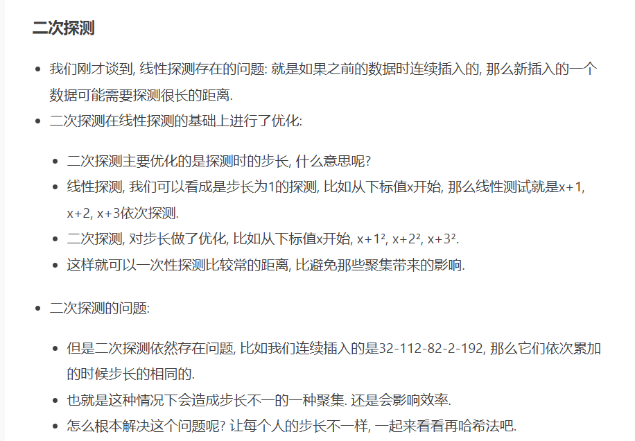
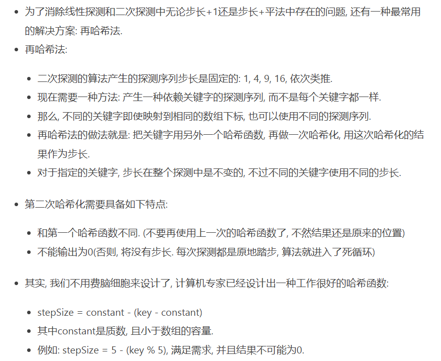
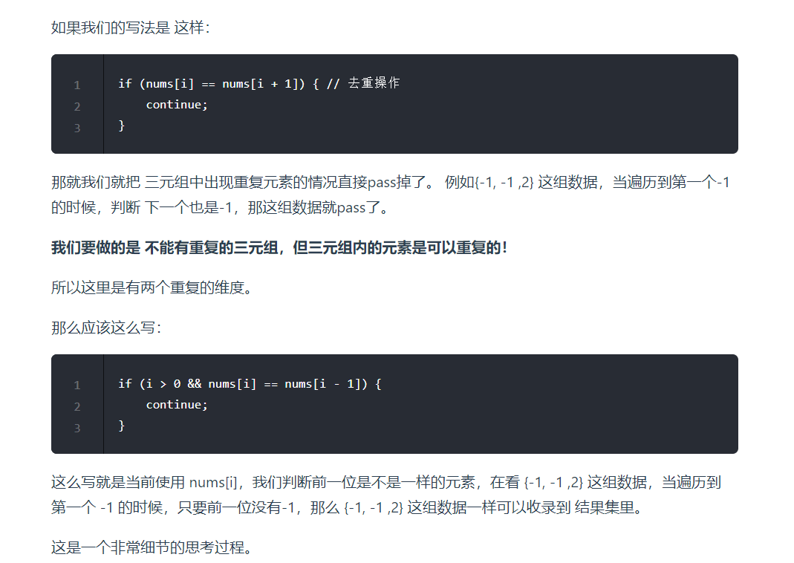

# **哈希理论**
https://www.jianshu.com/p/6e88d63061f2
## **解决哈希冲突**

1.链地址法（拉链法）



2.开放地址法


**线性探测**

插入32时，经过哈希化应该插入到index2下，但是已经有元素82，我们就直接插入到下一个空白的位置例如index3。

查询32时，经过哈希化应该查询index2，若index2下已经有元素了并且不是32，我们就继续往下查询，直到查询到32。

但是也有一个问题，例如我们想要查询32，但是32这个元素还没有插入到集合中，是否需要我们完全遍历一遍哈希表呢？

当然不是, 查询过程有一个约定, 就是查询到空位置, 就停止. (因为查询到这里有空位置, 32之前不可能跳过空位置去其他的位置.)

删除32时，注意: 删除操作一个数据项时, 不可以将这个位置下标的内容设置为null, 为什么呢?
因为将它设置为null可能会影响我们之后查询其他操作, 所以通常删除一个位置的数据项时, 我们可以将它进行特殊处理(比如设置为-1).
当我们之后看到-1位置的数据项时, 就知道查询时要继续查询, 但是插入时这个位置可以放置数据.

**线性探测存在的问题**

比如我在没有任何数据的时候, 插入的是22-23-24-25-26, 那么意味着下标值:2-3-4-5-6的位置都有元素. 这种一连串填充单元就叫做聚集.我们插入数据时，需要我们探索多次去找空白位置。

**二次探测**


**再哈希法**


## **15.三数之和（双指针）**

```C++
class Solution {
public:
    //双指针
    vector<vector<int>> threeSum(vector<int>& nums) {
        vector<vector<int>> res;
        sort(nums.begin(), nums.end());
        for(int i = 0; i < nums.size(); i++){
            if(nums[i] > 0) return res;

            //对a去重 不能写成 nums[i] == nums[i + 1] 因为{-1，-1，2}这种情况会忽略
            //去重的意思是res里不能有重复的组，而不是一组答案里不能有重复的元素
            if(i > 0 && nums[i] == nums[i - 1]){
                continue;
            }

            int left = i + 1;
            int right = nums.size() - 1;
            while(left < right){
                if(nums[i] + nums[left] + nums[right] < 0){
                    left++;
                }
                else if(nums[i] + nums[left] + nums[right] > 0){
                    right--;
                }
                else{
                    res.push_back(vector<int>{nums[i], nums[left], nums[right]});
                    //对b、c去重
                    while(right > left && nums[left] == nums[left + 1]){
                        left++;
                    }
                    while(right > left && nums[right] == nums[right - 1]){
                        right--;
                    }
                    
                    //双指针收缩 继续寻找符合条件的bc
                    right--;
                    left++;

                }
            }
        }
        return res;
    }
};
```

## **18.四数之和（双指针）**

## **454.四数相加-ii**

## **202.快乐数（注意解题思想）**

