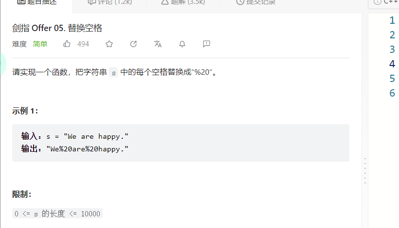
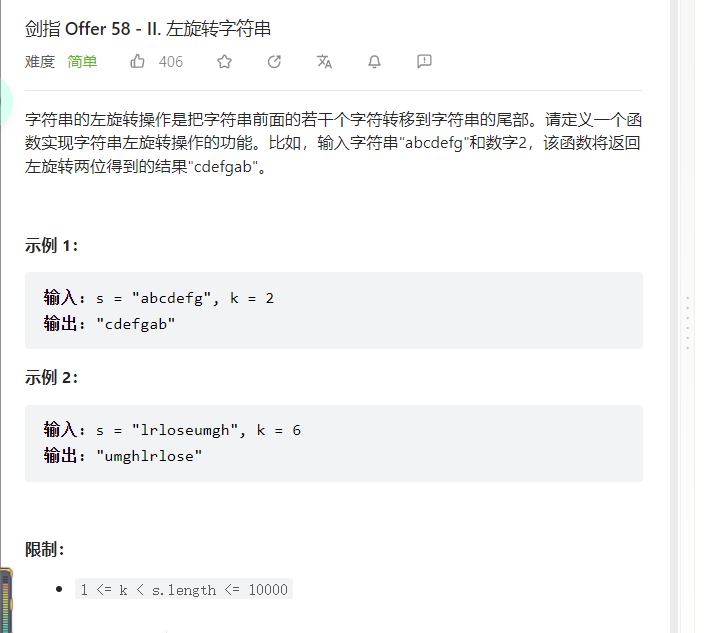

**反转字符串-ii**（注意反转的起始坐标问题）\
**剑指offer：05.替换空格** （leetcode上没有）\
**剑指Offer: 58 - II. 左旋转字符串**\
**注释：粘贴图片到markdown的方式 ctrl+alt+v**



```C++
class Solution {
public:
    string replaceSpace(string s) {
        int count = 0;
        for(int i = 0; i < s.size(); i++){
            if(s[i] == ' '){
                count++;
            }
        }
        int oldsize = s.size();
        s.resize(s.size() + 2 * count);
        int newsize = s.size();

        //j < i 当循环走到j = i时，就说明替换完毕了所以跳出循环 就可以结束了
        for(int i = newsize, j = oldsize; j < i; j--, i--){
            if(s[j] != ' '){
                s[i] = s[j];
            }else{
                s[i] = '0';
                s[i - 1] = '2';
                s[i - 2] = '%';
                i = i - 2;
            }
        }
        return s;
    }
};
```

```C++
class Solution {
    /*
    其中s.begin()表示字符串s的第一个字符的迭代器，s.end()表示字符串s的最后一个字符的下一位的迭代器。
    */
    //或者先旋转前n个 再旋转n到末尾  再反转整个
public:
    string reverseLeftWords(string s, int n) {
        reverse(s.begin(), s.end());
        reverse(s.begin(), s.begin() + s.size() - n);
        reverse(s.begin() + s.size() - n, s.end());
        return s;
    }
};
```
**28.找出字符串中第一个匹配项的下标： KMP**
