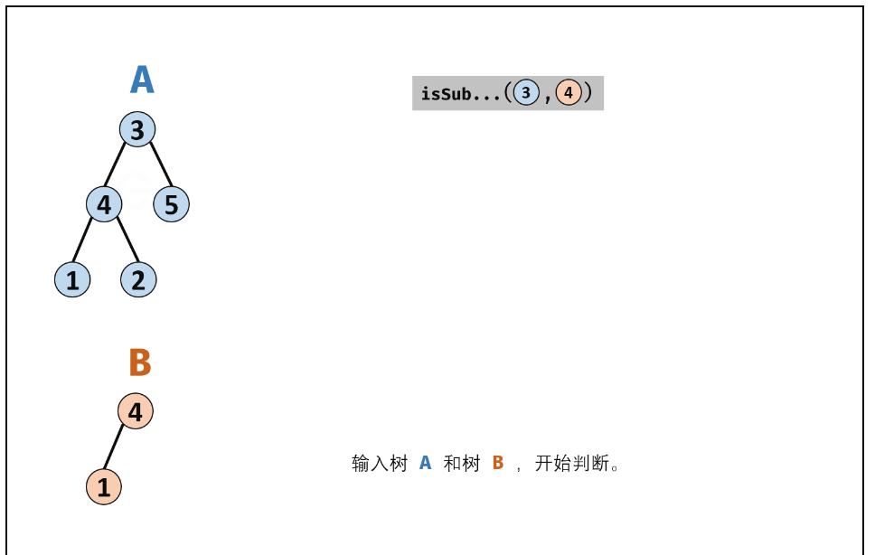

## **递归：**
1. 确定函数参数和返回值 
2. 确定函数终止条件 
3. 确定单层递归逻辑 

## **二叉树层序遍历乱杀以下题目：**
102.二叉树的层序遍历\
107.二叉树的层次遍历II\
199.二叉树的右视图\
637.二叉树的层平均值\
429.N叉树的层序遍历\
515.在每个树行中找最大值\
116.填充每个节点的下一个右侧节点指针\
117.填充每个节点的下一个右侧节点指针II\
**116和117没看出来啥区别**\
**104.二叉树的最大深度**\

**111.二叉树的最小深度:** 

这道题和上一道二叉树的最大深度，还是有不同的地方的，不能直接代码硬搬。应该注意：**最小深度是从根节点到最近叶子节点的最短路径上的节点数量。** 叶子节点是没有左右孩子的节点。注意下面这种情况:


## **二叉树的属性：**
101.对称二叉树

100.相同的树（和上一题基本相同）

**110.平衡二叉树**（思想和求二叉树的最大深度比较接近，判断左右子树的高度差，如果大于1返回-1，否则直接返回最大深度即可。）
```C++
class Solution {
public:
    // struct TreeNode{
    //     int val;
    //     TreeNode* left;
    //     TreeNode* right;
    //     TreeNode() : val(0), left(nullptr), right(nullptr) {}
    //     TreeNode(int x) : val(x), left(nullptr), right(nullptr) {}
    //     TreeNode(int x, TreeNode* left, TreeNode* right) : val(x), left(left), right(right) {}
    // };
    int CalHeight(TreeNode* root){
        if(root == nullptr){
            return 0;
        }

        int left = CalHeight(root->left);
        if(left == -1){
            return -1;
        }

        int right = CalHeight(root->right);
        if(right == -1){
            return -1;
        }

        int res = left >= right ? left - right : right - left;
        if(res > 1){
            return -1;
        }
        else{
            return 1 + max(left, right);
        }
    }
    bool isBalanced(TreeNode* root) {
        if(root == nullptr) return true;
        int res = CalHeight(root);

        return res == -1 ? false : true;
    }
};
```

257.二叉树的所有路径，有迭代和递归两种方法，迭代方法没写过。

404.左叶子之和

**222.完全二叉树的节点个数** : 

**如果递归向左遍历的深度等于递归向右遍历的深度，那说明就是满二叉树。** 

**112.路经总和**
### 递归函数什么什么时候需要返回值？什么时候不需要？总结如下三点：
- 需要搜索整棵树，并且不用处理递归返回值，递归函数就不需要返回值（如路径总和2）
- 需要搜索整棵树，并且需要处理递归返回值，递归函数就需要返回值（二叉树的最近公共祖先）
- 如果需要搜索其中一条符合条件的路径，那么递归函数一定需要返回值，因为遇到符合条件的路径了就要及时返回。

**572.另一课树的子树**

**先序遍历包含判断** 
```bash
三种情况
1.两棵树相同
2.父亲的左子树和其相同
3.父亲的右子树和其相同
``` 



## **二叉树的修改与改造**
**106.从中序与后序遍历序列构造二叉树**

遵循左闭右开
```C++
class Solution {
public:
    // struct TreeNode{
    //     int val;
    //     TreeNode* left;
    //     TreeNode* right;
    //     TreeNode() : val(0), left(nullptr), right(nullptr) {}
    //     TreeNode(int x):val(x),left(nullptr),right(nullptr){}
    // };
    TreeNode* traversal(vector<int>& inorder, int inorderbegin, int inorderend, vector<int>& postorder, int postorderbegin, int postorderend){
        //去掉下面这个语句[1,2] [2,1]这种情况就不通过
        if(postorderbegin == postorderend) return NULL;
        int rootvalue = postorder[postorderend - 1];
        TreeNode* root = new TreeNode(rootvalue);
        
        //遇到叶子节点返回 左闭右开此时左右中序，左右后序都只为1个元素
        if(postorderend - postorderbegin == 1) return root;

        //在中序数组中找切割点
        int cut;
        for(cut = inorderbegin; cut < inorderend; cut++){
            if(inorder[cut] == rootvalue){
                break;
            }
        }

        //切割中序左右数组
        //左中序区间左闭右开[leftInorderbegin,leftInorderend)
        int leftInorderbegin = inorderbegin;
        int leftInorderend = cut;
        //右中序区间左闭右开[rightInorderbegin,rightInorderend)
        int rightInorderbegin = cut + 1;
        int rightInorderend = inorderend;

        //切割后序左右数组
        //左后序区间[leftpostorderBegin,lefttpostorderEnd)
        int leftpostorderBegin = postorderbegin;
        int lefttpostorderEnd = postorderbegin + leftInorderend - leftInorderbegin;
        //右后序区间[rightpostorderBegin,rightpostorderEnd)
        int rightpostorderBegin = lefttpostorderEnd;
        int rightpostorderEnd = postorderend - 1;

        root->left = traversal(inorder, leftInorderbegin, leftInorderend, postorder, leftpostorderBegin, lefttpostorderEnd);
        root->right = traversal(inorder, rightInorderbegin, rightInorderend, postorder, rightpostorderBegin, rightpostorderEnd);

        return root;
    }
    TreeNode* buildTree(vector<int>& inorder, vector<int>& postorder) {
        if(inorder.size() == 0 || postorder.size() == 0){
            return nullptr;
        }
        return traversal(inorder, 0, inorder.size(), postorder, 0, postorder.size());
    }
};
```


226.翻转二叉树（剑指offer-27.二叉树的镜像）
```C++
//本质前序遍历
void traverasl(TreeNode*& node){
    if(node == nullptr) return;
    swap(node->left, node->right);
    traverasl(node->left);
    traverasl(node->right);
    //return;
}

TreeNode* invertTree(TreeNode* root) {
    if(root == nullptr) return root;
    traverasl(root);
    return root;
}
```


## **求二叉搜索树的属性**
98.验证二叉搜索树

**我们要比较的是 左子树所有节点小于中间节点，右子树所有节点大于中间节点。** 

**不能单纯地比较左节点小于当前节点的值，右节点大于当前节点的值。** 

这几道题，都要学会在递归过程中定义一个pre指针记录前一个结点，与当前cur节点进行比较。

## **二叉树的公共祖先问题**

**236.二叉树的最近公共祖先（好题，递归回溯思想）**

后序自底向上遍历 

```C++
/**
 * Definition for a binary tree node.
 * struct TreeNode {
 *     int val;
 *     TreeNode *left;
 *     TreeNode *right;
 *     TreeNode(int x) : val(x), left(NULL), right(NULL) {}
 * };
 */
class Solution {
public:
    TreeNode* lowestCommonAncestor(TreeNode* root, TreeNode* p, TreeNode* q) {
        if(root == p || root == q || root == nullptr) return root;

        TreeNode* left = lowestCommonAncestor(root->left, p, q);
        TreeNode* right = lowestCommonAncestor(root->right, p, q);
        if(left != nullptr && right != nullptr) return root;
        
        if(left != nullptr && right == nullptr) return left;
        if(left == nullptr && right != nullptr) return right;
        else {
            //左右都空
            return nullptr;
        }
       
   
    }
};
```

235.二叉搜索树的最近公共祖先 

**和上一题的区别是，上一题对整棵树进行遍历，这个题是对树的一条边进行遍历，有符合条件的直接返回。** 

**对整个树进行遍历:**
```C++
left =  traversal(root->left);
right = traversal(root->right);
left与right的逻辑处理函数
```
**对一条边进行遍历:**
```C++
if(traversal(root->left)) return;
if(traversal(root->right)) return;
```

## **二叉搜索树的修改与改造**
450.删除二叉搜索树中的节点 

**注意：** 当要删除的节点左右孩子均不为空的时候，要把删除的节点的左孩子移动到要删除节点的右孩子的最左边的子节点下面
