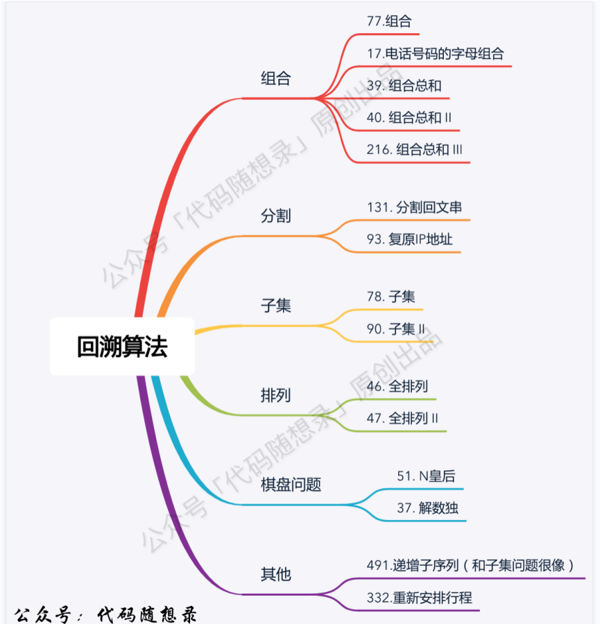
## 回溯法模板
```C++
void backtracking(参数) {
    if (终止条件) {
        存放结果;
        return;
    }

    for (选择：本层集合中元素（树中节点孩子的数量就是集合的大小）) {
        处理节点;
        backtracking(路径，选择列表); // 递归
        回溯，撤销处理结果
    }
}
```
## 组合
* 77.组合
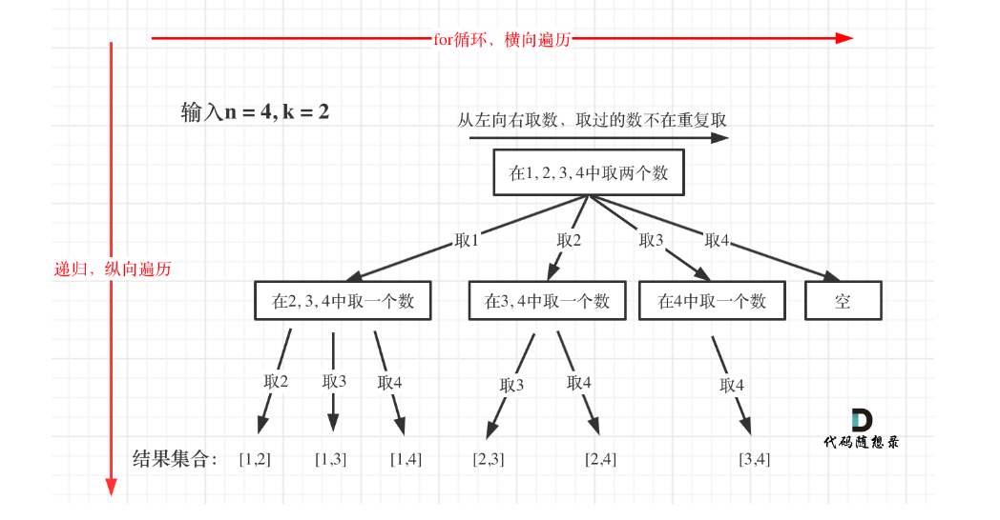
**本题优化：**
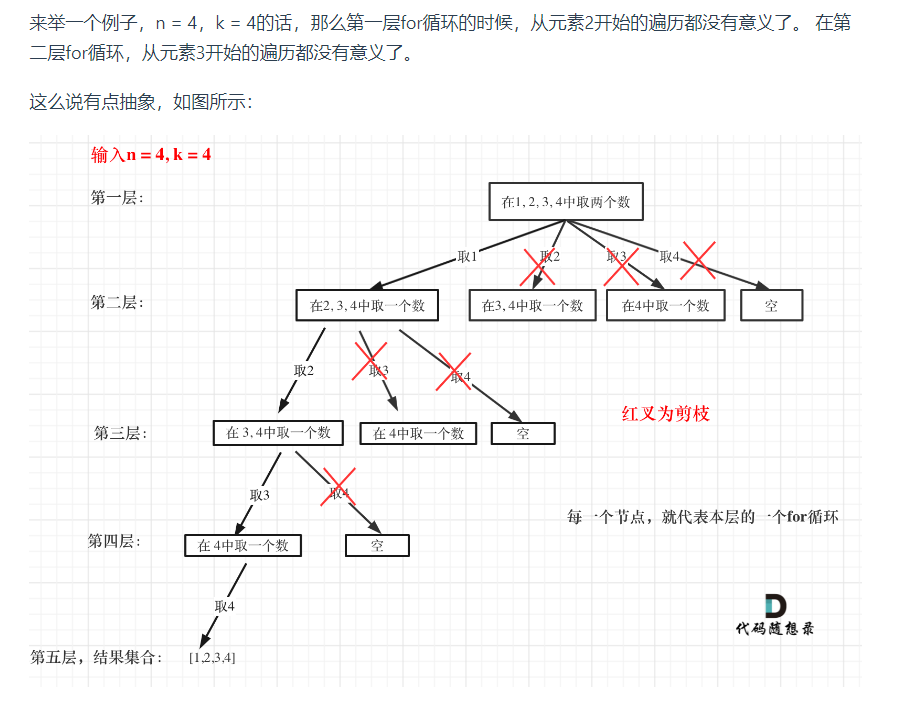

* 39.组合总和
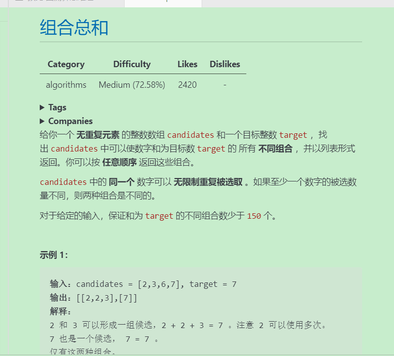
```bash
if(sum > target){
    return;
}
//没有这句代码就跑不通
```

* 40.组合总和ii(好题。) 
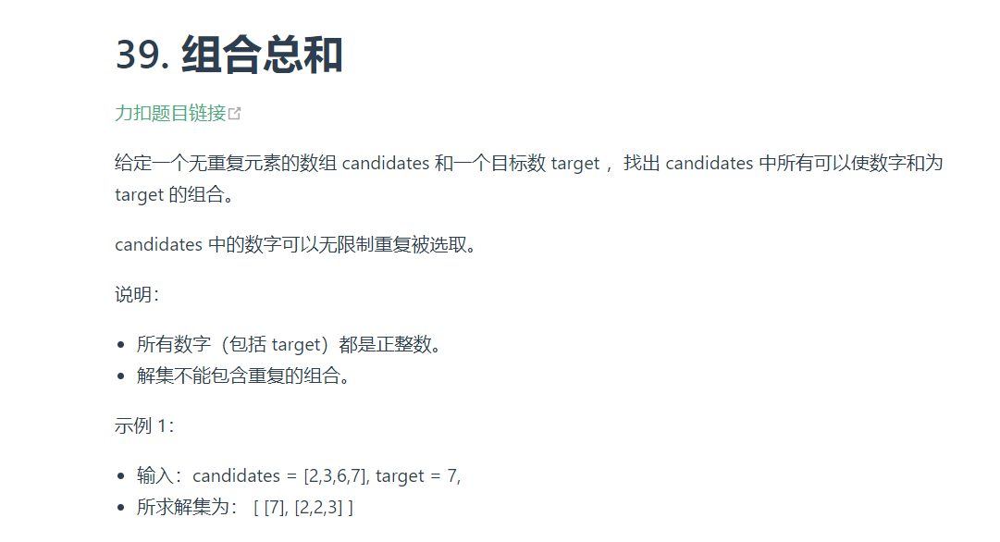
```bash
注意vector中有重复元素，进行处理再去进行组合。
```
**为什么 used[i - 1] == false 就是同一树层呢***，因为同一树层，used[i - 1] == false 才能表示，当前取的 candidates[i] 是从 candidates[i - 1] 回溯而来的。

而 **used[i - 1] == true**，说明是进入下一层递归，去下一个数，所以是树枝上，如图所示：
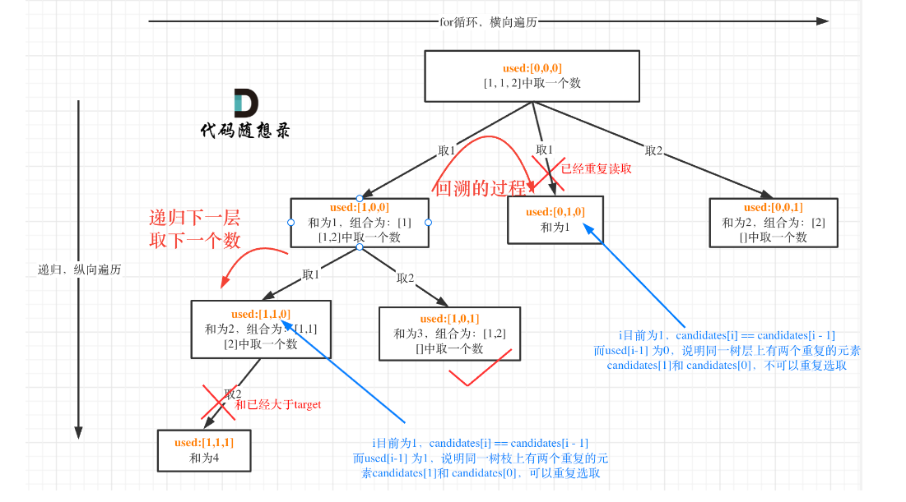
```C++
class Solution {
private:
    vector<vector<int>> result;
    vector<int> path;
    void backtracking(vector<int>& candidates, int target, int sum, int startIndex, vector<bool>& used) {
        if (sum == target) {
            result.push_back(path);
            return;
        }
        for (int i = startIndex; i < candidates.size() && sum + candidates[i] <= target; i++) {
            // used[i - 1] == true，说明同一树枝candidates[i - 1]使用过
            // used[i - 1] == false，说明同一树层candidates[i - 1]使用过
            // 要对同一树层使用过的元素进行跳过
            if (i > 0 && candidates[i] == candidates[i - 1] && used[i - 1] == false) {
                continue;
            }
            sum += candidates[i];
            path.push_back(candidates[i]);
            used[i] = true;
            backtracking(candidates, target, sum, i + 1, used); // 和39.组合总和的区别1，这里是i+1，每个数字在每个组合中只能使用一次
            used[i] = false;
            sum -= candidates[i];
            path.pop_back();
        }
    }

public:
    vector<vector<int>> combinationSum2(vector<int>& candidates, int target) {
        vector<bool> used(candidates.size(), false);
        path.clear();
        result.clear();
        // 首先把给candidates排序，让其相同的元素都挨在一起。
        sort(candidates.begin(), candidates.end());
        backtracking(candidates, target, 0, 0, used);
        return result;
    }
};

```

* 组合总和iii
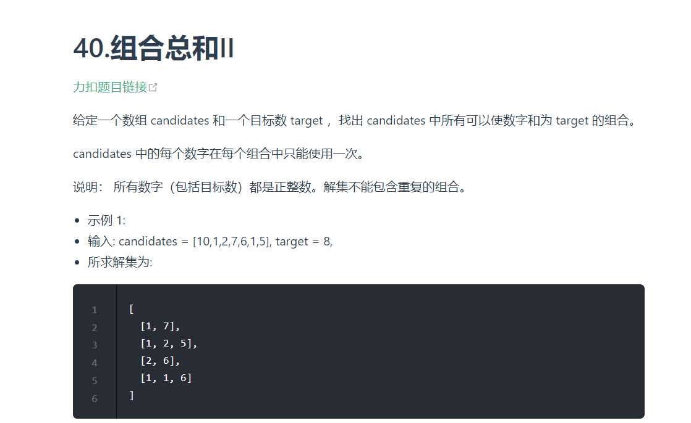
```C++
class Solution {
public:
    vector<vector<int>> res;
    vector<int> path;

    void back(int n, int k, int index, int sum){
        if(path.size() == k && sum == n){
            res.push_back(path);
            return;
        }

        for(int i = index; i <= 9 && i <= n; i++) {
            path.push_back(i);
            sum += i;
            back(n, k, i + 1, sum);
            sum -= i;
            path.pop_back();
        }

    }
    vector<vector<int>> combinationSum3(int k, int n) {
        res.clear();
        path.clear();
        back(n, k, 1, 0);
        return res;
    }
};
```

## 分割
* 131.分割回文串(好题) \
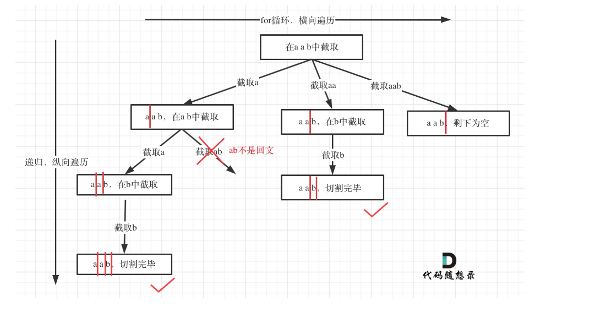
```bash
本题难点：
(1)判断回文
(2)如何去切割
```
```C++
class Solution {
public:
    vector<vector<string>> res;
    vector<string> path;
    bool huiwen(string& s, int start, int end) {
        for(int i = start, j = end; i < j; i++, j--){
            if(s[i] != s[j]){
                return false;
            }
        }
        return true;
    }

    void back(string s, int index){
        if(index == s.size()){
            res.push_back(path);
            return;
        }

        for(int i = index; i < s.size(); i++){
            if(huiwen(s, index, i)){
                string str = s.substr(index, i - index + 1);
                path.push_back(str);
            }else{
                continue;
            }
            back(s, i + 1);
            path.pop_back();
        }
    }


    vector<vector<string>> partition(string s) {
        res.clear();
        path.clear();
        back(s, 0);
        return res;
    }
};
```

* 93.复原ip地址(上题加强版)
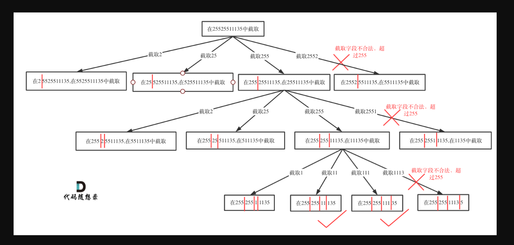
```bash
注意要使用pointnum参数，来判断回溯是否结束，当句点数目为3时，则代表回溯结束。
同时注意判读每段字符串是否合法，即：
1.不能含前导0
2.每位数都在0-9
3.不能大于255
```
```C++
class Solution {
public:
    vector<string> res;
    //pointnum 句点个数
    void back(string &s, int index, int pointnum){
        if(pointnum == 3){
            //检查第四个字符串是否符合要求
            if(isvalid(s, index, s.size() - 1)){
                res.push_back(s);
                return;
            }
        }

        //单层逻辑
        for(int i = index; i < s.size(); i++) {
            if(isvalid(s, index, i)){
                pointnum++;
                s.insert(s.begin() + i + 1, '.');
                back(s, i + 2, pointnum);
                s.erase(s.begin() + i + 1);
                pointnum--;
            }
            else{
                //不符合要求直接跳出本层循环
                break;
            }
        }
        return;
    }

    bool isvalid(string& s, int start, int end) {
        /*
            1.不能含前导0
            2.每位数都在0-9
            3.不能大于255
        */
        if(start > end){
            return false;
        }

        if(s[start] == '0' && start != end){
            return false;
        }
        int num = 0;
        for(int i = start; i <= end; i++){
            if(s[i] < '0' || s[i] > '9'){
                return false;
            }

            num = num * 10 + s[i] - '0';
        }
        if(num > 255) {
            return false;
        }
        return true;
    }

    vector<string> restoreIpAddresses(string s) {
        res.clear();
        if(s.size() < 4 || s.size() > 12) {
            return res;
        }
        back(s, 0, 0);
        return res;
    }
};
```

## 子集
* 78.子集
```bash
子集是收集树形结构中树的所有节点的结果。而组合问题、分割问题是收集树形结构中叶子节点的结果。
```
```C++
class Solution {
public:
    vector<vector<int>> res;
    vector<int> path;
    void back(vector<int>& nums, int index){
        //把自己添加进去
        res.push_back(path);
        if(index >= nums.size()){
            return;
        }

        for(int i = index; i < nums.size(); i++){
            path.push_back(nums[i]);
            back(nums, i + 1);
            path.pop_back();
        }
        return;

    }
    vector<vector<int>> subsets(vector<int>& nums) {
        res.clear();
        path.clear();
        back(nums, 0);
        return res;
    }   
};
```

* 90.子集ii
```bash
给定数组中有重复元素，别忘了要先排序再进行处理！！！
本题也可以不使用used数组来去重，因为递归的时候下一个Index是i+1而不是0。如果要是全排列的话，每次要从0开始遍历，为了跳过已入栈的元素，需要使用used。
```
```C++
class Solution {
public:
    vector<vector<int>> res;
    vector<int> path;
    void back(vector<int>& nums, int index) {
        res.push_back(path);
        if(index >= nums.size()) {
            return;
        }
        for(int i = index; i < nums.size(); i++) {
            if(i > index && nums[i] == nums[i - 1]){
                continue;
            }
            path.push_back(nums[i]);
            back(nums, i + 1);
            path.pop_back();
        }
    }
    vector<vector<int>> subsetsWithDup(vector<int>& nums) {
        res.clear();
        path.clear();
        sort(nums.begin(), nums.end());
        back(nums, 0);
        return res;
    }
};
```

## 排列
* 46.全排列 \
给定一个不含重复数字的数组nums ，返回其所有可能的全排列。\
因为排列问题，每次都要从头开始搜索，例如元素1在[1,2]中已经使用过了，但是在[2,1]中还要再使用一次1。而used数组，其实就是记录此时path里都有哪些元素使用了，一个排列里一个元素只能使用一次。


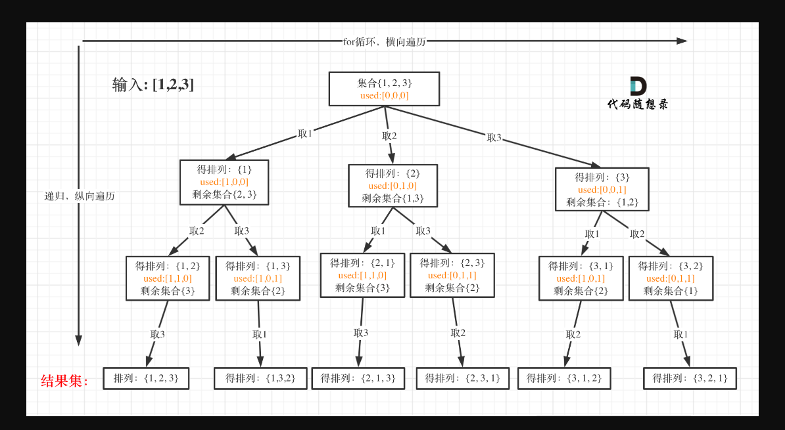
```bash
输入：nums = [1,2,3]
输出：[[1,2,3],[1,3,2],[2,1,3],[2,3,1],[3,1,2],[3,2,1]]
```
```C++
class Solution {
public:
    vector<vector<int>> res;
    vector<int> path;
    void back(int n, int k, int startindex){
        if(path.size() == k){
            res.push_back(path);
            return;
        }
        for(int i = startindex; i <= n; i++){
            path.push_back(i);
            back(n, k, i + 1);
            path.pop_back();
        }
            
    }

    vector<vector<int>> combine(int n, int k) {
        res.clear();
        path.clear();
        back(n, k, 1);
        return res;
    }
};
```

* 47.全排列2 \
这道题目和46.全排列的区别在与给定一个可包含重复数字的序列，要返回所有不重复的全排列。
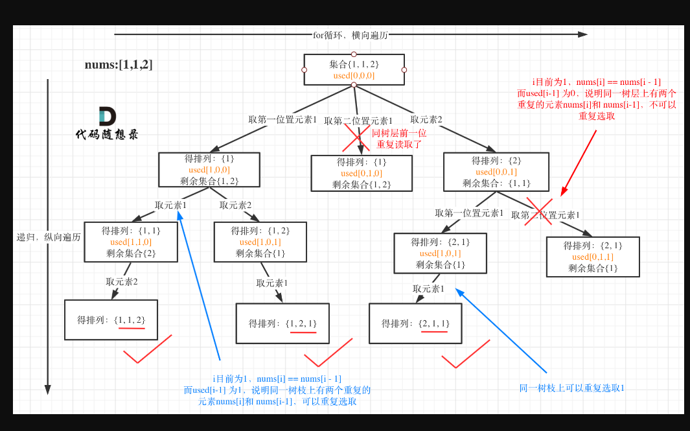
```bash
// used[i - 1] == true，说明同一树枝nums[i - 1]使用过
// used[i - 1] == false，说明同一树层nums[i - 1]使用过
// 如果同一树层nums[i - 1]使用过则直接跳过

输入：nums = [1,1,2]
输出：
[[1,1,2],
 [1,2,1],
 [2,1,1]]
```
```C++
class Solution {
public:
    vector<vector<int>> res;
    vector<int> path;

    void back(vector<int>& nums, vector<bool>& used) {
        if(path.size() == nums.size()) {
            res.push_back(path);
            return;
        }
        /*
            used[i - 1] == true，说明同一树枝nums[i - 1]使用过
            used[i - 1] == true，说明是进入下一层递归，去下一个数，所以是树枝上
           
            used[i - 1] == false，说明同一树层nums[i - 1]使用过
            表示当前取的 candidates[i] 是从 candidates[i - 1] 回溯而来的。
        */

        for(int i = 0; i < nums.size(); i++){
            //如果同一树层nums[i - 1]使用过则直接跳过
            if((i > 0 && nums[i] == nums[i - 1]) && used[i - 1] == false) {
                continue;
            } 
            if(used[i] == false){
                path.push_back(nums[i]);
                used[i] = true;
                back(nums, used);
                used[i] = false;
                path.pop_back();
            }
        }
        return;
    }

    vector<vector<int>> permuteUnique(vector<int>& nums) {
        res.clear();
        path.clear();
        sort(nums.begin(), nums.end());
        vector<bool> used(nums.size(), false);
        back(nums, used);
        return res;

    }
};
```

## 棋盘问题
* 51.n皇后（hard） \
棋盘的宽度就是for循环的长度，递归的深度就是棋盘的高度，这样就可以套进回溯法的模板里了。
```C++
class Solution {
public:
    vector<vector<string>> res;
    void back(int row, int n, vector<string>& chess) {
        if(row == n) {
            res.push_back(chess);
            return;
        }

        for(int i = 0; i < n; i++) {
            if(isvalid(row, i, n, chess)) {
                chess[row][i] = 'Q';
                back(row + 1, n, chess); //递归下一行
                chess[row][i] = '.'; //回溯撤销
            }
        }

        return;
    }

    bool isvalid(int row, int col, int n, vector<string>& chess) {
        //检查列
        for(int i = 0; i < row; i++) {
            if(chess[i][col] == 'Q') {
                return false;
            }
        }

        //检查45度 左斜
        for(int i = row - 1, j = col - 1; i >= 0 && j >= 0; i--, j--) {
            if(chess[i][j] == 'Q') {
                return false;
            }
        }

        //检查135度 右斜
        for(int i = row - 1, j = col + 1; i >= 0 && j < n; i--, j++) {
            if(chess[i][j] == 'Q') {
                return false;
            }
        }
        return true;
    }

    vector<vector<string>> solveNQueens(int n) {
        res.clear();
        vector<string> chess(n, string(n, '.'));
        back(0, n, chess);
        return res;
    }
};
```

* 37.**解数独**（hard二维回溯）
```bash
函数中不断地去调用if(backtracking(board))，从而来填充下一个位置上的数，如果最后一个位置上的数填充完毕后，return true,代表找到了一组解，逐层再返回true，返回到第一层直接返回true。
如果某一层返回了false，说明这个位置没有合适的数可以填。则代表此层的上一层应该进行回溯了，这个位置已经填好的数应该重新填。
```
```C++
class Solution {
public:
    bool back(vector<vector<char>>& board) {
        for(int i = 0; i < board.size(); i++) {
            for(int j = 0; j < board[0].size(); j++) {
                if(board[i][j] == '.') {
                    for(char k = '1'; k <= '9'; k++) {
                        if(isvalid(i, j, k, board)) {
                            board[i][j] = k;
                            if(back(board)) {
                                return true;
                            }
                            board[i][j] = '.';
                        }
                    }
                    return false;
                }
            }
        }
        return true;
    }

    bool isvalid(int row, int col, char k, vector<vector<char>>& board) {
        //检查行
        //注意不是 i<col  是检查一整列 应该是 i < 9
        for(int i = 0; i < 9; i++) {
            if(board[row][i] == k) {
                return false;
            }
        }

        //检查列
        for(int i = 0; i < 9; i++) {
            if(board[i][col] == k) {
                return false;
            }
        }

        //检查3*3
        int row_ = (row / 3) * 3;
        int col_ = (col / 3) * 3;

        for(int i = row_; i < row_ + 3; i++) {
            for(int j = col_; j < col_ + 3; j++) {
                if(board[i][j] == k) {
                    return false;
                }
            }
        }

        return true;
    }

    void solveSudoku(vector<vector<char>>& board) {
        back(board);
    }
};
```

## 其它
* 491.递增子序列 \
和子集ii比较像，但是本题不能直接对vector排序。需要创建个set来记录每层重复的元素是否被使用过。（这道题告诉我们，不要总想着去套回溯的模板）
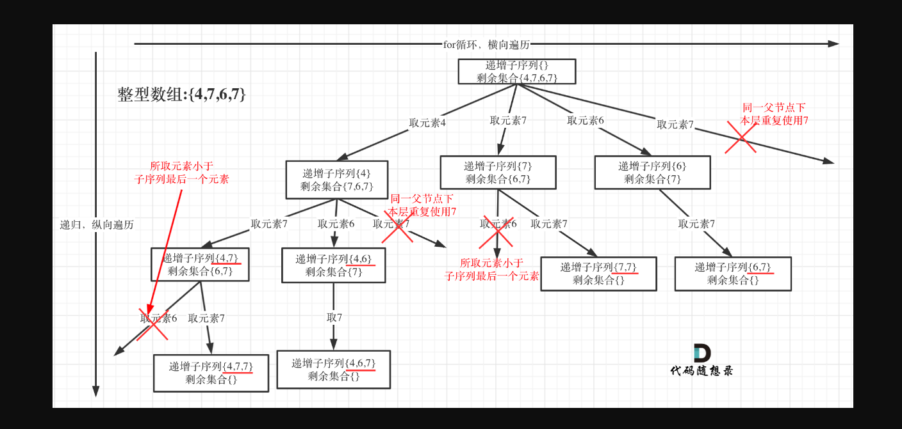

```C++
class Solution {
public:
    vector<int> path;
    vector<vector<int>> res;

    void back(vector<int>& nums, int index){
        if(path.size() >= 2) {
            res.push_back(path);
        }
        if(index >= nums.size()) {
            return;
        }
        //每一树层都重新定义了一个set，来判断当前层元素是否被重复使用
        unordered_set<int> uset;
        for(int i = index; i < nums.size(); i++) {
            if((!path.empty() && nums[i] < path.back()) || uset.find(nums[i]) != uset.end()) {
                continue;
            }
            uset.insert(nums[i]);
            path.push_back(nums[i]);
            back(nums, i + 1);
            path.pop_back();
        }

        return;
    }

    vector<vector<int>> findSubsequences(vector<int>& nums) {
        //注意不能排序，否则就直接变成递增了
        back(nums, 0);
        return res;
    }
};
```

* 332.重新安排行程(hard)
```bash
 //unordered_map<出发地点, map<到达地点, 票数>> 
    unordered_map<string, map<string, int>> target;
```
```C++
class Solution {
public:
    //unordered_map<出发地点, map<到达地点, 票数>> 
    unordered_map<string, map<string, int>> target;

    bool backtracking(int ticketnum, vector<string>& res) {
        if(res.size() == ticketnum + 1) {
            return true;
        }

        for(auto& index : target[res[res.size() - 1]]) {
            if(index.second > 0) {
                res.push_back(index.first);
                index.second--;
                if(backtracking(ticketnum, res)) {
                    return true;
                }
                res.pop_back();
                index.second++;
            }
        }

        return false;
    }

    vector<string> findItinerary(vector<vector<string>>& tickets) {
        vector<string> res;
        for(auto& vec : tickets) {
            target[vec[0]][vec[1]]++;
        }
        res.push_back("JFK");
        backtracking(tickets.size(), res);
        return res;
    }
};
```