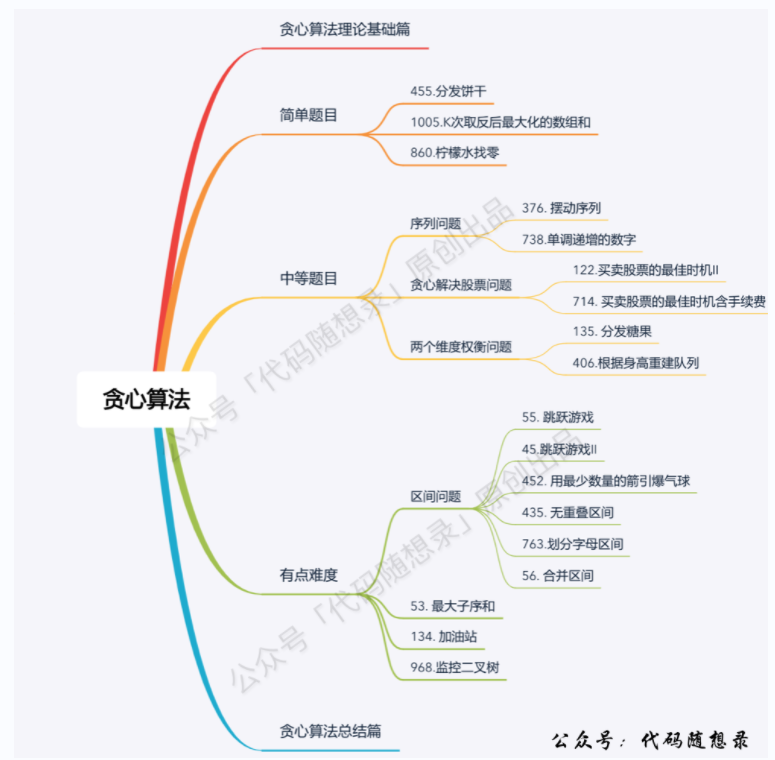
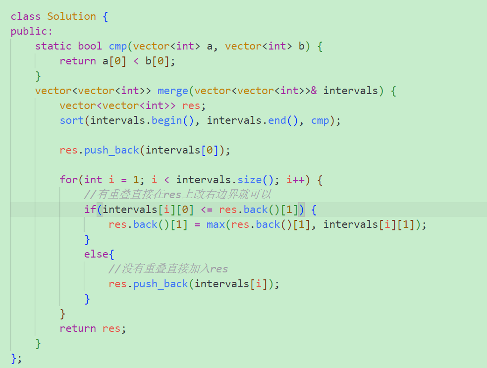

## 贪心算法解题大致过程
- 将问题分解为若干个子问题
- 找出适合的贪心策略
- 求解每一个子问题的最优解
- 将局部最优解堆叠成全局最优解

## 简单题目
**455.分发饼干** \
贪心思想：局部最优是用大饼干先喂大胃口的孩子，充分利用饼干尺寸喂饱一个，全局最优就是喂饱尽可能多的小孩。\
我当初做的时候是用小饼干喂小胃口孩子的思想。

**1005.K次取反后最大化的数组和** 
1. 将数组按照绝对值大小，从大到小排序
2. 从前向后遍历，遇到负数将其转变为正数，同时K--
3. 如果k还大于0，那么就重复转变数组中最小的元素，将k用完
4. 求和


## 中等题目

### **序列问题**
**376.摆动序列**


```bash
这是我们思考本题的一个大题思路，但本题要考虑三种情况：
情况一：上下坡中有平坡
情况二：数组首尾两端
情况三：单调坡中有平坡
```
**738.单调递增的数字** \
例如：本题只要想清楚个例，例如**98**，一旦出现strNum[i - 1] > strNum[i]的情况（非单调递增），首先想让strNum[i - 1]减一，strNum[i]赋值9，这样这个整数就是**89**。就可以很自然想到对应的贪心解法了。想到了贪心，还要考虑遍历顺序，只有从后向前遍历才能重复利用上次比较的结果。最后代码实现的时候，也需要一些技巧，例如用一个flag来标记从哪里开始赋值9。

### **贪心解决股票问题**

**122.买卖股票的最佳时机-ii** \
局部最优：收集每天的正利润。 全局最优：求得最大利润


### 两个维度权衡问题
**135.分发糖果（hard）**
```bash
本题要从两个维度权衡问题，即从左至右来一次遍历，和从右到左来一次遍历。不能同时考虑一个点的左右情况，容易顾此失彼。
一次是从左到右遍历，只比较右边孩子评分比左边大的情况。
一次是从右到左遍历，只比较左边孩子评分比右边大的情况，
取candy[i + 1] + 1和candy[i]两者间大的值，这样才能保证得分比左右都高的点分发的糖果比左右都多。
```


**406.根据身高重建队列**
```bash
此题的思想就是先根据身高大小，从大到小对vector中的元素进行一次排序。
然后根据k值，再插入到指定的位置上。
然后注意用list<vector<int>>代替vector<vector<int>>进行插入操作，能够减少时间复杂度。
```

## 有点难度题目

### 区间问题
**55.跳跃游戏**

注意for循环是再cover的范围，不是num.size()的范围，只要覆盖的范围能到
最后一个元素的位置就返回true。所以for循环要在cover的范围内往后移动

**45.跳跃游戏ii**

```bash
这里还是有个特殊情况需要考虑，当移动下标达到了当前覆盖的最远距离下标时

如果当前覆盖最远距离下标不是是集合终点，步数就加一，还需要继续走。
如果当前覆盖最远距离下标就是是集合终点，步数不用加一，因为不能再往后走了。
```
**452.用最少数量的箭引爆气球** \
局部最优：当气球出现重叠，一起射，所用弓箭最少。全局最优：把所有气球射爆所用弓箭最少。

```bash
//气球i和气球i - 1不挨着
if(points[i][0] > points[i - 1][1]) {
    res++;
}
//气球i和气球i - 1挨着
else{
    points[i][1] = min(points[i][1], points[i - 1][1]);
}
```
**435.无重叠区间** \
```bash
方法1：
本题其实和（452.用最少数量的箭引爆气球）非常像，弓箭的数量就相当于是非交叉区间的数量，只要把弓箭那道题目代码里射爆气球的判断条件加个等号（认为[0，1][1，2]不是交叉区间，即为非交叉区间），然后用总区间数减去弓箭数量 就是要移除的区间数量了。
    int res = 1;
    sort(points.begin(), points.end(), cmp);
    for(int i = 1; i < points.size(); i++) {
        if(points[i][0] >= points[i - 1][1]) {
            res++; //记录重叠区间个数，即非交叉区间的数量
        }
        else{
            points[i][1] = min(points[i][1], points[i - 1][1]);
        }
    }
    return points.size() - res;
```
```bash
方法2：
从左边从小到大排序
static bool cmp(vector<int>& a, vector<int>& b) {
    //从小到大
    return a[0] < b[0];
}
int eraseOverlapIntervals(vector<vector<int>>& intervals) {
    sort(intervals.begin(), intervals.end(), cmp);
    int count = 0; //记录重叠区间个数
    int end = intervals[0][1]; //记录区间分割点
    for(int i = 1; i < intervals.size(); i++) {
        //无重叠
        if(intervals[i][0] >= end) {
            end = intervals[i][1];
        }
        //重叠
        else{
            count++;
            end = min(end, intervals[i][1]);
        }

    }
    return count;

}
```
**763.划分字母区间**


**56.合并区间**



### 区间问题结束
**53.最大子数组和**
```C++
class Solution {
public:
    int maxSubArray(vector<int>& nums) {
        int res = INT32_MIN;
        int count = 0;
        for(int i = 0; i < nums.size(); i++) {
            count += nums[i];
            //相当于不断调整最大子数组和的结束位置
            if(res < count) {
                res = count;
            }
            //子数组累加和为负数了 重新确定起点 即i + 1
            if(count < 0) {
                count = 0;
            }
        }
        return res;
    }
};
```
**134.加油站** \
此题暴力法容易超时，贪心的想法很巧妙


```C++
int canCompleteCircuit(vector<int>& gas, vector<int>& cost) {
    int cursum = 0;
    int sum = 0;
    int start = 0;
    for(int i = 0; i < gas.size(); i++) {
        cursum += gas[i] - cost[i];
        sum += gas[i] - cost[i];
        //当前油量断油了 应该从下一个位置出发，并重新统计cursum
        if(cursum < 0) {
            start = i + 1;
            cursum = 0;
        }
    }
    // sum += gas[i] - cost[i]小于0 说明油量不够 不能走一圈
    if(sum < 0) {
        return -1;
    }
    return start;
}
```
**968.监控二叉树（hard太难了）** \

摄像头可以覆盖上中下三层，如果把摄像头放在叶子节点，就浪费了一层的覆盖。所以把摄像头放在**叶子节点的父节点**，才能充分利用摄像头的覆盖面积。\
**大体思路就是从下到上，先给叶子节点父节点放个摄像头，然后隔两个节点放一个摄像头，直到二叉树头节点。** \
此时这道题目还有两个难点：
- 二叉树的遍历
- 如何隔两个节点放一个摄像头

**二叉树的遍历选择后序遍历。**\
**如何隔两个节点放一个摄像头 :** \
每个节点有几种状态用以下数字表示：\
0.该节点无覆盖\
1.本节点有摄像头\
2.本节点有覆盖\
```C++
class Solution {
public:
    struct TreeNode{
        int val;
        TreeNode* left;
        TreeNode* right;
        TreeNode() : val(0), left(nullptr), right(nullptr) {}
        TreeNode(int x):val(x),left(nullptr),right(nullptr){}
    };
    /*
    0.无覆盖
    1.安装摄像头
    2.有覆盖
    */
    int res = 0;
    int traversal(TreeNode* root) {
        /*
        为了让摄像头数量最少，尽量让叶子节点的父节点安装摄像头，
        这样才能摄像头的数量最少，所以空节点的状态只能是有覆盖
        这样就可以在叶子节点的父节点放摄像头了。
        */
        if(root == nullptr) return 2;
  W
        int left = traversal(root->left);
        int right = traversal(root->right);
        //1.左右节点都有覆盖，那么此时中间节点就应该是无覆盖的状态
        if(left == 2 && right == 2) {
            return 0;
        }

        //2.左右节点至少有一个无覆盖的情况 则中间节点（父节点）应该
        //安装摄像头
        if(left == 0 || right == 0) {
            res++;
            return 1;
        }
 
        //3.左右节点至少有一个摄像头，那么其父节点应该是2（覆盖状态）
        //其它情况前段代码均已覆盖
        if(left == 1 || right == 1) {
            return 2;
        }


        //这个return -1 逻辑不会走到这里
        return -1;

    }
    int minCameraCover(TreeNode* root) {
        res = 0;
        //4.头节点无覆盖
        if(traversal(root) == 0) {
            res++;
        }
        return res;
    }
};
```


