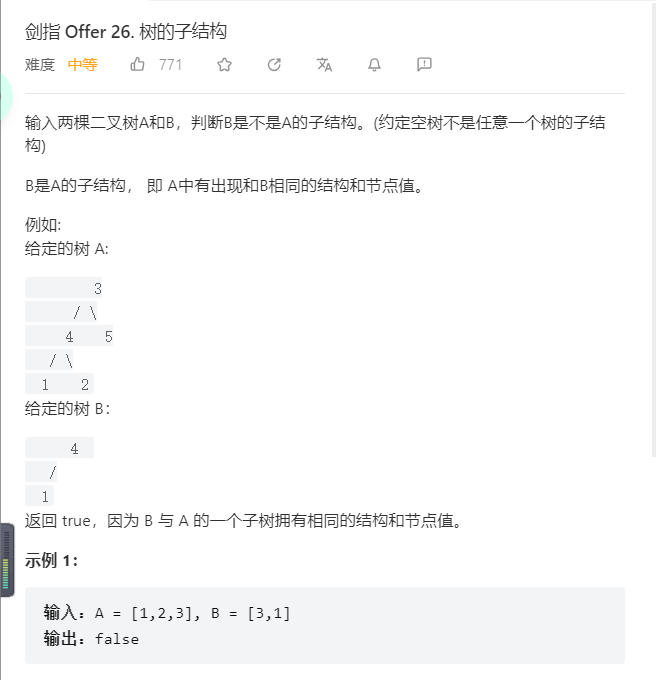
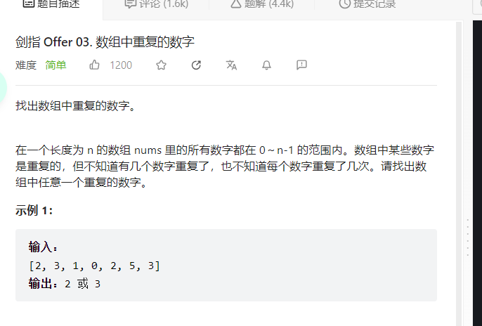
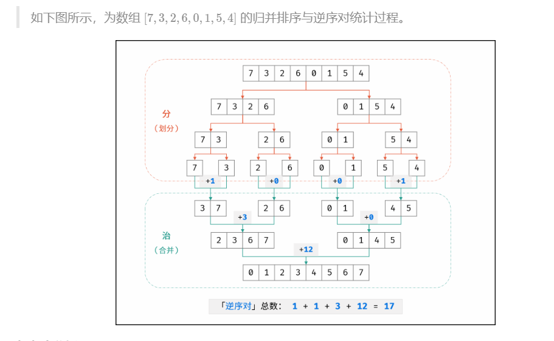
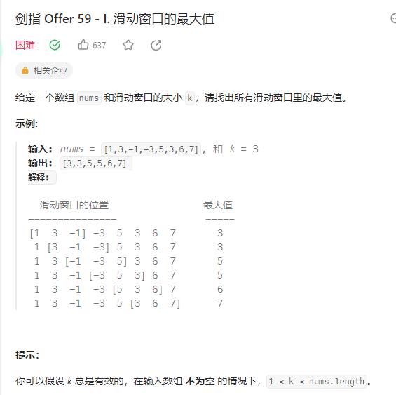

# **动态规划**
## **19.正则表达式匹配**


```C++
class Solution {
public:
    bool isMatch(string s, string p) {
        //dp[i][j]: 以i - 1、j - 1结尾的两个字符串是否匹配
        int len1 = s.size();
        int len2 = p.size();
        //dp[i][j] : 以i - 1结尾的串s，和以j - 1结尾的串p是否匹配
        vector<vector<bool>> dp(len1 + 1, vector<bool>(len2 + 1, false));
        //初始化首行 必须p的偶数位等于*时，奇数位才能可以为空，空串才能和空串匹配
        dp[0][0] = true;
        for(int i = 2; i <= len2; i += 2) {
            if(dp[0][i - 2] && p[i - 1] == '*') dp[0][i] = true;//空串和空串匹配
        }
        for(int i = 1; i <= len1; i++) {
            for(int j = 1; j <= len2; j++) {
                if(p[j - 1] == '*') {
                    //情况1 直接砍掉 "p[j - 1]* 例： aa和aab*
                    if (dp[i][j - 2]) {
                        dp[i][j] = true;
                    }
                    //情况2 例如 aa 和 aaab* 满足 但是添加字符后，即添加s[i - 1]
                    // aaa 和 aaab*不满足 但是 aab 和 aaab*满足
                    else if (dp[i - 1][j] && s[i - 1] == p[j - 2]) {
                        dp[i][j] = true;
                    }
                    else if (dp[i - 1][j] && p[j - 2] == '.') {
                        //情况3：".*"表示万能串 可以任意匹配主串
                        dp[i][j] = true;
                    }
                }
                else{
                    if (dp[i - 1][j - 1] && p[j - 1] == s[i - 1]) {
                        dp[i][j] = true;
                    }
                    else if (dp[i - 1][j - 1] && p[j - 1] == '.') {
                        dp[i][j] = true;
                    }
                }
            }
        }
        return dp[len1][len2];

    }
};
```

## **49.丑数**

```C++
class Solution {
public:
    int nthUglyNumber(int n) {
        //dp[i]: 从小到大顺序的第i + 1个丑数为dp[i]
        vector<int> dp(n, 0);
        dp[0] = 1;
        int a = 0;
        int b = 0;
        int c = 0;
        for(int i = 1; i < n; i++) {
            int n2 = dp[a] * 2;
            int n3 = dp[b] * 3;
            int n5 = dp[c] * 5;
            dp[i] = min(min(n2, n3), n5);
            if(dp[i] == n2) a++;
            if(dp[i] == n3) b++;
            if(dp[i] == n5) c++;
        }
        return dp[n - 1];

    }
};
```
# **二叉树**
## **26.树的子结构** 
本题和leetcode中的**另一棵子树**并不完全相同。另一棵子树中的compare函数定义如下：
```C++
    bool compare(TreeNode* father, TreeNode* son){
        if(father == nullptr && son == nullptr) return true;
        else if(father == nullptr || son == nullptr) return false;
        else if(father->val != son->val) return false;

        return compare(father->left, son->left) && compare(father->right, son->right);
    }
```


**也就是说上面这张图，根本不符合另一棵树的子树的要求，但是符合树的子结构的要求。**


```C++
/**
 * Definition for a binary tree node.
 * struct TreeNode {
 *     int val;
 *     TreeNode *left;
 *     TreeNode *right;
 *     TreeNode(int x) : val(x), left(NULL), right(NULL) {}
 * };
 */
class Solution {
public:
    bool compare(TreeNode* root, TreeNode* subroot) {
        if(subroot == nullptr) return true;
        else if(root == nullptr) return false;
        else if(root->val != subroot->val) return false;

        return compare(root->left, subroot->left) && compare(root->right, subroot->right);
    }

    bool isSubStructure(TreeNode* A, TreeNode* B) {
        if(A == nullptr || B == nullptr) return false;

        return compare(A, B) || isSubStructure(A->left, B) || isSubStructure(A->right, B);
    }
};
```
## **36.二叉树与双向链表**


```C++
/*
// Definition for a Node.
class Node {
public:
    int val;
    Node* left;
    Node* right;

    Node() {}

    Node(int _val) {
        val = _val;
        left = NULL;
        right = NULL;
    }

    Node(int _val, Node* _left, Node* _right) {
        val = _val;
        left = _left;
        right = _right;
    }
};
*/
class Solution {
public:
    //中序遍历 左中右
    Node* pre = nullptr;
    Node* head = nullptr; 
    
    void traversal(Node* cur) {
        if (cur == nullptr) return;
        //左
        traversal(cur->left);

        //找到了第一个节点即头节点，用head保存头节点用于之后的返回
        if(pre == nullptr) {
            head = cur;
        }
        else {
            pre->right = cur;
        }
        cur->left = pre;
        pre = cur;

        traversal(cur->right);
        return;
    }

    Node* treeToDoublyList(Node* root) {
        if (root == nullptr) return nullptr;
        traversal(root);
        head->left = pre;
        pre->right = head;
        return head;
    }
};
```
## **54. 二叉搜索树的第k大节点**

```C++
/**
 * Definition for a binary tree node.
 * struct TreeNode {
 *     int val;
 *     TreeNode *left;
 *     TreeNode *right;
 *     TreeNode(int x) : val(x), left(NULL), right(NULL) {}
 * };
 */
class Solution {
public:
    int res = 0;
    int count = 0;
    //中序遍历倒叙遍历
    void inorder(TreeNode* cur, int k) {
        if(cur == nullptr) return;
        inorder(cur->right, k);
        count++;
        if(count == k) {
            res = cur->val;
            return;
        }

        inorder(cur->left, k);
        return;
    } 

    int kthLargest(TreeNode* root, int k) {
        inorder(root, k);
        return res;
    }
};
```

## **37.序列化二叉树**

```C++
/**
 * Definition for a binary tree node.
 * struct TreeNode {
 *     int val;
 *     TreeNode *left;
 *     TreeNode *right;
 *     TreeNode(int x) : val(x), left(NULL), right(NULL) {}
 * };
 */
class Codec {
public:

    // Encodes a tree to a single string.
    string serialize(TreeNode* root) {
        if(root == NULL) return "";
        string res;
        queue<TreeNode*> qe;
        qe.push(root);
        while(!qe.empty()) {
            TreeNode* cur = qe.front();
            qe.pop();
            if(cur == nullptr) {
                res += '#';
                res += ',';
            }
            else{
                res += to_string(cur->val);
                res += ',';
                qe.push(cur->left);
                qe.push(cur->right);
            }
            
        }
        cout << res << endl;
        return res;
    }

    // Decodes your encoded data to tree.
    TreeNode* deserialize(string data) {
        if(data.size() == 0)
            return nullptr;
        vector<TreeNode* > nodes;
        int j = 0;
        while(j < data.size())
        {
            string stmp = "";
            //有负数的情况 所以用while 不用if
            while(data[j] != ',')
            {
                stmp += data[j];
                j++;
            }

            if(stmp == "#")
            {
                nodes.push_back(nullptr);
            }
            else
            {
                int tmp = atoi(stmp.c_str());
                TreeNode* newnode = new TreeNode(tmp);
                nodes.push_back(newnode);
            }
            j++;
        }
        int pos = 1;
        for(int i = 0; i < nodes.size(); ++i)
        {
            if(nodes[i] == nullptr)
                continue;
            nodes[i]->left = nodes[pos++];
            nodes[i]->right = nodes[pos++];
        }

        return nodes[0];

    }
};

// Your Codec object will be instantiated and called as such:
// Codec codec;
// codec.deserialize(codec.serialize(root));
```
## **33.二叉搜索树的后序遍历序列**

```C++
class Solution {
public:
    bool traversal(vector<int>& postorder, int left, int right) {
        if(left >= right) return true;

        int value = postorder[right];

        int k = left;
        while(k < right && postorder[k] < value) {
            k++;
        }
        for(int i = k; i < right; i++) {
            if(postorder[i] < value) {
                return false;
            }
        }

        return traversal(postorder, left, k - 1) && traversal(postorder, k, right - 1);

    }

    bool verifyPostorder(vector<int>& postorder) {
        if(postorder.size() <= 1) return true;
        return traversal(postorder, 0, postorder.size() - 1);
    }
};
```

# **数组**
## **3.数组中重复的数字**

本题可以哈希set和原地调整两个方面去考虑
```C++
class Solution {
public:
//原地调换
    int findRepeatNumber(vector<int>& nums) {
        int i = 0;
        while (i < nums.size()) {
            //比如索引2上 存着的元素已经等于2 则继续往下遍历
            if(nums[i] == i) {
                i++;
                continue;
            }

            //比如 如果索引2上已经存放着2了直接返回 2
            if(nums[i] == nums[nums[i]]) {
                return nums[i];
            }
            swap(nums[i], nums[nums[i]]);
        }
        return -1;
    }
};
```
## **51.数组中的逆序对（hard）**

归并思想，归并算法主要是基于分治的思想，先将数组递归拆成大小为1的小数组，然后再将这些有序的小数组再合并成有序的大数组。

本题就是在合并的过程中去统计**数组中的逆序对数**


```C++
class Solution {
public:
//归并
    int res = 0;
    void mergesort(vector<int>& nums, vector<int>& temp, int begin, int end) {
        if(begin >= end) return;
        int mid = begin + (end - begin) / 2;
        int start1 = begin;
        int end1 = mid;
        int start2= mid + 1;
        int end2 = end;

        mergesort(nums, temp, start1, end1);
        mergesort(nums, temp, start2, end2);

        int index = begin;

        while (start1 <= end1 && start2 <= end2) {
            if(nums[start1] <= nums[start2]) {
                temp[index++] = nums[start1++];
            }
            else {
                //统计数组中的逆序对数
                res += (end1 - start1 + 1);
                temp[index++] = nums[start2++];

            }
        }

        while (start1 <= end1) {
            temp[index++] = nums[start1++];
        }

        while (start2 <= end2) {
            temp[index++] = nums[start2++];
        }

        for (index = begin; index <= end; index++) {
            nums[index] = temp[index];
        }

    }

    int reversePairs(vector<int>& nums) {
        if (nums.size() == 0) return res;
        vector<int> datatemp(nums.size(), 0);
        mergesort(nums, datatemp, 0, nums.size() - 1);
        cout << res << endl;
        return res;
    }
};
```

# **字符串**
## **48.最长不含重复字符的子字符串**

```C++
class Solution {
public:
    //滑动窗口 + 哈希
    int lengthOfLongestSubstring(string s) {
        if(s.size() == 0) return 0;
        unordered_set<int> uset;
        int left = 0;
        int res = 0;
        for(int i = 0; i < s.size(); i++) {
           while(uset.find(s[i]) != uset.end()) {
               uset.erase(s[left]);
               left++;
           } 
           uset.insert(s[i]);
           res = max(res, i - left + 1);
        }
        return res;
    }
};
```
比如“abcdbaa”，索引从0开始。 我们容易得到，当 j = 4时，以s[4]结尾字符串sub[4] = “cdb”的 长度dp[4] =3。 接下来我们看 j +1的情况。根据定义，sub[4]字符串中的字符肯定不重复，所以当 j = 5时，这时距离字符s[5]的左侧的重复字符a的索引 i = 0， 也就是说s[ 0 ]在子字符串sub[ 4 ]之外了，以s[5]结尾的字符串自然在sub[4]的基础上加上字符s[5]就构成了新的最长的不重复的子串sub[5]，长度dp[5] = dp[4] + 1; 接下来我们继续看 j =6的情况，这时s[6]的左侧重复字符a的索引 i = 5，该重复字符在sub[ 5 ]中。新的最长不重复的字串sub[6]左边界以 i 结尾，长度dp[6] = j - i = 1。
```C++
class Solution {
public:
    //abcdeca 动规+哈希
    int lengthOfLongestSubstring(string s) {
        int len = s.size();
        if(len == 0) return 0;
        //dp[i]:以i结尾的最长不含重组字符的子字符串长度（最后一个字符一定是s[i]）
        vector<int> dp(len, 0);
        dp[0] = 1;
        int res = 1;
        unordered_map<char, int> umap;
        //abcdbaa
        umap[s[0]] = 0;
        for(int i = 1; i < len; i++) {
            //不含此字符
            if (umap.find(s[i]) == umap.end()) {
                dp[i] = dp[i - 1] + 1;
            }
            //abcdbaa 如此时i = 6 j = 5
            else {
                int j = umap[s[i]];
                if (i - j <= dp[i - 1]) {
                    dp[i] = i - j;
                }
                else {
                    dp[i] = dp[i - 1] + 1;
                }
            }
            umap[s[i]] = i;
            res = max(res, dp[i]);
            cout << res << endl;
        }
        return res;
    }
};
```
# **回溯与递归**

## **16.数值的整数次方**


```C++
class Solution {
public:
//主要考察的是快速降幂
/*
n = 偶数时;
x的n次方 = x的n/2次方 * x的n/2次方
n = 奇数时；
x的n次方 = x的n - 1次方 * x
*/
    double myPow(double x, int n) {
        if(n == 0) return 1;
        if(n == 1) return x;
        if(n == -1) return 1 / x;
        double half = myPow(x, n / 2);
        double mod = myPow(x, n % 2);
        cout << "half: " << half << " " << "mod: " << mod << endl;

        return half * half * mod;
    }
};
```
## **17.打印从1到最大的n位数**


```C++
class Solution {
public:
//主要考的是大数问题 n太大超过int、long等范围时 应选择用string处理
    vector<string> res;
    string path;
    char NUM[10] = {'0', '1', '2', '3', '4', '5', '6', '7', '8', '9'};
    //index表示当前遍历到第几位 n为位数 例如n = 2 就从左到右遍历2位
    void back(int index, int n) {
        if (index == n) {
            res.push_back(path);
            return;
        }

        //避开0 打头的 例如 01 02 03、、、
        int start = index == 0 ? 1 : 0;
        for (int i = start; i < 10; i++) {
            path.push_back(NUM[i]);
            back(index + 1, n);
            path.pop_back();
        }
    }

    vector<int> printNumbers(int n) {
        for(int i = 1; i <= n; i++) {
            back(0, i);
        }

        vector<int> res_int;
        // for (auto i: res) {
        //     cout << i << ' ';
        // }

        for (auto i: res) {
            res_int.push_back(stoi(i));
        }
        return res_int;
    }
};
```
# **排序**

## **40.最小的k个数**

可以快排、可以小顶堆（从大到小）


**基于快速排序的数组划分**


```C++
class Solution {
public:
    vector<int> quickSort(vector<int>& arr, int k, int l, int r) {
        int i = l, j = r;
        while (i < j) {
            while (i < j && arr[j] >= arr[l]) j--;
            while (i < j && arr[i] <= arr[l]) i++;
            swap(arr[i], arr[j]);
        }
        swap(arr[i], arr[l]);

        // for(auto iter: arr) {
        //     cout << iter << " ";
        // }
        
        cout << endl;
        if (i > k) {
            return quickSort(arr, k, l, i - 1);
           
        } 
        if (i < k) {
            return quickSort(arr, k, i + 1, r);
        }
        //下面是 i == k的情况
        vector<int> res;
        res.assign(arr.begin(), arr.begin() + k);
        return res;
    }

    vector<int> getLeastNumbers(vector<int>& arr, int k) {
        if (k >= arr.size()) return arr;
        return quickSort(arr, k, 0, arr.size() - 1);
    }

};
```
## **41.数据流中的中位数（hard）**

采用大顶堆、小顶堆

大顶堆中保存一组数中较小的一半

小顶堆保存较大的一半

保证小顶堆中的数字都大于大顶堆，并且小顶堆的数量与大顶堆相等，或者比大顶堆大1。当两个堆中个数相等时，向小顶堆中插入元素；不等时向大顶堆插入(反过来也行)；


```C++
class MedianFinder {
public:
    /** initialize your data structure here. */
    MedianFinder() {

    }
    //小顶堆A 存储较大的一半
    //大顶堆B 存储较小的一半
    /*
    数量上时刻保持两堆相等、或者小顶比大顶多一个
    */
    priority_queue<int, vector<int>, greater<int>> minheap;//小顶堆
    priority_queue<int, vector<int>, less<int>> maxheap; //大顶堆
    void addNum(int num) {
        //相等插入小顶堆，先插大顶把大的中的最小的再插入小顶堆
        if(minheap.size() == maxheap.size()) {
            maxheap.push(num);
            int top = maxheap.top();
            maxheap.pop();
            minheap.push(top);   
        }
        else {
            minheap.push(num);
            int top = minheap.top();
            minheap.pop();
            maxheap.push(top);
        }
    }
    
    double findMedian() {
        if(minheap.size() == maxheap.size()) {
            return (minheap.top() + maxheap.top()) * 1.0 / 2.0;
        }
        else {
            return minheap.top() * 1.0;
        }
    }
};

/**
 * Your MedianFinder object will be instantiated and called as such:
 * MedianFinder* obj = new MedianFinder();
 * obj->addNum(num);
 * double param_2 = obj->findMedian();
 */
```

# **查找**
## **注意：排序数组中的搜索问题，首先想到二分法（或者双指针）解决**

## **53.在排序数组中查找数字I(二分查找)**

```C++
class Solution {
public:
    /*
    转换为使用二分法分别找到左边界left、和右边界right，
    则target的数量为right - left - 1
    */
    int search(vector<int>& nums, int target) {
        int i = 0;
        int j = nums.size() - 1;
        //找右边界
        while (i <= j) {
            int mid = j + (i - j) / 2;
            if(nums[mid] > target) {
                j = mid - 1;
            }
            else {
                i = mid + 1;
            }
        }
        int right = i;

        i = 0; j = nums.size() - 1;
        //找左边界
        while (i <= j) {
            int mid = j + (i - j) / 2;
            if(nums[mid] >= target) {
                j = mid - 1;
            }
            else {
                i = mid + 1;
            }
        }
        int left = j;
        return right - left - 1;
    }
};
```

## **53.0 ~ n-1中缺失的数字**


```C++
class Solution {
public:
    int missingNumber(vector<int>& nums) {
        int i = 0;
        int j = nums.size() - 1;
        //二分法将数组分成两部分，昨天部分索引和元素相同
        //右边第一个位置索引和元素不同，因此缺失的元素就是右边数组的第一个索引
        while(i <= j) {
            int mid = i + (j - i) / 2;
            if(nums[mid] == mid) {
                i = mid + 1; //右数组首元素索引
            }
            else{
                j = mid - 1; //左数组末尾元素索引
            }
        }
        return i;
    }
};
```
## **11.旋转数组中的最小数字**


```C++
class Solution {
public:
    int minArray(vector<int>& numbers) {
        int i = 0;
        int j = numbers.size() - 1;
        while (i < j) {
            int mid = i + (j - i) / 2;
            if(numbers[mid] > numbers[j]) {
                i = mid + 1;
            }
            else if(numbers[mid] < numbers[j]) {
                j = mid;//避免错过mid为最小值的情况，所以不是j = mid - 1
            }
            else {
                j--; //
            }
        }
        return numbers[i];
    }
};
```
# **位运算**

## **15.二进制中1的个数**


```C++
class Solution {
public:
    int hammingWeight(uint32_t n) {
        int res = 0;
        //右移
        while (n != 0) {
            res += n & 1;
            n >>= 1;
        }
        return res;
    }
};

```
**也可以使用**
```bash
n & (n - 1)那么算
```


## **56.数组中数字出现的次数I**


```C++
class Solution {
public:
    vector<int> singleNumbers(vector<int>& nums) {  
        /*找到两个只出现一次的数字的异或值，
            例如{1，1，2，2，3，4}  1^1^2^2^3^4 = 3 ^ 4
            m定义为1，从低位到高位左移，找到两个不同元素的二进制表示的第一个不同的位置，
            并以此将数组中的元素划分成两组；
        */
        int a = 0, m = 1, x = 0, y = 0; 
        for(int i = 0; i < nums.size(); i++) {
            a ^= nums[i];
        }
        while((m & a) == 0) {
            m <<= 1;
        }

        for(auto i: nums) {
            if((i & m) == 0) {
                x ^= i;
            }
            else {
                y ^= i;
            }
        }
        return {x, y};
    }
};
```

# **数学**
## **62.圆圈中最后剩下的数字（约瑟夫环问题）**


```C++
class Solution {
public:
//约瑟夫环
    int lastRemaining(int n, int m) {
        int res = 0;
        if(n == 1) {
            return res;
        }
        for(int i = 2; i <= n; i++) {
            res = (res + m) % i;
        }
        return res;
    }
};
```

## **1-n整数中1出现的次数**


```C++
class Solution {
public:
    int f(int n) {
        if(n <= 1) {
            return n;
        }

        string s = to_string(n);
        int high = s[0] - '0';
        int Pow = pow(10, s.size() - 1);
        int last = n - high * Pow;
        //1开头的 例如1234
        if(high == 1) {
            return f(Pow - 1) + last + 1 + f(last);
        }
        //其它数字开头的 例如3234
        else {
            return high * f(Pow - 1) + Pow + f(last);
        }

    }

    int countDigitOne(int n) {
        return f(n);
    }
};
```

## **44.数字序列中某一位的数字**


# **栈与队列**

## **59.滑动窗口最大值**

和代码随想录我写的版本不一样

```C++
class Solution {
public:
    vector<int> maxSlidingWindow(vector<int>& nums, int k) {
        if(k > nums.size() || k <= 0) return {};
        deque<int> dq;
        vector<int> res;
        
        //窗口未成形
        //单调队列中的元素 队尾到队首 从小到大
        //当元素到来时 如果到来的元素比队列头还大直接清空 只留下到来的元素在队列中，如果到来的元素 比队列末尾元素小 就加入队列
        /*
        [1 3 -1] -3 5 3 6 7 k = 3
        front -> back
        dq：1
        dq：3
        dq: 3 -1
        dq: 3 -1 -3
        dq: 5
        dq: 5 3
        dq: 6
        dq: 7
        */
        for(int i = 0; i < k; i++) {
            while(!dq.empty() && nums[i] > dq.back()) {
                dq.pop_back();
            }
            dq.push_back(nums[i]);
        }
        res.push_back(dq.front());
        //1 3 -1 -3 5 3 6 7
        //0 1  2  3 4 5 6 7
        for(int i = k; i < nums.size(); i++) {
            
            //i-k是已经在区间外了，如果首位等于nums[i-k]，那么说明此时首位值已经不再区间内了，需要删除
            //例如i = 4时 此时到元素5 4 - k = 4 - 3 = 1 index为1 的元素为3 正好是最大值
            //下面这句解释更好
            //即如果当前最大的是即将要移除的左边界，那么要移除的左边界不允许放在deque 应该拿走
            if(nums[i - k] == dq.front()) {
                dq.pop_front(); //维持窗口大小始终为k 超过k了就要pop队列头
            }
            while(!dq.empty() && nums[i] > dq.back()) {
                dq.pop_back();
            }
            dq.push_back(nums[i]);
            res.push_back(dq.front());
        }
        return res;
    }
};
```
