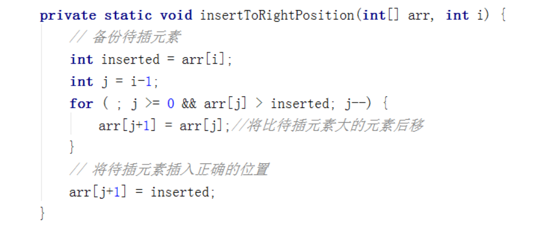

# **冒泡排序**
**冒泡排序是一种稳定的排序算法。**
{9, 5, 6, 8, 2, 7, 3, 4, 1};

```C++
#include <vector>
#include <iostream>
using namespace std;

void bubble(vector<int>& vc) {
    int len = vc.size();
    bool flag = true;
    //for(int i = 0; i < len - 1; i++) 小于len - 1更规范
    //对于n个元素的冒泡排序趟数， n - 1躺更符合规范理解一些
    for(int i = 0; i < len; i++) {
        //每趟循环都把剩余元素中最大的元素放到最后
        flag = true;
        for(int j = 0; j < len - i - 1; j++) {
            if(vc[j] > vc[j + 1]) {
                flag = false;
                swap(vc[j], vc[j + 1]);
            }
        }
        if(flag == true) {
            break;
        }
    }
}

int main() {
    vector<int> vc{9, 5, 6, 8, 2, 7, 3, 4, 1};
    bubble(vc);
    for(auto i: vc) {
        std::cout << i << " ";
    }
    cout << endl;
    getchar();
    return 0;
}
```

# **选择排序**
选择排序是给每个位置选择当前元素最小的，比如给第一个位置选择最小的，在剩余元素里面给>二个元素选择第二小的，依次类推，直到第n-1个元素，第n个 元素不用选择了，因为只剩下它一个最大的元素了。

那么，在一趟选择，如果当前元素比一个元素小，而该小的元素又出现在一个和当前元素相等的元素后面，那么 交换后稳定性就被破坏了。

比较拗口，举个例子，序列5 8 5 2 9， 我们知道第一遍选择第1个元素5会和2交换，那么原序列中2个5的相对前后顺序就被破坏了，**所以选择排序不是一个稳定的排序算法。**


```C++
void selectsort(vector<int>& nums) {
    int len = nums.size();
    int minindex = 0;
    for (int i = 0; i < len; i++) {
        minindex = i;
        for (int j = i + 1; j < len; j++) {
            if (nums[j] < nums[minindex]) {
                minindex = j;
            }
        }
        swap(nums[i], nums[minindex]);
    }
}
```

#  **插入排序**
插入排序是在一个已经有序的小序列的基础上，一次插入一个元素。

当然，刚开始这个有序的小序列只有1个元素，就是第一个元素。比较是从有序序列的末尾开 始，也就是想要插入的元素和已经有序的最大者开始比起，如果比它大则直接插入在其后面，否则一直往前找直到找到它该插入的位置。

如果碰见一个和插入元素相 等的，那么插入元素把想插入的元素放在相等元素的后面。

所以，相等元素的前后顺序没有改变，从原无序序列出去的顺序就是排好序后的顺序，所以**插入排序是稳定的。**

**插入排序在数组基本有序，并且规模较小的时候效率比较高**

```C++
void print(vector<int>& a, int i) {
    cout << "step" << i << ": " ;
    for(int j = 0; j < a.size(); j++) {
        cout << a[j] << " ";
    }
    cout << endl;
}
//{9, 5, 6, 8, 2, 7, 3, 4, 5, 1}
void insertsort(vector<int>& nums) {
    int len = nums.size();
    for(int i = 1; i < len; i++) {
        if (nums[i] < nums[i - 1]) {
            int j = i - 1;
            int x = nums[i]; //复制哨兵元素，即待排序元素
            while (j >= 0 && x < nums[j]) {
                nums[j + 1] = nums[j];
                j--;
            }
            //找到了插入位置
            nums[j + 1] = x;
        }
        print(nums, i);
    }
}
```


另一种方法：



# **快速排序（不稳定）**
算法思想

1、选取第一个数为基准

2、将比基准小的数交换到前面，比基准大的数交换到后面

3、对左右区间重复第二步，直到各区间只有一个数

我们从数组中选择一个元素，我们把这个元素称之为中轴元素吧，然后把数组中所有小于中轴元素的元素放在其左边，所有大于或等于中轴元素的元素放在其右边，显然，此时中轴元素所处的位置的是有序的。也就是说，我们无需再移动中轴元素的位置。

从中轴元素那里开始把大的数组切割成两个小的数组(两个数组都不包含中轴元素)，接着我们通过递归的方式，让中轴元素左边的数组和右边的数组也重复同样的操作，直到数组的大小为1，此时每个元素都处于有序的位置。

```C++
void quickSort(vector<int>& nums, int begin, int end) {
    if(begin >= end) return;
    int left = begin;
    int right = end;
    int val = nums[begin];
    //从后往前找比第一个元素小的 从前后找比第一个元素大的
    //并且必须要从后往前开始
    while(left < right) {
        while (left < right && nums[right] >= val) {
            right--;
        }
        if (left < right) {
            nums[left] = nums[right];
            left++;
        }

        while(left < right && nums[left] <= val) {
            left++;
        }
        if (left < right) {
            nums[right] = nums[left];
            right--;
        }
    }
    nums[left] = val;
    print(nums);

    quickSort(nums, begin, left - 1);
    quickSort(nums, left + 1, end);
}
```

这么写也可以：
```C++
void quickSort(vector<int>& nums, int begin, int end) {
    if(begin >= end) return;
    int left = begin;
    int right = end;
    
    //从后往前找比第一个元素小的 从前后找比第一个元素大的
    //这样就可以使  基数元素 左边的都比他小 右边的都比他大
    //并且必须要从后往前开始
    while(left < right) {
        while (left < right && nums[right] >= nums[left]) {
            right--;
        }
        while(left < right && nums[left] <= nums[right]) {
            left++;
        }
        swap(nums[left], nums[right]);
    }
    swap(nums[begin], nums[left]);

    quickSort(nums, begin, left - 1);
    quickSort(nums, left + 1, end);
}

int main() {
   
    vector<int> vc = {4,6,2,8,9,5,7,3,1}; 
    quickSort(vc, 0, vc.size() - 1);

    for (auto i: vc) {
        cout << i << " ";
    }

    getchar();
    return 0;
}
```

<span style="color: blue;">这是蓝色的文本</span>

# **希尔排序（不稳定）**
希尔排序可以说是插入排序的一种变种。无论是插入排序还是冒泡排序，如果数组的最大值刚好是在第一位，要将它挪到正确的位置就需要 n - 1 次移动。也就是说，原数组的一个元素如果距离它正确的位置很远的话，则需要与相邻元素交换很多次才能到达正确的位置，这样是相对比较花时间了。

希尔排序就是为了加快速度简单地改进了插入排序，交换不相邻的元素以对数组的局部进行排序。

希尔排序的思想是采用插入排序的方法，先让数组中任意间隔为 h 的元素有序，刚开始 h 的大小可以是 h = n / 2,接着让 h = n / 4，让 h 一直缩小，当 h = 1 时，也就是此时数组中任意间隔为1的元素有序，此时的数组就是有序的了。

```C++
void print(vector<int>& a) {
    for(int j = 0; j < a.size(); j++) {
        cout << a[j] << " ";
    }
    cout << endl;
}
void shellsortCore(vector<int>& nums, int gap, int i) {
    int insertnum = nums[i];
    int j;
    for(j = i - gap; j >= 0 && insertnum < nums[j]; j -= gap) {
        nums[j + gap] = nums[j];
    }

    nums[j + gap] = insertnum;
}

void shellSort(vector<int>& nums) {
    int len = nums.size();
    //进行分组，最开始的时候，gap为数组长度一半
    for (int gap = len / 2; gap > 0; gap /= 2) {
         //对各个分组进行插入分组
        for (int i = gap; i < len; i++) {
             //将nums[i]插入到所在分组正确的位置上
            shellsortCore(nums, gap, i);
        }
    }
    
    print(nums);
}
```

# **归并排序**
将一个大的无序数组有序，我们可以把大的数组分成两个，然后对这两个数组分别进行排序，之后在把这两个数组合并成一个有序的数组。由于两个小的数组都是有序的，所以在合并的时候是很快的。

通过递归的方式将大的数组一直分割，直到数组的大小为 1，此时只有一个元素，那么该数组就是有序的了，之后再把两个数组大小为1的合并成一个大小为2的，再把两个大小为2的合并成4的 … 直到全部小的数组合并起来。

归并排序是建立在归并操作上的一种有效的排序算法。该算法是采用分治法（Divide and Conquer）的一个非常典型的应用。将已有序的子序列合并，得到完全有序的序列；**即先使每个子序列有序，再使子序列段间有序。若将两个有序表合并成一个有序表，称为2-路归并。**

**算法思想**

- 把长度为n的输入序列分成两个长度为n/2的子序列；

- 对这两个子序列分别采用归并排序；

- 将两个**排序好**的子序列合并成一个最终的排序序列。


```C++
void mergeSortCore(vector<int>& data, vector<int>& dataTemp, int low, int high) {
	if (low >= high) return;

	int mid = low + (high - low) / 2;
	int start1 = low, end1 = mid, start2 = mid + 1, end2 = high;

	mergeSortCore(data, dataTemp, start1, end1);
	mergeSortCore(data, dataTemp, start2, end2);
    
    //等到回溯的时候 再合并数组
    //此时 区间[l , mid] 和 区间[mid + 1 , r] 中的元素已经是有序的了
    //所以我们需要用两个指针 i 和 j，把这两个区间的元素，按从小到大的顺序放到辅助数组 temp 中
	/*
    例如{5,3,2,8,7,4,1,6}; 先分左半部分的 5，3 再回溯排序（合） 3， 5 再分左半部分的2，8 排序 2，8
    最后再排 2，3，5，8
    同理处理右半部分
    */
    int index = low;
	while (start1 <= end1 && start2 <= end2) {
		dataTemp[index++] = data[start1] < data[start2] ? data[start1++] : data[start2++];
	}

	while (start1 <= end1) {
		dataTemp[index++] = data[start1++];
	}


	while (start2 <= end2) {
		dataTemp[index++] = data[start2++];
	}

	for (index = low; index <= high; ++index) {
		data[index] = dataTemp[index];
	}
}


void mergeSort(vector<int>& data) {
	int len = data.size();
	vector<int> dataTemp(len, 0);
	mergeSortCore(data, dataTemp, 0, len - 1);
    print(data);
}
```

# **堆排序**


最大堆升序排序代码如下：

首先初始化堆，不断调整使最大值位于堆顶，并且每个节点的左右节点的值都小于当前节点的值。

从最后一层的最右边节点开始调整


```C++
#include <vector>
#include <iostream>
using namespace std;

void print(vector<int>& a) {
    for(int j = 0; j < a.size(); j++) {
        cout << a[j] << " ";
    }
    cout << endl;
}

//堆的向下调整法
void maxHeapDown(vector<int>& a, int start, int end) {
    int c = start;            // 当前(current)节点的位置
    int l = 2*c + 1;        // 左(left)孩子的位置
    int tmp = a[c];            // 当前(current)节点的大小
    for (; l <= end; c = l, l = 2 * l + 1) {
        // "l"是左孩子，"l+1"是右孩子
        if (l < end && a[l] < a[l + 1])
            l++;        // 左右两孩子中选择较大者，即m_heap[l+1]
        if (tmp >= a[l])
            break;        // 调整结束
        else            // 交换值
        {
            a[c] = a[l];
            a[l]= tmp;
        }
    }
}
 

void heapSortAsc(vector<int>& a, int n) {
    int tmp;
    // 从(n/2-1) --> 0逐次遍历。遍历之后，得到的数组实际上是一个(最大)二叉堆。
    for (int i = n / 2 - 1; i >= 0; i--)
        maxHeapDown(a, i, n-1);

    //此时堆顶已经是数组中最大的元素
    // 从最后一个元素开始对序列进行调整，不断的缩小调整的范围直到第一个元素
    for (int i = n - 1; i > 0; i--){
        // 交换a[0]和a[i]。交换后，a[i]是a[0...i]中最大的。
        tmp = a[0];
        a[0] = a[i];
        a[i] = tmp;
        // 调整a[0...i-1]，使得a[0...i-1]仍然是一个最大堆。
        // 即，保证a[i-1]是a[0...i-1]中的最大值。
        maxHeapDown(a, 0, i-1);
    }
}

int main() {
    //4,10,3,0,5,1,2
    vector<int> vc{5,7,8,3,1,2,4,6};
    heapSortAsc(vc, 8);
    print(vc);

    getchar();
    return 0;
}
```


# **计数排序**
计数排序统计小于等于该元素值的元素的个数i，于是该元素就放在目标数组的索引i位（i≥0）。

- 计数排序基于一个假设，待排序数列的所有数均为整数，且出现在（0，k）的区间之内。
- 如果 k（待排数组的最大值） 过大则会引起较大的空间复杂度，一般是用来排序 0 到 100 之间的数字的最好的算法，但是它不适合按字母顺序排序人名。
- 计数排序不是比较排序，排序的速度快于任何比较排序算法。

算法思想：

- 找出待排序的数组中最大和最小的元素；
- 统计数组中每个值为 i 的元素出现的次数，存入数组 C 的第 i 项；
- 对所有的计数累加（从 C 中的第一个元素开始，每一项和前一项相加）；
- 向填充目标数组：将每个元素 i 放在新数组的第 C[i] 项，每放一个元素就将 C[i] 减去 1；

```C++
#include <vector>
#include <iostream>
#include <algorithm>
using namespace std;

void print(vector<int>& a) {
    for(int j = 0; j < a.size(); j++) {
        cout << a[j] << " ";
    }
    cout << endl;
}

void CountSort(vector<int>& nums, vector<int>& obj) {
    if(nums.size() == 0) return;

    //使用nums的最大值 +1 作为计数容器 CountVc的大小
    int CountVc_len = *max_element(nums.begin(), nums.end()) + 1;
    vector<int> CountVc(CountVc_len, 0);

    //统计每个键值的出现次数
    for(int i = 0; i < nums.size(); i++) {
        CountVc[nums[i]]++;
    }
    //print(CountVc); //0 1 1 2 1 2 1 1 1

    //后面的键值出现的位置为前面所有键值出现的次数之和
    for (int i = 1; i < CountVc_len; i++) {
        CountVc[i] += CountVc[i - 1];
    }
    //print(CountVc); //0 1 2 4 5 7 8 9 10
    
    // 将键值放到目标位置
    // 此处逆序是为了保持相同键值的稳定性
    for(int i = nums.size(); i > 0; i--) {
        obj[--CountVc[nums[i - 1]]] = nums[i - 1];
    }
    print(obj); // 1 2 3 3 4 5 5 6 7 8 索引0 - 9

}

int main() {
    //4,10,3,0,5,1,2
    vector<int> vc{5,7,8,3,1,2,4,6,5,3};
    vector<int> vcobj(vc.size(), 0);


    CountSort(vc, vcobj);
    //print(vc);

    getchar();
    return 0;
}
```

# **桶排序**


```C++
void bucketSort(vector<int>& nums) {
    int len = nums.size();
    //求nums中最大的元素
    int max = *max_element(nums.begin(), nums.end());
    vector<int> vc(max + 1, 0);

    for(int i = 0; i < len; i++) {
        vc[nums[i]]++;
    }
    //print(vc);

    for(int i = 0, j = 0; i <= max; i++) {
        while(vc[i] > 0) {
            nums[j] = i;
            vc[i]--;
            j++;
        }
    }
    print(nums);
}
```

# **基数排序**

基数排序(Radix Sort)是桶排序的扩展，它的基本思想是：将整数按位数切割成不同的数字，然后按每个位数分别比较。

具体做法是：将所有待比较数值统一为同样的数位长度，数位较短的数前面补零。然后，从最低位开始，依次进行一次排序。这样从最低位排序一直到最高位排序完成以后, 数列就变成一个有序序列。


```C++
#include <vector>
#include <iostream>
#include <algorithm>
using namespace std;

void print(vector<int>& a) {
    for(int j = 0; j < a.size(); j++) {
        cout << a[j] << " ";
    }
    cout << endl;
}

//求出所有数中的最大值，并返回其位数
int getpos(vector<int>& nums) {
    int maxval = *max_element(nums.begin(), nums.end());
    int num = 1;
    while(maxval >= 10) { 
        maxval /= 10;
        num++;
    }
    return num;
}

void radixSort(vector<int>& nums) {
    int index = getpos(nums);
    int len = nums.size();
    int radix = 1;
    vector<int> tmp(len, 0); //存储 "被排序数据" 的临时数组
    vector<int> count(10, 0); //计数器 0 - 9

    //进行index次排序
    for(int i = 1; i <= index; i++) {
        //每次分配前清空计数器
        for(int j = 0; j < 10; j++) {
            count[j] = 0;
        }

        for(int j = 0; j < len; j++) {
            int k = (nums[j] / radix) % 10;
            count[k]++; 
        }
        print(count);
        //vc = {5,7,8,3,1,2,4,6,5,3};
        //0 1 1 2 1 2 1 1 1 0

        // 更改count[i]。目的是让更改后的count[i]的值，
        //是该数据在tmp中的位置。
        for(int j = 1; j < 10; j++) {
            count[j] += count[j - 1];
        }
        print(count);
        //0 1 2 4 5 7 8 9 10 10

        //将数据存储到临时数组tmp中
        for(int j = len - 1; j >= 0; j--) {
            int k = (nums[j] / radix) % 10;
            tmp[count[k] - 1] = nums[j];
            count[k]--;
        }

        for(int j = 0; j < len; j++) {
            nums[j] = tmp[j];
        }

        radix = radix * 10;

    }
    //print(nums);
}

int main() {
    //4,10,3,0,5,1,2
    //50, 3, 542, 745, 2014, 154, 63, 616
    vector<int> vc = {5,7,8,3,1,2,4,6,5,3};

    radixSort(vc);
    //print(vc);

    getchar();
    return 0;
}
```

